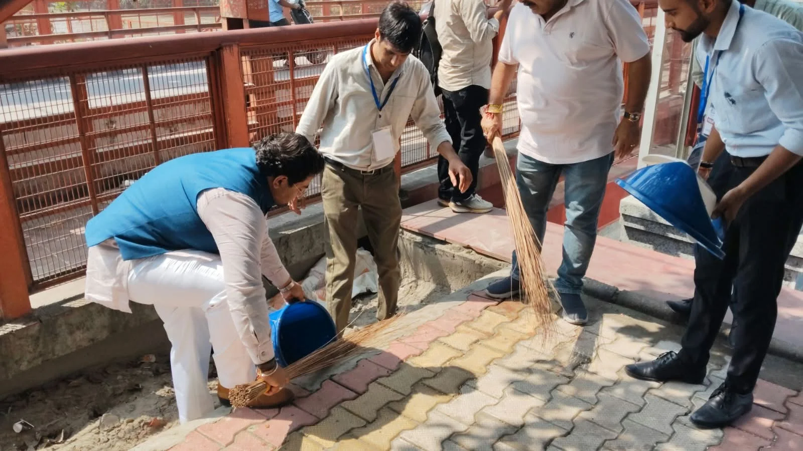
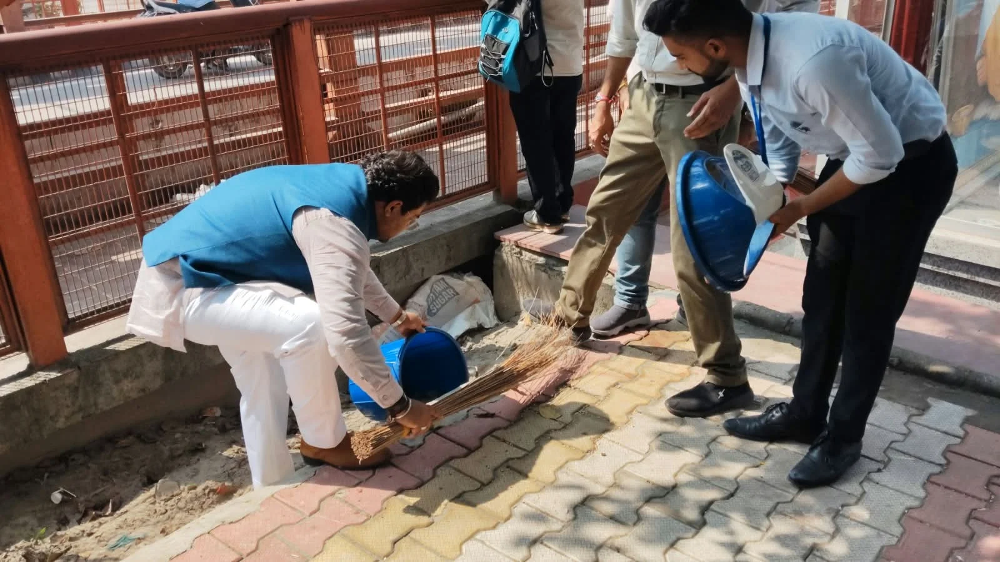

**रुड़की संवाददाता | आसिफ खान**

रुड़की। शहर को स्वच्छ और सुंदर बनाने की मुहिम को धरातल पर उतारते हुए शुक्रवार को एसएमएमईएसटी सेवा कृत्वा पथ की ओर से रविदास घाट से लेकर चोपाटी और सिविल लाइंस बाजार तक व्यापक स्वच्छता अभियान चलाया गया। अभियान के दौरान संगठन से जुड़े लोगों ने स्वयं सड़कों और सार्वजनिक स्थलों पर सफाई की और दुकानदारों तथा राहगीरों को स्वच्छता के प्रति जागरूक किया। अभियान ने साफ संदेश दिया कि शहर की सफाई केवल सरकारी मशीनरी के भरोसे नहीं छोड़ी जा सकती, बल्कि प्रत्येक नागरिक को अपनी जिम्मेदारी समझनी होगी।

अभियान की खास बात यह रही कि उद्यमी सौरभ सैनी स्वयं हाथ में झाड़ू लेकर रविदास घाट पर सफाई करने उतरे। उन्होंने सार्वजनिक स्थल पर झाड़ू लगाकर लोगों को स्वच्छता के प्रति जिम्मेदारी निभाने का संदेश दिया। उनके इस कदम को देखकर अभियान में शामिल लोगों के साथ स्थानीय नागरिकों में भी जागरूकता देखने को मिली।

सौरभ सैनी ने कहा कि साफ शहर केवल व्यवस्था से नहीं, बल्कि नागरिकों की सोच और सहभागिता से बनता है। सार्वजनिक स्थानों पर कूड़ा डालकर हम अपने ही शहर के वातावरण को खराब करते हैं। उन्होंने लोगों से अपील की कि घर और दुकान का कूड़ा निर्धारित स्थान पर ही डालें और सड़क, नाली अथवा सार्वजनिक स्थलों को कूड़ेदान न बनाएं।

**दुकानदारों को बांटे डस्टबिन, सड़क और नालियों में कूड़ा न डालने की अपील**

स्वच्छता अभियान के दौरान चोपाटी बाजार और आसपास के क्षेत्र में दुकानदारों से सीधे संवाद किया गया। अभियान में शामिल लोगों ने दुकानदारों से कहा कि दुकानों से निकलने वाले कूड़े को सड़क किनारे या नालियों में फेंकने के बजाय डस्टबिन में एकत्र किया जाए। इसके लिए कई दुकानदारों को डस्टबिन भी वितरित किए गए।

आयोजकों ने दुकानदारों को समझाया कि बाजार की सफाई केवल नगर निगम की जिम्मेदारी मानकर चलने से समस्या खत्म नहीं होगी। दुकानदार यदि अपनी दुकानों के सामने सफाई रखें और कूड़ा निर्धारित स्थान पर डालें तो बाजार की तस्वीर काफी हद तक बदली जा सकती है।

**कूड़ा उठाया, लोगों को दिया स्वच्छता का संदेश**

अभियान के दौरान रविदास घाट, चोपाटी बाजार और सिविल लाइंस क्षेत्र में सार्वजनिक स्थानों पर पड़े कूड़े को एकत्र किया गया। अभियान में शामिल लोगों ने राहगीरों और स्थानीय नागरिकों को भी स्वच्छता के प्रति जागरूक किया। लोगों से अपील की गई कि वे सार्वजनिक स्थानों पर कूड़ा फेंकने से बचें और आसपास गंदगी दिखाई देने पर उसे साफ कराने में सहयोग करें।

अभियान के आयोजकों ने कहा कि स्वच्छता सिर्फ फोटो खिंचवाने या एक दिन अभियान चलाने तक सीमित नहीं रहनी चाहिए। जब तक सफाई को दैनिक जीवन का हिस्सा नहीं बनाया जाएगा, तब तक सार्वजनिक स्थलों को पूरी तरह स्वच्छ रखना चुनौती बना रहेगा। इसके लिए दुकानदारों, व्यापारियों, राहगीरों और स्थानीय नागरिकों की सामूहिक भागीदारी जरूरी है।

उन्होंने कहा कि शहर के बाजारों और प्रमुख सार्वजनिक स्थलों पर नियमित जागरूकता अभियान चलाने की जरूरत है, ताकि लोगों में स्वच्छता को लेकर जिम्मेदारी की भावना मजबूत हो। अभियान के माध्यम से लोगों को यह भी संदेश दिया गया कि जिस शहर में हम रहते हैं, उसकी स्वच्छता की जिम्मेदारी भी हमारी ही है।

एसएमएमईएसटी सेवा कृत्वा पथ की इस पहल के दौरान लोगों से सार्वजनिक स्थानों पर कूड़ा न डालने, दुकानों के आसपास सफाई रखने और स्वच्छता अभियान में सक्रिय भागीदारी करने की अपील की गई।
