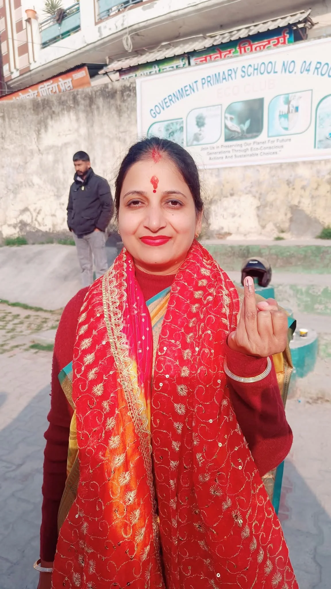
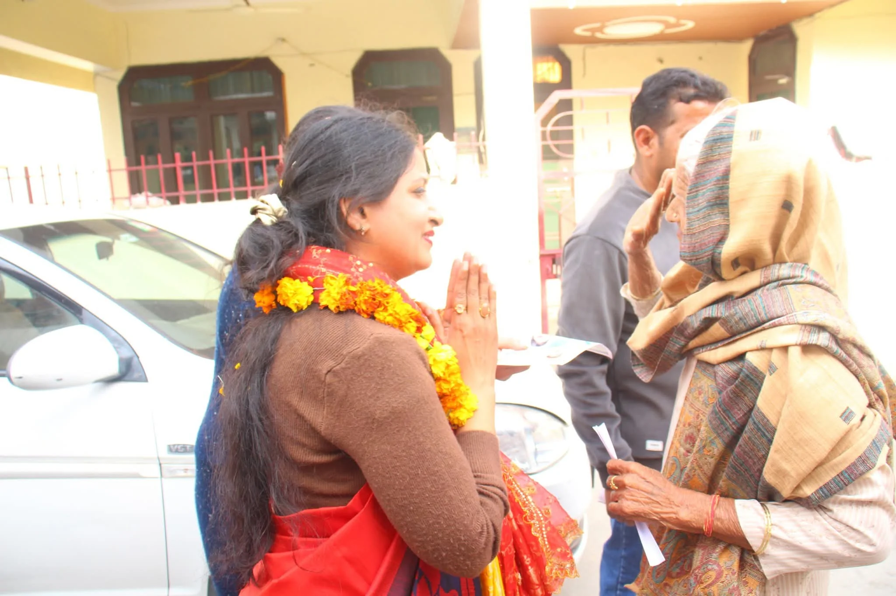
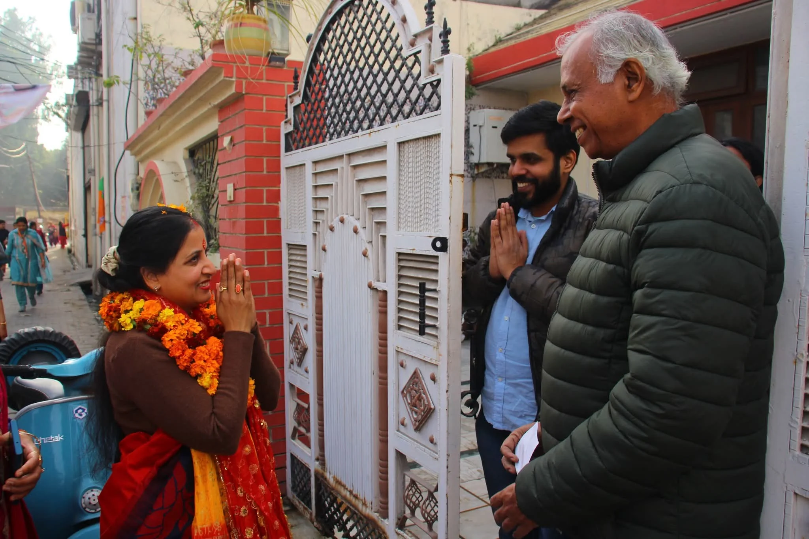
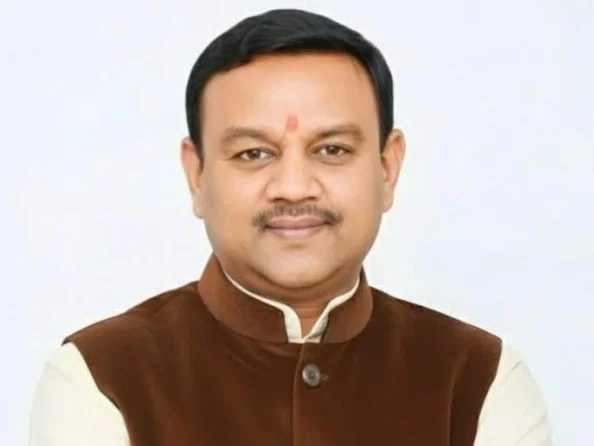
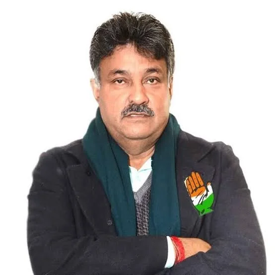

हरिद्वार/रूडकी विशेष संवाददाता | आसिफ खान 

विधानसभा चुनाव 2027 की सियासी गर्मी अभी पूरी तरह शुरू भी नहीं हुई, लेकिन रुड़की में कांग्रेस के संभावित विधानसभा प्रत्याशी को लेकर राजनीतिक चर्चाओं ने जोर पकड़ लिया है। संभावित दावेदारों में पूजा गुप्ता, गौरव गोयल और यशपाल राणा के नाम प्रमुखता से सामने आ रहे हैं।

इन तीनों के राजनीतिक सफर को देखें तो तस्वीर बिल्कुल अलग-अलग नजर आती है। पूजा गुप्ता का नाम हालिया निकाय चुनाव के बाद भी लगातार जनता के बीच सक्रिय रहने वाले चेहरे के तौर पर चर्चा में है। वहीं पूर्व मेयर गौरव गोयल के पास नगर निगम की राजनीति और चुनावी अनुभव है। दूसरी तरफ यशपाल राणा के पास लंबा राजनीतिक अनुभव और विधानसभा चुनाव लड़ने का अनुभव है, लेकिन उनके राजनीतिक सफर में पार्टी अनुशासन और कानूनी विवादों से जुड़े अध्याय भी रहे हैं।

**पूजा गुप्ता पर सबसे ज्यादा नजर—हार के बाद भी नहीं टूटा जनसंपर्क**

2025 नगर निगम चुनाव में कांग्रेस ने पूजा गुप्ता को मेयर पद का प्रत्याशी बनाया था। कांग्रेस के तत्कालीन प्रदेश अध्यक्ष करन माहरा ने भी उनके समर्थन में स्थानीय मुद्दों को लेकर चुनाव अभियान चलाया था।

चुनाव परिणाम उनके पक्ष में नहीं रहा, लेकिन इसके बाद राजनीतिक सक्रियता में कमी दिखाई देने के बजाय पूजा गुप्ता की जनता के बीच मौजूदगी और सामाजिक गतिविधियों को लेकर लगातार चर्चाएं बनी हुई हैं।

हालिया घटनाक्रम भी इसी ओर इशारा करता है। अक्टूबर 2026 की एक रिपोर्ट में कांग्रेस के वरिष्ठ नेता जेपी अग्रवाल के रुड़की पहुंचने पर पूजा गुप्ता के नेतृत्व में कांग्रेस कार्यकर्ताओं द्वारा कार्यक्रम आयोजित किए जाने का उल्लेख है। कार्यक्रम में पूजा गुप्ता ने कार्यकर्ताओं को जनता की समस्याओं और अधिकारों की आवाज उठाने की बात कही।

यही लगातार सक्रियता 2027 की संभावित टिकट चर्चा में पूजा गुप्ता को महत्वपूर्ण चेहरा बना रही है।

सबसे बड़ा सवाल—क्या कांग्रेस निकाय चुनाव के बाद भी सक्रिय रहे चेहरे को विधानसभा में मौका देगी?

पूजा गुप्ता की दावेदारी के साथ एक महत्वपूर्ण तथ्य यह भी है कि उन्होंने 2025 में कांग्रेस के टिकट पर सीधे बड़े नगर निगम चुनाव का सामना किया। यानी पार्टी के चुनाव चिन्ह पर मैदान में उतरने और संगठन के साथ चुनाव लड़ने का अनुभव उनके पास है।

अब 2027 में सवाल केवल यह नहीं है कि पिछला चुनाव कौन जीता या हारा। सवाल यह भी है कि कौन लगातार जनता के बीच मौजूद रहा, कौन स्थानीय मुद्दों को उठाता रहा और कौन संगठन के साथ जमीन पर सक्रिय दिखाई देता है।

इसी वजह से पूजा गुप्ता का नाम रुड़की की आगामी विधानसभा राजनीति में लगातार चर्चा में है।

दूसरे बड़े चेहरे के तौर पर गौरव गोयल—मेयर की कुर्सी से विधानसभा की तैयारी तक?

पूजा गुप्ता के बाद पूर्व मेयर गौरव गोयल का नाम भी संभावित दावेदारों की चर्चाओं में महत्वपूर्ण है।

गौरव गोयल ने रुड़की नगर निगम के मेयर चुनाव में निर्दलीय उम्मीदवार के रूप में जीत हासिल की थी और बाद में भाजपा से जुड़े। 2025 के नगर निगम चुनाव तक वह मेयर रहे।

अब 2027 विधानसभा चुनाव से पहले उनकी राजनीतिक दिशा पर भी नजर है। 2026 में उनके कांग्रेस में शामिल होने की खबरें सामने आईं और उन्हें उन भाजपा पृष्ठभूमि वाले नेताओं में गिना गया जो 2027 से पहले कांग्रेस में आए।

गौरव गोयल के पक्ष में सबसे बड़ा राजनीतिक आधार उनका मेयर के रूप में अनुभव और रुड़की की स्थानीय राजनीति में लंबी पहचान है। लेकिन कांग्रेस के टिकट के लिए उनकी चुनौती यह होगी कि पार्टी संगठन और स्थानीय कांग्रेस कार्यकर्ताओं के बीच उनका नया राजनीतिक समीकरण किस तरह बनता है।

यशपाल राणा—अनुभव बड़ा, लेकिन विवाद भी कम नहीं

पूर्व मेयर यशपाल राणा का राजनीतिक अनुभव दोनों अन्य चेहरों से अलग है। वह रुड़की नगर निगम के शुरुआती दौर में मेयर रहे और 2022 विधानसभा चुनाव में कांग्रेस प्रत्याशी के रूप में चुनाव भी लड़ चुके हैं। 2022 में उन्हें 34,709 वोट मिले, जबकि भाजपा के प्रदीप बत्रा को 36,986 वोट मिले।

लेकिन 2027 की टिकट चर्चा में राणा के सामने कुछ पुराने रिकॉर्ड राजनीतिक चुनौती बन सकते हैं।

पहली बड़ी चुनौती—पार्टी अनुशासन का विवाद। जनवरी 2025 में कांग्रेस ने आरोप लगाया कि राणा ने पार्टी प्रत्याशी पूजा गुप्ता के खिलाफ अपनी पत्नी को निर्दलीय मेयर प्रत्याशी के तौर पर मैदान में उतारा। इसके बाद कांग्रेस ने उन्हें छह साल के लिए निष्कासित करने की घोषणा की।

दूसरी चुनौती—पुराना कानूनी विवाद। 2018 में सरकारी जमीन से जुड़े एक मामले में उनके खिलाफ कार्रवाई के निर्देश और पांच वर्ष तक निकाय चुनाव लड़ने पर रोक की रिपोर्ट सामने आई थी। राणा ने उस समय इसे अपने खिलाफ साजिश बताया था।

इसके अलावा 2022 के उनके चुनावी हलफनामे के बारे में सार्वजनिक चुनावी डेटाबेस में आपराधिक मामलों की संख्या दर्ज है; ऐसे किसी भी बिंदु को खबर में संबंधित आधिकारिक हलफनामे के संदर्भ के साथ ही प्रस्तुत किया जाना चाहिए।

यानी राणा की दावेदारी में अनुभव के साथ पुराने विवाद भी चर्चा का हिस्सा

यशपाल राणा का 2022 का विधानसभा चुनावी प्रदर्शन उनकी राजनीतिक क्षमता का एक महत्वपूर्ण तथ्य है, लेकिन 2027 की टिकट चर्चा में 2025 का कांग्रेस से निष्कासन और पुराने कानूनी विवाद भी नजरअंदाज नहीं किए जा सकते।

रुड़की में 2027 की असली लड़ाई—चेहरा, जनसंपर्क या पुराना राजनीतिक अनुभव?

अब कांग्रेस के सामने कई सवाल हैं।

क्या पूजा गुप्ता की लगातार जनसक्रियता को विधानसभा टिकट की कसौटी बनाया जाएगा?

क्या गौरव गोयल के मेयर पद के अनुभव और नए कांग्रेस राजनीतिक समीकरण को महत्व मिलेगा?

या यशपाल राणा का पुराना विधानसभा चुनावी अनुभव और वोट आधार उनके पक्ष में जाएगा?

फिलहाल किसी भी नाम पर कांग्रेस ने 2027 विधानसभा चुनाव के लिए आधिकारिक प्रत्याशी घोषित नहीं किया है। इसलिए टिकट की अंतिम तस्वीर अभी बाकी है।

लेकिन रुड़की की राजनीति में इतना जरूर साफ है कि 2027 के लिए संभावित चेहरों की चर्चा तेज हो चुकी है और इस चर्चा में पूजा गुप्ता की हालिया राजनीतिक सक्रियता, गौरव गोयल का नगर निगम अनुभव और यशपाल राणा का पुराना चुनावी रिकॉर्ड—तीनों अलग-अलग राजनीतिक आधार प्रस्तुत कर रहे हैं।
