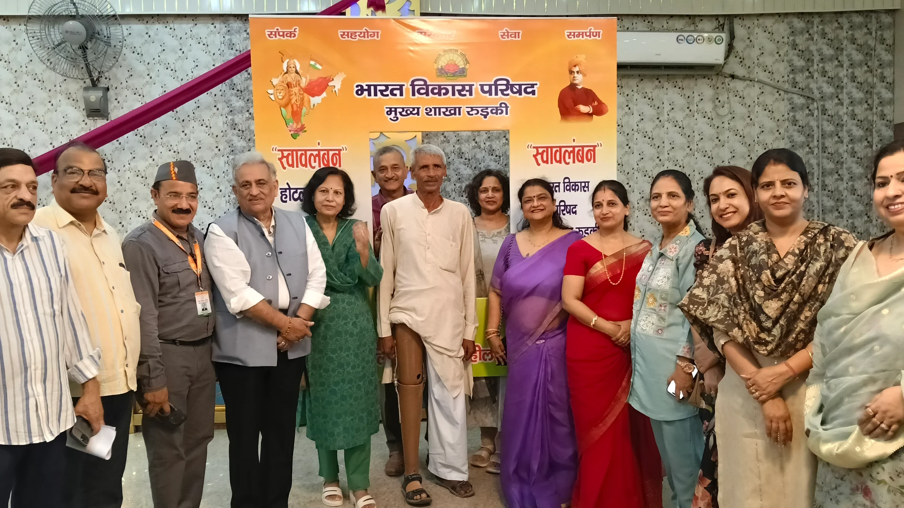
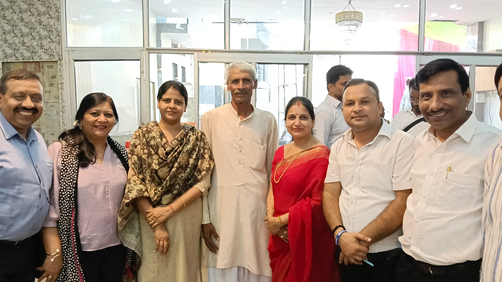
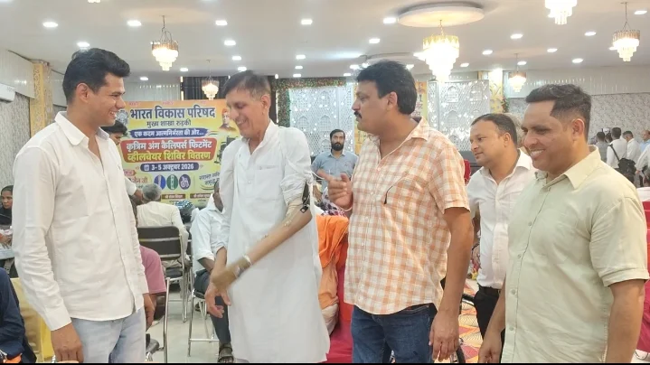
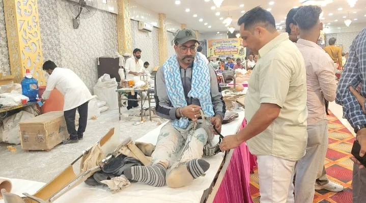

**रुड़की संवाददाता । आसिफ खान** 

दिव्यांगजनों को आत्मनिर्भर बनाने और उन्हें समाज की मुख्यधारा से जोड़ने की दिशा में भारत विकास परिषद मुख्य शाखा रुड़की ने बड़ा कदम उठाया है। भगवान महावीर विकलांग सहायता समिति के सहयोग से कृत्रिम अंग, कैलिपर्स एवं व्हीलचेयर फिटनेस और वितरण शिविर का आयोजन किया गया है। तीन से पांच अक्टूबर तक चलने वाले इस शिविर में दूर-दराज के क्षेत्रों से जरूरतमंद दिव्यांगजन पहुंच रहे हैं।

शिविर में जरूरतमंदों को बिना किसी शुल्क के कृत्रिम अंग, कैलिपर्स और व्हीलचेयर उपलब्ध कराने की व्यवस्था की गई है। पहले दिन करीब 60 लाभार्थियों को कृत्रिम अंग लगाए जा रहे हैं, जबकि आगामी दो दिनों में यह संख्या करीब 200 तक पहुंचाने का लक्ष्य रखा गया है। इसके साथ ही लगभग 20 व्हीलचेयर और करीब 100 बच्चों को कैलिपर्स उपलब्ध कराने की योजना है।

**कृत्रिम अंग सिर्फ सहारा नहीं, आत्मनिर्भरता की ताकत**

पूर्व मेयर प्रत्याशी एवं समाजसेविका पूजा गुप्ता ने कहा कि हाथ-पैर खो चुके लोगों के लिए रोजमर्रा की जिंदगी बेहद चुनौतीपूर्ण हो जाती है और उन्हें कई कामों के लिए दूसरों पर निर्भर रहना पड़ता है। ऐसे में कृत्रिम अंग उनके लिए केवल एक उपकरण नहीं, बल्कि आत्मविश्वास और आत्मनिर्भरता की नई उम्मीद बन सकते हैं।

उन्होंने लाभार्थियों का हौसला बढ़ाते हुए कहा कि दिव्यांगता को कमजोरी समझने के बजाय अपनी ताकत बनाकर आगे बढ़ना चाहिए। उन्होंने भारती का उदाहरण देते हुए कहा कि दिव्यांगता के बावजूद वह खेलों में शानदार प्रदर्शन कर रही हैं और अन्य लोगों के लिए प्रेरणा बनी हुई हैं।

**पहले भी 250 लोगों को मिला था लाभ**

कांग्रेस प्रदेश मंत्री सचिन गुप्ता ने बताया कि इससे पहले रोटरी क्लब की ओर से भी इसी तरह का शिविर आयोजित किया गया था, जिसमें करीब 250 लोगों को कृत्रिम अंग लगाए गए थे। उन्होंने बताया कि वर्तमान शिविर में भी बड़ी संख्या में जरूरतमंदों को लाभ पहुंचाने का लक्ष्य रखा गया है।

**पांच जिलों से पहुंचे लाभार्थी**

शिविर में मुजफ्फरनगर, सहारनपुर, हरिद्वार, चमोली और देहरादून समेत विभिन्न क्षेत्रों से दिव्यांगजन पहुंचे हैं। आयोजकों के अनुसार लाभार्थियों के लिए चाय-नाश्ते और भोजन की व्यवस्था भी पूरी तरह निःशुल्क की गई है। शिविर में किसी भी लाभार्थी से किसी प्रकार का शुल्क नहीं लिया जा रहा है।

आयोजकों ने जरूरतमंद दिव्यांगजनों से अपील की है कि वे शिविर में पहुंचकर उपलब्ध सुविधाओं का लाभ उठाएं। शिविर का उद्देश्य केवल कृत्रिम अंग उपलब्ध कराना नहीं, बल्कि दिव्यांगजनों को आत्मविश्वास के साथ अपने पैरों पर खड़ा होने का अवसर देना है।
