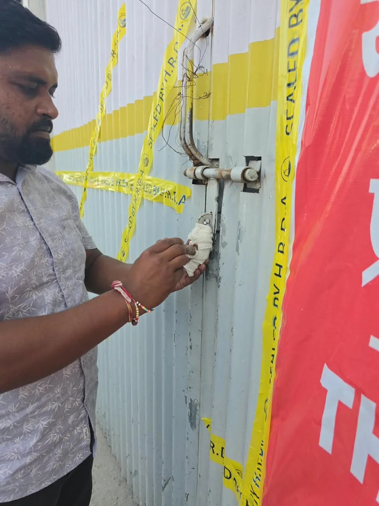
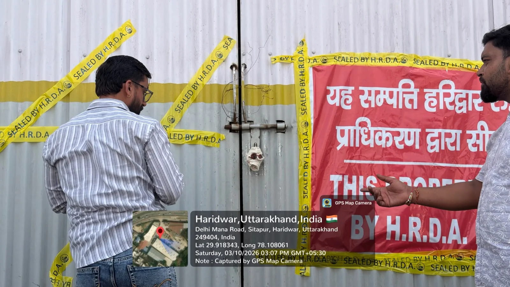

**हरिद्वार संवाददाता | आसिफ खान**

हरिद्वार। हरिद्वार-रूड़की विकास प्राधिकरण ने निर्माण संबंधी प्रकरणों में सख्ती दिखाते हुए 03 अक्टूबर 2026 को बड़ी कार्रवाई की। उच्च अधिकारियों के निर्देशों के क्रम में प्राधिकरण की टीम पुलिस बल के साथ मौके पर पहुंची और प्राधिकरणीय आदेशों के अनुपालन में सीलिंग की कार्रवाई को अंजाम दिया।

HRDA सचिव प्रत्युश सिंह के निर्देशन में हुई कार्रवाई के दौरान सहायक अभियंता वर्षा तथा संबंधित क्षेत्र की अवर अभियंता शिवानी सहित प्राधिकरण की टीम मौके पर सक्रिय रही।

**जटवाड़ा में सीलिंग, पुलिस बल के साथ पहुंची टीम**

पहली कार्रवाई कन्या गुरुकुल के आगे फ्लाईओवर के नीचे, पुल जटवाड़ा, हरिद्वार स्थित करन मल्होत्रा/हितबद्ध व्यक्ति से संबंधित वाद संख्या UCMS/HRDA/C/0098/2023-24 के आंशिक भाग में की गई।

प्राधिकरण की टीम ने पुलिस बल की सहायता से मौके पर पहुंचकर संबंधित हिस्से को सील करने की कार्रवाई की। कार्रवाई के दौरान मौके की स्थिति का निरीक्षण कर निर्धारित प्रक्रिया के तहत प्राधिकरणीय आदेश का अनुपालन कराया गया।

**सप्तसरोवर मामले में भी आदेश का अनुपालन**

दूसरी कार्रवाई सप्तसरोवर, हरिद्वार स्थित अक्षय मल्होत्रा से संबंधित वाद संख्या UCMS/HRDA/C/0866/2024 में की गई।

इस मामले में जारी सील आदेश संख्या 3880(II), दिनांक 23.07.2026 के विरुद्ध विपक्षी अक्षय मल्होत्रा द्वारा माननीय न्यायालय/अध्यक्ष, HRDA के समक्ष अपील संख्या 16/2025-26 प्रस्तुत की गई थी।

उक्त अपील में माननीय न्यायालय/अध्यक्ष, HRDA द्वारा 29.08.2026 को आदेश जारी किए गए। प्राधिकरण के अनुसार इसी आदेश के अनुपालन में स्थल पर आवश्यक कार्रवाई कराई गई।

**सचिव प्रत्युश सिंह का प्राधिकरणीय पक्ष**

प्राधिकरण के अनुसार सचिव प्रत्युश सिंह के निर्देशन में संबंधित अधिकारियों और टीम को सक्षम आदेशों का विधिवत अनुपालन सुनिश्चित करने के निर्देश दिए गए हैं। प्राधिकरणीय कार्रवाई को निर्धारित प्रक्रिया के अनुसार आगे बढ़ाया जा रहा है और संबंधित प्रकरणों में आदेशों के अनुपालन पर विशेष ध्यान दिया जा रहा है।

**सहायक अभियंता वर्षा की भूमिका**

प्राधिकरण के अनुसार सहायक अभियंता वर्षा के नेतृत्व में मौके की कार्रवाई को संबंधित टीम द्वारा आगे बढ़ाया गया। टीम ने पुलिस बल की मौजूदगी में निर्धारित प्रक्रिया के तहत सीलिंग की कार्रवाई पूरी की और प्रकरण से संबंधित आदेशों के अनुपालन को मौके पर सुनिश्चित कराया।

**अवर अभियंता शिवानी ने संभाला मौके का मोर्चा**

अवर अभियंता शिवानी की मौजूदगी में संबंधित स्थल पर कार्रवाई की गई। प्राधिकरण के अनुसार मौके की स्थिति का निरीक्षण करने के बाद आदेश के अनुरूप आवश्यक कार्रवाई कराई गई।

**HRDA का सख्त संदेश—आदेशों का होगा अनुपालन**

एक ही दिन में दो अलग-अलग प्रकरणों में कार्रवाई से HRDA की प्रवर्तन व्यवस्था की सक्रियता सामने आई। पुलिस बल की मौजूदगी और प्राधिकरणीय टीम की कार्रवाई के बीच दोनों मामलों में संबंधित आदेशों का अनुपालन कराया गया।

प्राधिकरण का स्पष्ट रुख है कि सक्षम स्तर से जारी आदेशों का अनुपालन निर्धारित प्रक्रिया के तहत कराया जाएगा और संबंधित मामलों में कार्रवाई को केवल कागजी प्रक्रिया तक सीमित नहीं रखा जाएगा।
