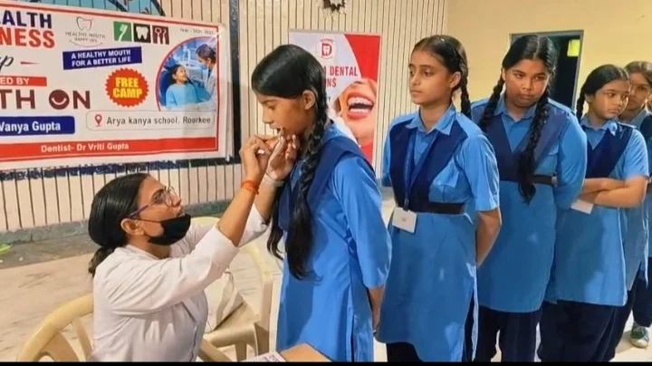
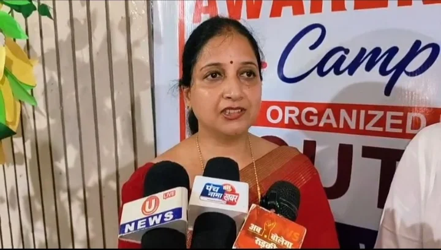
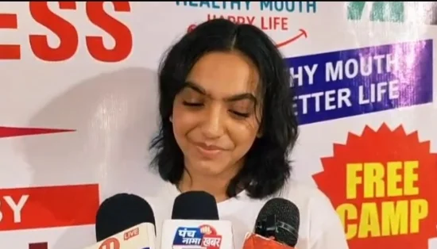
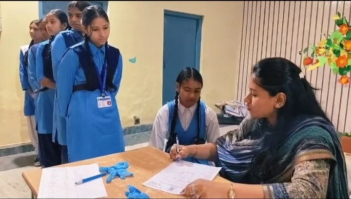

**रूडकी संवाददाता | आसिफ खान**

रुड़की। उम्र महज 16 साल, लेकिन सोच समाजसेवा की—आर्य कन्या गर्ल्स इंटर कॉलेज में आयोजित डेंटल चेकअप कैंप में कक्षा 11 की छात्रा एवं माउंट ओन की फाउंडर वान्या गुप्ता की पहल ने बच्चों के स्वास्थ्य और दंत स्वच्छता को लेकर जागरूकता की नई मिसाल पेश की। शिविर में करीब 100 से 150 बच्चों के सामान्य स्वास्थ्य और दांतों की जांच की गई। साथ ही बच्चों को डेंटल केयर किट वितरित कर दांतों की देखभाल के प्रति जागरूक किया गया।

शिविर के दौरान स्वास्थ्य टीम ने बच्चों को साफ-साफ समझाया कि दांतों की सफाई में लापरवाही आगे चलकर परेशानी का कारण बन सकती है। बच्चों को सही तरीके से ब्रश करने, नियमित रूप से दांत साफ रखने और जरूरत से ज्यादा मिठाई खाने से बचने की सलाह दी गई।

जांच के दौरान कई बच्चों में सही तरीके से ब्रश न करने और कैविटी जैसी दंत समस्याओं की जानकारी सामने आई। स्वास्थ्य टीम ने बच्चों को सलाह दी कि दांतों से जुड़ी समस्या को नजरअंदाज करने के बजाय समय रहते विशेषज्ञ से जांच कराई जाए।

**कम उम्र में बड़ी पहल, पूजा गुप्ता ने की सराहना**

शिविर में पूर्व मेयर प्रत्याशी एवं समाजसेविका पूजा गुप्ता भी पहुंचीं। उन्होंने वान्या गुप्ता की पहल की सराहना करते हुए कहा कि इतनी कम उम्र में बच्चों के स्वास्थ्य को लेकर इस तरह की पहल करना उत्साहजनक है।

पूजा गुप्ता ने कहा कि वान्या ने डॉक्टरों के साथ समन्वय कर दंत जांच शिविर आयोजित कराया और बच्चों को जरूरी स्वास्थ्य जानकारी के साथ डेंटल किट उपलब्ध कराई। उन्होंने वान्या को शुभकामनाएं देते हुए कहा कि वह भविष्य में भी अधिक से अधिक बच्चों को अपने साथ जोड़कर समाजसेवा के कार्यों को आगे बढ़ाएं।

उन्होंने कहा कि स्वास्थ्य शिविरों का उद्देश्य केवल जांच करना नहीं, बल्कि बच्चों को उनकी सेहत के प्रति सजग करना भी है। सही समय पर सही जानकारी मिलने से बच्चे अपनी रोजमर्रा की आदतों में सकारात्मक बदलाव ला सकते हैं।

**शिविर ने दिया सीधा संदेश—दांतों की सफाई में लापरवाही नहीं**

कार्यक्रम के जरिए बच्चों को दांतों की नियमित सफाई और स्वास्थ्य के प्रति गंभीर रहने का संदेश दिया गया। आयोजकों ने भविष्य में भी ऐसे स्वास्थ्य एवं जागरूकता शिविर आयोजित किए जाने की आवश्यकता पर जोर दिया।
