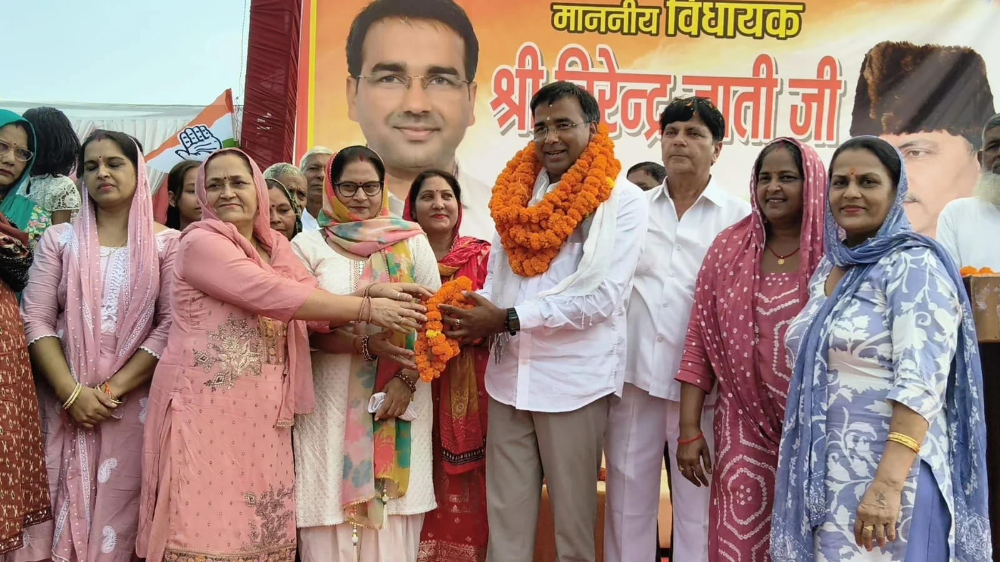
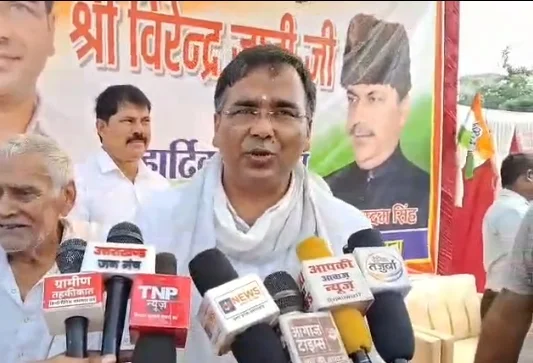

**रूडकी संवाददाता | आसिफ खान**

रुड़की। सलेमपुर में आयोजित एक कार्यक्रम ने क्षेत्र की सियासत में हलचल तेज कर दी। झबरेड़ा विधायक वीरेंद्र जाती की मौजूदगी में सैकड़ों लोगों ने कांग्रेस का हाथ थाम लिया। बड़ी संख्या में लोगों के कांग्रेस में शामिल होने से कार्यक्रम पूरी तरह राजनीतिक रंग में रंग गया और इसे आगामी 2027 विधानसभा चुनाव से पहले कांग्रेस के शक्ति प्रदर्शन के तौर पर देखा जा रहा है।

कार्यक्रम का आयोजन सलेमपुर प्रधान पदम सिंह सैनी ने किया। कांग्रेस में शामिल हुए लोगों का विधायक वीरेंद्र जाती ने स्वागत एवं अभिनंदन किया। इस दौरान समर्थकों में खासा उत्साह दिखाई दिया।

**सियासी मैदान में वीरेंद्र जाती का सीधा संदेश**

विधायक वीरेंद्र जाती ने कहा कि जनता ने उन्हें वोट दिया हो या नहीं, उन्होंने विकास और सम्मान के मामले में किसी के साथ भेदभाव नहीं किया। उनके लिए पूरा क्षेत्र और हर वर्ग बराबर है।

उन्होंने सड़क, नाला निर्माण और क्षेत्र की अन्य मूलभूत समस्याओं का जिक्र करते हुए कहा कि उन्होंने सेवा भावना से काम किया है और आगे भी जनता की आवाज उठाते रहेंगे। विधायक ने कहा कि जनता का आशीर्वाद मिला तो 2027 में फिर चुनाव जीतकर क्षेत्र की सेवा करेंगे।

**सरकार पर जमकर बरसे विधायक**

वीरेंद्र जाती ने कृष्णानगर और सलेमपुर क्षेत्र की समस्याओं को लेकर सरकार पर सवाल उठाए। उन्होंने कहा कि इन क्षेत्रों में अभी बहुत काम होना बाकी है और सरकार की ओर से अपेक्षित सहयोग नहीं मिल रहा है।

उन्होंने जनता से जागरूक होने की अपील करते हुए कहा कि यदि सरकार किसी क्षेत्र की समस्याओं पर ध्यान नहीं देती तो जनता को लोकतांत्रिक तरीके से सरकार को आईना दिखाना चाहिए।

**'एक प्रदेश, एक नीति' का मुद्दा उठाया**

विधायक ने हरिद्वार जिले के मैदानी क्षेत्रों को लेकर कथित नीतिगत असमानता का मुद्दा भी उठाया। स्थायी प्रमाण पत्र, जाति प्रमाण पत्र और अन्य व्यवस्थाओं का जिक्र करते हुए उन्होंने कहा कि एक ही प्रदेश में अलग-अलग क्षेत्रों के लिए अलग-अलग नीतियां नहीं होनी चाहिए।

बिजली व्यवस्था का उदाहरण देते हुए उन्होंने कहा कि पहाड़ी क्षेत्रों में 100 यूनिट तक मुफ्त बिजली की बात होती है, जबकि मैदानी क्षेत्रों के संबंध में अलग सोच दिखाई देती है। उन्होंने कहा कि कांग्रेस 'एक प्रदेश, एक नीति' की बात करती रही है और क्षेत्रीय असमानता के खिलाफ आवाज उठाती रहेगी।

**सलेमपुर में उमड़ी भीड़, 2027 पर नजर**

कार्यक्रम के आयोजक एवं सलेमपुर प्रधान पदम सिंह सैनी ने क्षेत्रीय जनता और कांग्रेस कार्यकर्ताओं का आभार जताया। उन्होंने कहा कि क्षेत्र के विकास और जनता की समस्याओं को लेकर लगातार प्रयास जारी रहेंगे।

सलेमपुर में बड़ी संख्या में लोगों का कांग्रेस से जुड़ना स्थानीय राजनीति में चर्चा का विषय बन गया है। कार्यक्रम में दिखाई दिया उत्साह आगामी 2027 विधानसभा चुनाव से पहले कांग्रेस की राजनीतिक सक्रियता का संकेत देता नजर आया।

अब देखना होगा कि सलेमपुर में दिखाई दिया यह सियासी उत्साह आने वाले चुनाव में कांग्रेस के लिए कितना बड़ा जनसमर्थन साबित होता है।
