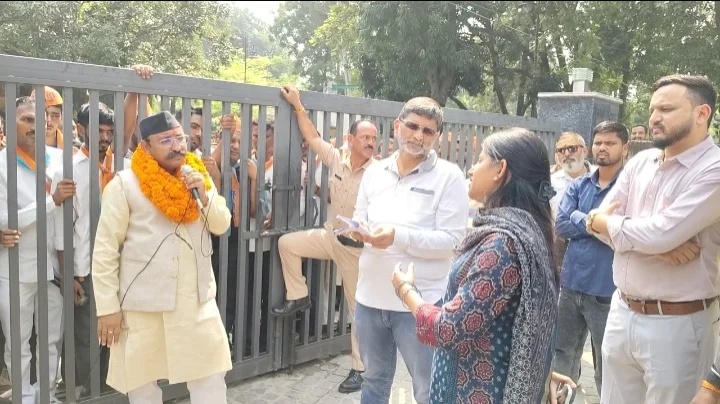
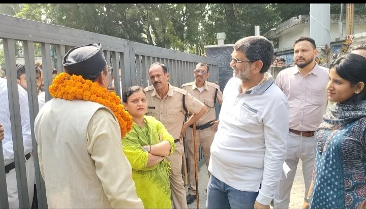

**हरिद्वार संवाददाता । आसिफ खान** 

हरिद्वार-रुड़की विकास प्राधिकरण (HRDA) की कार्यशैली को लेकर सूराज सेवादल ने प्राधिकरण कार्यालय पर जोरदार धरना-प्रदर्शन किया। प्रदेश अध्यक्ष रमेश जोशी के नेतृत्व में पहुंचे सैकड़ों कार्यकर्ताओं ने भ्रष्टाचार, कथित अवैध वसूली, कार्रवाई में भेदभाव और आम लोगों को परेशान किए जाने के आरोप लगाते हुए प्राधिकरण की कार्यप्रणाली पर सवाल खड़े किए।

प्रदर्शन के दौरान रमेश जोशी के निशाने पर HRDA सचिव प्रत्युष सिंह रहे। जोशी सचिव के कार्यालय पहुंचे, लेकिन सचिव वहां मौजूद नहीं मिले। इस पर उन्होंने नाराजगी जताते हुए कहा कि “एक बजने को है और सचिव अपने कार्यालय में मौजूद नहीं हैं।” जोशी ने सवाल उठाया कि जब जनता अपनी समस्याएं लेकर प्राधिकरण पहुंचती है तो उसे अधिकारियों से मिलने के लिए इंतजार करना पड़ता है, लेकिन अधिकारी स्वयं कार्यालय में मौजूद नहीं हैं।

**PIS की फाइल का जिक्र, जोशी ने दी चेतावनी**

प्रदर्शन के दौरान रमेश जोशी ने PIS में चल रही एक फाइल का भी जिक्र किया। उन्होंने चेतावनी दी कि संगठन इस फाइल और उससे जुड़े मामले पर नजर रखे हुए है। जोशी ने कहा कि यदि मामले में पारदर्शिता नहीं बरती गई या शिकायतों को नजरअंदाज किया गया तो संगठन इसे आगे भी प्रमुखता से उठाएगा।

उन्होंने कहा कि संगठन केवल धरना देकर वापस जाने वाला नहीं है, बल्कि जनता से जुड़े मामलों में जवाबदेही तय होने तक आवाज उठाई जाएगी।

**गरीबों पर कार्रवाई, रसूखदारों पर नरमी का आरोप**

सूराज सेवादल ने आरोप लगाया कि गरीब और कमजोर वर्ग के लोगों के मकानों पर सीलिंग और कार्रवाई की जा रही है, जबकि प्रभावशाली लोगों के मामलों में कथित तौर पर नरमी बरती जाती है। संगठन ने सवाल उठाया कि यदि नियम सभी के लिए समान हैं तो कार्रवाई का पैमाना भी समान होना चाहिए।

प्रदर्शनकारियों ने प्राधिकरण में कई मामलों की फाइलें लंबे समय तक लंबित रखने का आरोप भी लगाया। उनका कहना था कि आम लोगों को अपने काम के लिए बार-बार कार्यालय के चक्कर लगाने पड़ते हैं।

**इंतजार प्रधान ने संभाला मोर्चा, आंदोलन की चेतावनी**

सूराज सेवादल के प्रदेश सचिव इंतजार प्रधान ने भी प्रदर्शन के दौरान प्राधिकरण की कार्यशैली को लेकर कड़ा रुख अपनाया। उन्होंने कहा कि संगठन जनता से जुड़े मुद्दों को लेकर पीछे हटने वाला नहीं है। गरीब और कमजोर वर्ग के लोगों की समस्याओं का समाधान नहीं हुआ तो आंदोलन को और व्यापक किया जाएगा।

इंतजार प्रधान ने कहा कि प्रदेश अध्यक्ष रमेश जोशी की ओर से अधिकारियों को 15 दिन का अल्टीमेटम दिया गया है। यदि तय अवधि में शिकायतों पर ठोस कार्रवाई नहीं हुई तो संगठन दोबारा प्राधिकरण कार्यालय पर प्रदर्शन करेगा और आंदोलन को बड़े स्तर पर ले जाने से पीछे नहीं हटेगा।

**अधीक्षण अभियंता राजन सिंह के सामने रखीं शिकायतें**

प्रदर्शन के दौरान कार्यकर्ताओं ने HRDA के अधीक्षण अभियंता राजन सिंह से भी मुलाकात की और अपनी समस्याएं रखीं। रिहायशी क्षेत्रों में कथित व्यावसायिक निर्माण, गंगा किनारे प्रदूषण और प्राधिकरण की कार्रवाई से जुड़े मुद्दे भी उठाए गए।

संगठन ने मांग की कि प्राधिकरण की कार्रवाई में पारदर्शिता लाई जाए और आम लोगों की शिकायतों का समयबद्ध तरीके से निस्तारण किया जाए।

**15 दिन बाद क्या होगा? निगाहें HRDA पर**

सूराज सेवादल ने साफ कर दिया कि 15 दिन का अल्टीमेटम महज औपचारिकता नहीं है। संगठन का कहना है कि यदि इस अवधि में समस्याओं का समाधान नहीं हुआ तो अगला आंदोलन और व्यापक होगा।

रमेश जोशी के सचिव प्रत्युष सिंह की गैरमौजूदगी पर उठाए गए सवाल, PIS की फाइल को लेकर दी गई चेतावनी और इंतजार प्रधान की आंदोलन तेज करने की घोषणा के बाद अब HRDA की अगली कार्रवाई पर निगाहें टिक गई हैं।

नोट: भ्रष्टाचार, कथित अवैध वसूली और कार्रवाई में भेदभाव से जुड़े आरोप प्रदर्शनकारियों द्वारा लगाए गए हैं। इन आरोपों की स्वतंत्र पुष्टि इस स्तर पर नहीं हुई है।
