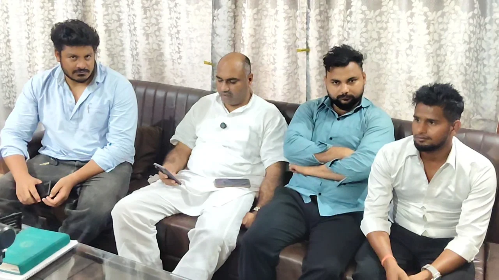
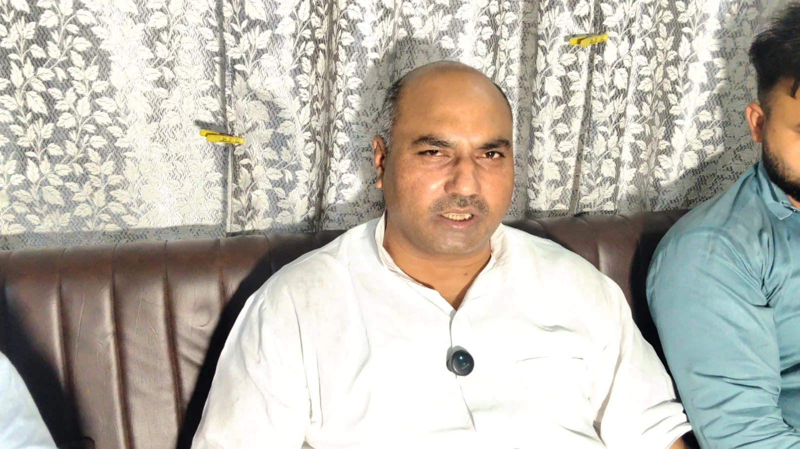

**रूडकी संवाददाता | आसिफ खान** 

पिरान कलियर विधानसभा सीट पर आगामी चुनाव को लेकर सियासी सरगर्मियां तेज होती दिखाई दे रही हैं। जन अधिकार पार्टी (जनशक्ति) के राष्ट्रीय अध्यक्ष आज़ाद अली ने कलियर विधानसभा के संभावित प्रत्याशी मुनीश सैनी और भाजपा पर तीखा हमला बोलते हुए क्षेत्र के विकास और राजनीतिक दावों पर सवाल खड़े किए हैं।

मुनीश सैनी की ओर से कलियर क्षेत्र के सौंदर्यीकरण को लेकर दिए जा रहे बयानों पर सवाल उठाते हुए आज़ाद अली ने कहा कि यदि वास्तव में क्षेत्र के विकास और सौंदर्यीकरण की इच्छा है तो चुनाव जीतने का इंतजार क्यों किया जा रहा है? उन्होंने कहा कि भाजपा की सरकार सत्ता में है और यदि इच्छाशक्ति है तो क्षेत्र में विकास कार्य अभी कराए जा सकते हैं। उन्हें काम करने से किसी ने नहीं रोका है।

आज़ाद अली ने दावा किया कि जन अधिकार पार्टी पिछले दो वर्षों से बिना जाति और समुदाय के भेदभाव के धरातल पर जनता की आवाज उठाने का काम कर रही है। उन्होंने कहा कि चुनाव नजदीक आते ही विकास के दावे करने के बजाय राजनीतिक दलों को जनता के बीच अपने काम का हिसाब रखना चाहिए।

**जय भगवान या मुनीश सैनी... मुकाबले के लिए तैयार: आज़ाद अली**

आज़ाद अली ने कहा कि जय भगवान और मुनीश सैनी पहले यह स्पष्ट करें कि चुनाव मैदान में कौन उतर रहा है। उन्होंने दावा किया कि दोनों में से कोई भी प्रत्याशी मैदान में आता है, जन अधिकार पार्टी मुकाबले के लिए पूरी तरह तैयार है।

उन्होंने कहा कि इस बार जनता के सामने केवल राजनीतिक दावे नहीं, बल्कि काम और विकास का वास्तविक हिसाब होगा। जनता डर की राजनीति के बजाय विकास और जमीन पर काम करने वालों को प्राथमिकता देगी।

**कांग्रेस-भाजपा पर मिलीभगत के आरोप**

आज़ाद अली ने कांग्रेस और भाजपा पर छात्रवृत्ति घोटाले समेत विभिन्न मामलों में कथित मिलीभगत के आरोप भी लगाए। हालांकि इन आरोपों के समर्थन में उन्होंने क्या साक्ष्य प्रस्तुत किए, यह स्पष्ट नहीं है। उन्होंने कहा कि यदि जनता उनकी पार्टी को मौका देती है तो भ्रष्टाचार से जुड़े मामलों की जांच कराई जाएगी और दोषी पाए जाने वाले अधिकारियों, कर्मचारियों तथा नेताओं के खिलाफ कार्रवाई की जाएगी।

**अवैध खनन और निर्माण की गुणवत्ता पर भी उठाए सवाल**

जन अधिकार पार्टी के राष्ट्रीय अध्यक्ष ने हरिद्वार जिले में कथित अवैध खनन और निर्माण कार्यों की गुणवत्ता को लेकर भी सरकार पर सवाल खड़े किए। उन्होंने प्रेमनगर पुल के क्षतिग्रस्त होने का उल्लेख करते हुए सरकार के ‘जीरो टॉलरेंस’ के दावे पर सवाल उठाया और पूछा कि यदि भ्रष्टाचार के खिलाफ वास्तव में सख्ती है तो ऐसे मामलों में जिम्मेदारी तय क्यों नहीं की जाती?

आज़ाद अली ने कहा कि आगामी विधानसभा चुनाव में जनता यह तय करेगी कि पिरान कलियर की आवाज कौन बनेगा। उन्होंने दावा किया कि इस बार कलियर विधानसभा का चुनाव बेहद दिलचस्प और राजनीतिक रूप से महत्वपूर्ण होने वाला है।

अब सवाल सिर्फ दावों का नहीं, बल्कि जनता के सामने काम का हिसाब रखने का है—और इसी मुद्दे पर कलियर की सियासत आने वाले दिनों में और गरमाने के संकेत दे रही है।
