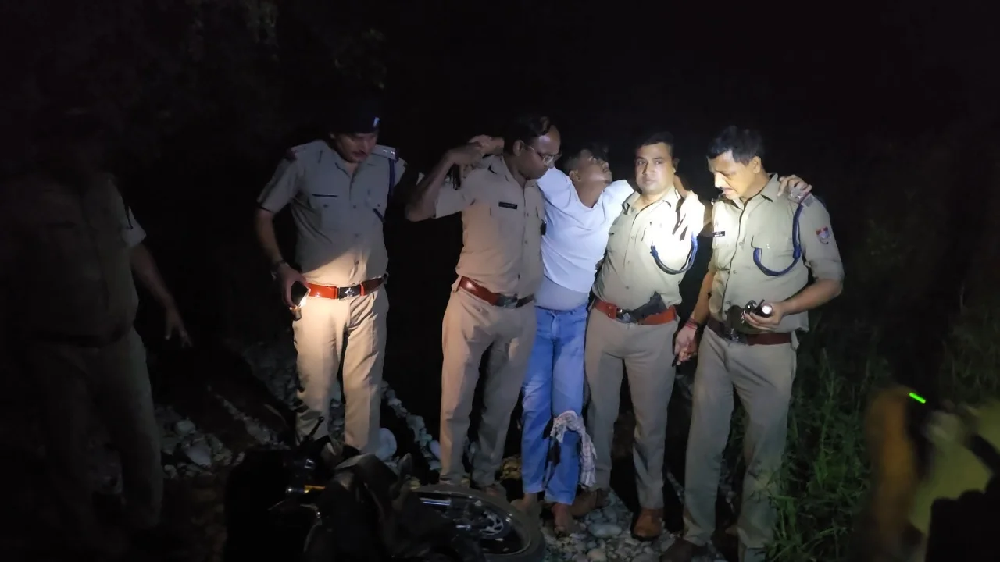
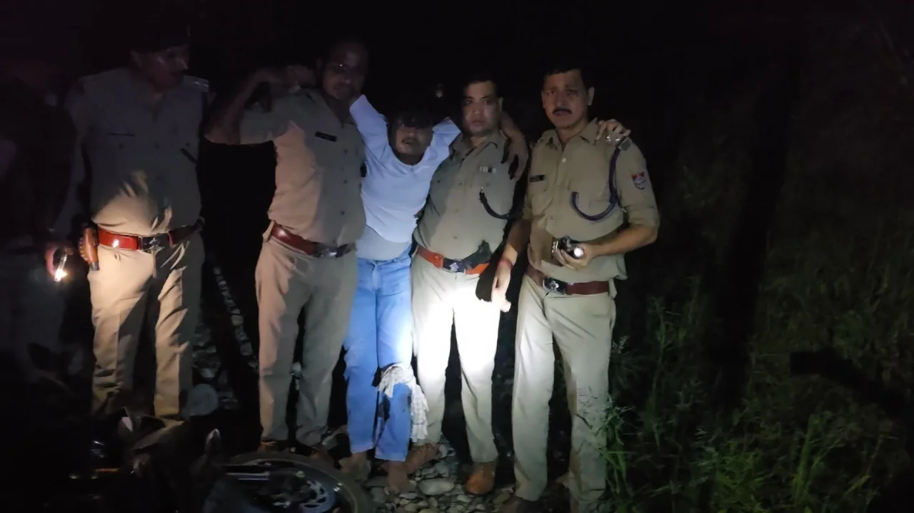

**हरिद्वार संवाददाता | आसिफ खान**

हरिद्वार। हरिद्वार के औद्योगिक क्षेत्र में पुलिस और बदमाशों के बीच मुठभेड़ की सूचना से हड़कंप मच गया। कोतवाली नगर पुलिस की कार्रवाई के दौरान एक आरोपी को गिरफ्तार कर लिया गया, जबकि उसका दूसरा साथी मौके से फरार हो गया। फरार आरोपी की तलाश में पुलिस की टीमें लगातार कांबिंग अभियान चला रही हैं। घटना की गंभीरता को देखते हुए वरिष्ठ पुलिस अधिकारी घटनास्थल के लिए रवाना हो गए, वहीं एसएसपी हरिद्वार भी मौके के लिए रवाना हुए।

पुलिस से मिली प्रारंभिक जानकारी के अनुसार, औद्योगिक क्षेत्र में हुई इस मुठभेड़ के बाद पुलिस ने एक अभियुक्त को हिरासत में लेने में सफलता हासिल की। वहीं, दूसरा आरोपी पुलिस की पकड़ से बाहर है। उसकी गिरफ्तारी के लिए आसपास के क्षेत्र में सघन तलाशी अभियान चलाया जा रहा है। पुलिस की कार्रवाई जारी रहने के कारण घटनास्थल और आसपास के इलाकों में सुरक्षा एवं निगरानी बढ़ा दी गई है।

**गिरफ्तार आरोपी की पहचान**

पुलिस के अनुसार, गिरफ्तार अभियुक्त की पहचान नरेश उर्फ भिंडे उर्फ राज (22 वर्ष), पुत्र कन्हैया, निवासी B-4/409, साईं मंदिर के निकट, सुल्तानपुरी, दिल्ली के रूप में हुई है।

**दूसरा आरोपी फरार, तलाश में जुटीं पुलिस टीमें**

मुठभेड़ के दौरान फरार हुए दूसरे अभियुक्त की पहचान दिनेश, पुत्र गोमा राम, निवासी B-4/305, सुल्तानपुरी, दिल्ली के रूप में बताई गई है। फरार आरोपी को पकड़ने के लिए पुलिस की टीमें लगातार कांबिंग कर रही हैं। पुलिस आसपास के संभावित ठिकानों और क्षेत्र में तलाशी अभियान के जरिए आरोपी तक पहुंचने का प्रयास कर रही है।

**घटनास्थल के लिए रवाना हुए आला अधिकारी**

घटना की सूचना मिलते ही पुलिस महकमे में सक्रियता बढ़ गई। एसएसपी हरिद्वार समेत वरिष्ठ पुलिस अधिकारियों के घटनास्थल के लिए रवाना होने की जानकारी सामने आई है। फिलहाल पुलिस की कार्रवाई जारी है और मुठभेड़ से संबंधित अन्य विस्तृत जानकारी तथा आधिकारिक बयान का इंतजार है।

अब सबकी निगाहें पुलिस की अगली कार्रवाई पर टिकी हैं। फरार आरोपी की गिरफ्तारी और मुठभेड़ से जुड़े घटनाक्रम को लेकर पुलिस की आधिकारिक जानकारी सामने आने के बाद ही तस्वीर पूरी तरह स्पष्ट हो सकेगी।
