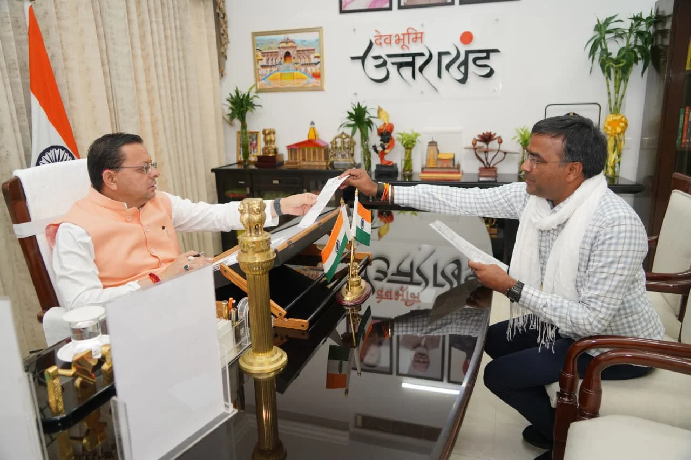

**देहरादून संवाददाता | आसिफ खान**

देहरादून। झबरेड़ा विधानसभा क्षेत्र में विकास कार्यों को गति देने के लिए विधायक विरेन्द्र जाती ने मुख्यमंत्री से मुलाकात कर क्षेत्र की प्रमुख समस्याओं और जनहित से जुड़ी मांगों को प्रमुखता से उठाया। ग्रामीण सड़कों के निर्माण से लेकर झबरेड़ा में रोडवेज बस अड्डे की स्थापना और संत शिरोमणि गुरु रविदास जी के मंदिर के सौंदर्यीकरण तक, विधायक ने क्षेत्र की जरूरतों को मुख्यमंत्री के समक्ष रखते हुए संबंधित कार्यों को प्राथमिकता के आधार पर कराने का आग्रह किया।

विधायक विरेन्द्र जाती ने खाताखेड़ी से सलेमपुर सड़क, नगला से सफरपुर सड़क, रसूलपुर तिराहे से शाहपुर सड़क तथा इकबालपुर मार्ग से धर्मपुर सड़क के निर्माण की मांग उठाई। इसके साथ ही भगतोवाली स्थित संत शिरोमणि गुरु रविदास जी के मंदिर के सौंदर्यीकरण और झबरेड़ा में रोडवेज बस अड्डे की स्थापना का मुद्दा भी प्रमुखता से रखा।

**ग्रामीण सड़कों और परिवहन सुविधाओं पर जोर**

विधायक ने कहा कि क्षेत्र के ग्रामीण इलाकों में बेहतर सड़क संपर्क और सुगम आवागमन सुनिश्चित करना बेहद जरूरी है। सड़कों का निर्माण होने से किसानों, व्यापारियों, विद्यार्थियों और आम नागरिकों को आवागमन में सुविधा मिलेगी तथा क्षेत्र के विकास को नई गति मिल सकेगी। वहीं, झबरेड़ा में रोडवेज बस अड्डे की स्थापना से लोगों को सार्वजनिक परिवहन की बेहतर सुविधा मिलने की उम्मीद है।

**गुरु रविदास मंदिर के सौंदर्यीकरण की मांग**

भगतोवाली में संत शिरोमणि गुरु रविदास जी के मंदिर के सौंदर्यीकरण का मुद्दा उठाते हुए विधायक ने इस धार्मिक एवं सामाजिक महत्व के स्थल के विकास की आवश्यकता पर जोर दिया। उन्होंने मुख्यमंत्री से आग्रह किया कि क्षेत्र की जनभावनाओं और आवश्यकताओं को ध्यान में रखते हुए इस कार्य को भी प्राथमिकता दी जाए।

**अब फैसले और बजट का इंतजार**

विधायक विरेन्द्र जाती ने मुख्यमंत्री से जनहित से जुड़े सभी प्रस्तावों पर शीघ्र सकारात्मक निर्णय लेने तथा आवश्यक स्वीकृति और बजट उपलब्ध कराने का अनुरोध किया। अब क्षेत्रवासियों की निगाहें इन मांगों पर होने वाली आगामी कार्रवाई पर टिकी हैं। यदि प्रस्तावों को मंजूरी मिलती है, तो झबरेड़ा विधानसभा क्षेत्र में सड़क संपर्क, सार्वजनिक परिवहन और धार्मिक स्थलों के विकास को लेकर महत्वपूर्ण कदम आगे बढ़ सकते हैं।

**स्टार न्यूज़ 11 | जनहित की खबर, जनता की आवाज़**
