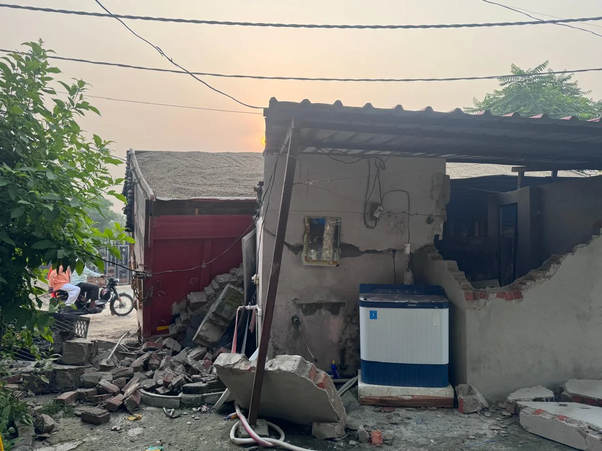
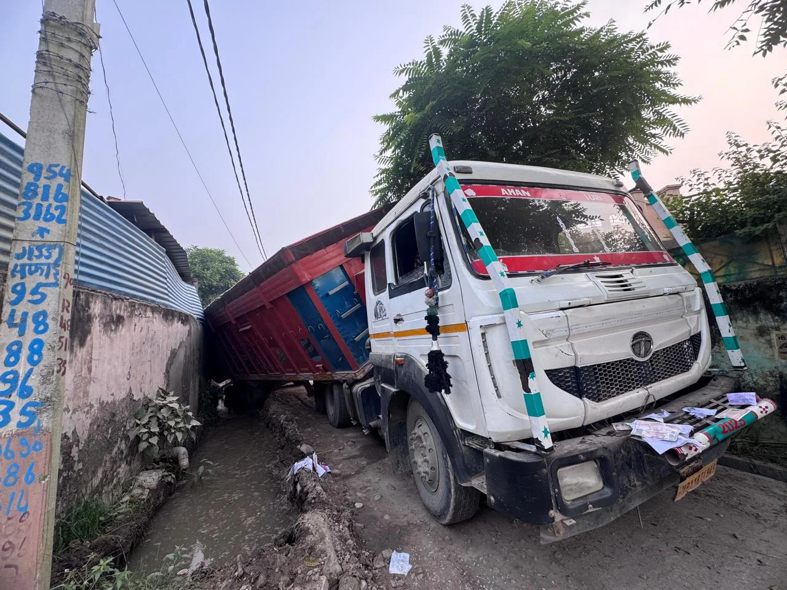

**रुड़की संवाददाता | आसिफ खान**

भगवानपुर/लाम ग्रंट। भगवानपुर क्षेत्र के ग्राम लाम ग्रंट में 6 अक्टूबर की देर रात करीब 2 बजे एक ऐसा हादसा हुआ, जिसने ग्रामीणों की चिंता और आक्रोश दोनों बढ़ा दिए। बजरी से भरा एक बेकाबू डम्पर अनियंत्रित होकर सड़क किनारे बने एक गरीब परिवार के मकान में जा घुसा। डम्पर की टक्कर इतनी जोरदार थी कि मकान की दीवार टूट गई और वाहन नाले में पलट गया। गनीमत रही कि परिवार दूसरे कमरे में मौजूद था, जिससे बड़ा जानी नुकसान टल गया। लेकिन सवाल यह है कि आखिर गांव की सड़कों पर बेलगाम दौड़ते भारी वाहनों पर लगाम कौन लगाएगा?

**गरीब के आशियाने को भारी नुकसान, परिवार पर टूटा संकट**

हादसे में लाम ग्रंट निवासी उदय सिंह का मकान बुरी तरह क्षतिग्रस्त हो गया। रात के सन्नाटे में अचानक हुए इस हादसे से इलाके में अफरा-तफरी मच गई। परिवार के लिए यह घटना किसी बड़े सदमे से कम नहीं है। यदि डम्पर सीधे उस कमरे में जा घुसता, जहां परिवार सो रहा होता, तो परिणाम बेहद भयावह हो सकते थे।

पीड़ित परिवार ने प्रशासन से आर्थिक सहायता और उचित मुआवजा दिलाने की गुहार लगाई है, ताकि क्षतिग्रस्त मकान की मरम्मत कराई जा सके।

**अवैध खनन के आरोप, ग्रामीणों ने उठाए सुरक्षा पर सवाल**

ग्रामीणों का आरोप है कि क्षेत्र में दिन-रात खनन सामग्री से लदे डम्पर और ट्रक तेज रफ्तार से दौड़ते हैं। इन भारी वाहनों की आवाजाही से गांव के लोगों की सुरक्षा पर खतरा मंडरा रहा है। ग्रामीणों के मुताबिक, इसी मार्ग से छोटे-छोटे बच्चे स्कूल जाते हैं और सड़क पर भारी वाहनों की तेज रफ्तार किसी भी समय बड़े हादसे का कारण बन सकती है।

स्थानीय लोगों ने क्षेत्र में अवैध खनन और खनन सामग्री के परिवहन की गतिविधियों की जांच कराने की मांग उठाई है। हालांकि, अवैध खनन से इस हादसे का सीधा संबंध होने की आधिकारिक पुष्टि अभी सामने नहीं आई है।

**ग्रामीणों का सवाल—हादसे के बाद ही जागेगा प्रशासन?**

ग्रामीणों ने पुलिस और प्रशासन से मांग की है कि गांव के भीतर तेज रफ्तार से चलने वाले भारी वाहनों पर सख्ती की जाए। रात-दिन दौड़ने वाले खनन वाहनों की जांच हो, उनकी गति नियंत्रित की जाए और नियमों का उल्लंघन करने वालों के खिलाफ कार्रवाई की जाए।

ग्रामीणों का कहना है कि यदि समय रहते प्रभावी कदम नहीं उठाए गए, तो भविष्य में किसी निर्दोष की जान भी जा सकती है। लोगों ने गांव के संवेदनशील मार्गों पर निगरानी बढ़ाने और बच्चों की सुरक्षा सुनिश्चित करने की भी मांग की है।

**मौके पर पहुंची पुलिस, जांच शुरू**

घटना की सूचना मिलने पर भगवानपुर कोतवाली पुलिस मौके पर पहुंची और मामले की जांच शुरू की। अब यह देखना महत्वपूर्ण होगा कि हादसे के कारणों की जांच में क्या तथ्य सामने आते हैं और पीड़ित परिवार को राहत दिलाने के लिए प्रशासन क्या कदम उठाता है।

सबसे बड़ा सवाल यही है—क्या इस हादसे के बाद गांव की सड़कों पर दौड़ते भारी वाहनों की रफ्तार पर लगाम लगेगी, या ग्रामीणों को किसी और बड़ी अनहोनी का इंतजार करना पड़ेगा?

**STAR NEWS 11 | जनहित में बेबाक खबर**
