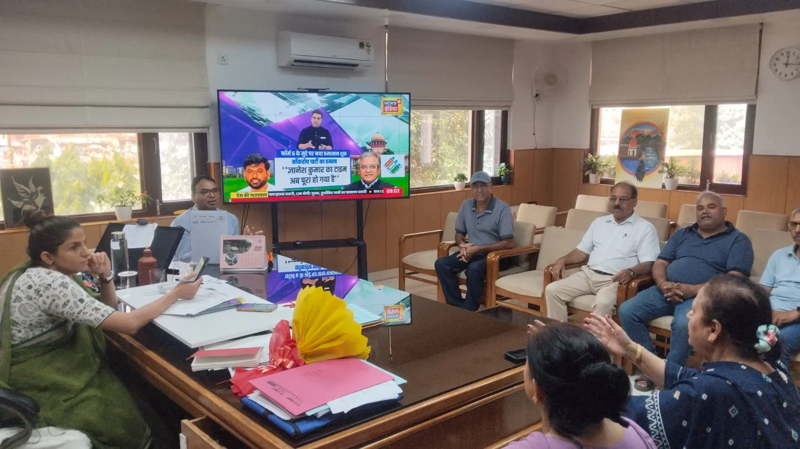
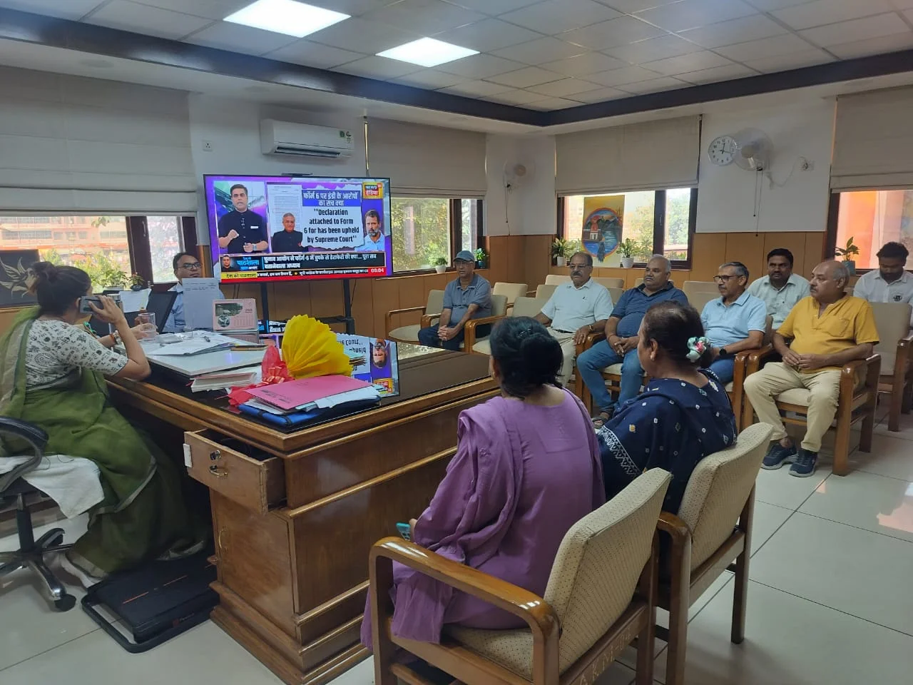

**हरिद्वार संवाददाता | आसिफ खान**

हरिद्वार। कुंभ मेला-2027 को लेकर हरिद्वार में विकास कार्यों ने रफ्तार पकड़नी शुरू कर दी है। इसी कड़ी में बिल्केश्वर क्षेत्र में पैदल आवागमन को सुरक्षित, सुगम और व्यवस्थित बनाने के लिए बड़े स्तर पर फुटपाथ एवं सड़क सुधार कार्य कराए जा रहे हैं। भगत सिंह चौक से बिल्केश्वर-मां मंसा देवी मार्ग तक लगभग 6.5 किलोमीटर लंबे पैडेस्ट्रियन फ्रेंडली फुटपाथ का निर्माण क्षेत्र की तस्वीर बदलने की दिशा में महत्वपूर्ण कदम माना जा रहा है। इस परियोजना के लिए 7.84 करोड़ रुपये स्वीकृत किए गए हैं।

विकास कार्यों को लेकर बिल्केश्वर कॉलोनी के प्रतिनिधिमंडल ने मंगलवार को मेलाधिकारी श्रीमती सोनिका से मुलाकात की। हरिद्वार सहकारी गृह निर्माण समिति की अध्यक्ष श्रीमती अंजना चड्ढा, सचिव श्री महेन्द्र अरोड़ा और कोषाध्यक्ष श्री संजीव वर्मन के नेतृत्व में पहुंचे प्रतिनिधिमंडल ने क्षेत्र में कराए जा रहे सड़क, फुटपाथ और सौंदर्यीकरण कार्यों की सराहना की। प्रतिनिधिमंडल ने इन कार्यों के लिए राज्य सरकार का आभार व्यक्त करते हुए क्षेत्र में नागरिक सुविधाओं का और विस्तार करने का आग्रह भी किया।

**6.5 किलोमीटर का फुटपाथ, पैदल चलने वालों को मिलेगी राहत**

बिल्केश्वर क्षेत्र में विकसित किया जा रहा पैडेस्ट्रियन फ्रेंडली फुटपाथ स्थानीय निवासियों के साथ-साथ हरिद्वार पहुंचने वाले श्रद्धालुओं के लिए भी उपयोगी साबित हो सकता है। परियोजना पूरी होने के बाद लोगों को बेहतर पैदल मार्ग उपलब्ध कराने, आवागमन को सुविधाजनक बनाने और क्षेत्र की व्यवस्था में सुधार लाने में मदद मिलेगी। सुबह की सैर करने वाले लोगों के लिए भी यह मार्ग एक बेहतर विकल्प बन सकेगा।

परियोजना के अंतर्गत रेज्ड फुटपाथ, सड़क के दोनों ओर पेव्ड शोल्डर्स, क्षतिग्रस्त सुरक्षा दीवारों का पुनर्निर्माण, मां मंसा देवी मार्ग का सुधारीकरण, केसी नालियों का निर्माण और आवश्यक स्थानों पर सड़क निर्माण सहित कई कार्य शामिल किए गए हैं।

**परियोजना की लागत पर भ्रम फैलाने का भी उठाया मुद्दा**

प्रतिनिधिमंडल ने मुलाकात के दौरान कहा कि परियोजना की लागत को लेकर कुछ लोगों द्वारा बढ़ा-चढ़ाकर गलत जानकारी प्रस्तुत किए जाने से भ्रम की स्थिति पैदा करने का प्रयास किया गया है। प्रतिनिधिमंडल ने इसे अनुचित बताते हुए कहा कि विकास कार्यों का मूल्यांकन वास्तविक तथ्यों और परियोजना में शामिल कार्यों के आधार पर किया जाना चाहिए।

स्थानीय निवासियों का कहना है कि फुटपाथ का निर्माण पूरा होने के बाद क्षेत्र के लोगों और बाहर से आने वाले श्रद्धालुओं को बेहतर एवं सुरक्षित पैदल आवागमन की सुविधा मिल सकेगी। इससे बिल्केश्वर क्षेत्र में नागरिक सुविधाओं के साथ-साथ श्रद्धालुओं की आवाजाही को भी व्यवस्थित करने में मदद मिलने की उम्मीद है।

**मेलाधिकारी सोनिका बोलीं—स्थानीय जरूरतों का भी रखा जा रहा ध्यान**

मेलाधिकारी श्रीमती सोनिका ने कहा कि कुंभ मेला-2027 की तैयारियों में श्रद्धालुओं की सुविधा के साथ स्थानीय नागरिकों की दीर्घकालीन आवश्यकताओं को भी प्राथमिकता दी जा रही है। उन्होंने कार्यों में गुणवत्ता और पारदर्शिता सुनिश्चित करने के लिए प्रभावी व्यवस्था किए जाने की बात कही।

मुलाकात के दौरान प्रतिनिधिमंडल में समिति के पदाधिकारी श्री वीरेन्द्र कुमार चड्ढा, श्री विवेक मिश्रा, श्री भारत केसवानी, श्रीमती गंगा सिंघल और श्री रणजीत सिंह सहित अन्य सदस्य शामिल रहे। इस अवसर पर अपर मेलाधिकारी श्री दयानंद सरस्वती भी उपस्थित रहे।

कुल मिलाकर, कुंभ-2027 के मद्देनजर बिल्केश्वर क्षेत्र में हो रहा अवस्थापना विकास स्थानीय निवासियों और श्रद्धालुओं के लिए महत्वपूर्ण माना जा रहा है। अब निगाहें इस बात पर रहेंगी कि निर्धारित गुणवत्ता के साथ निर्माण कार्य समय पर पूरे हों, ताकि लोगों को इन सुविधाओं का वास्तविक लाभ मिल सके।
