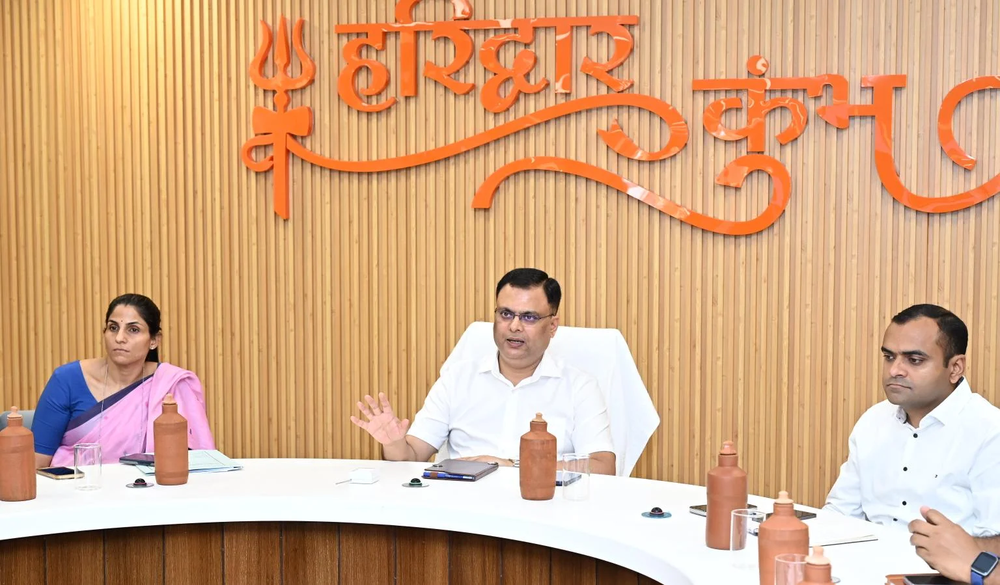
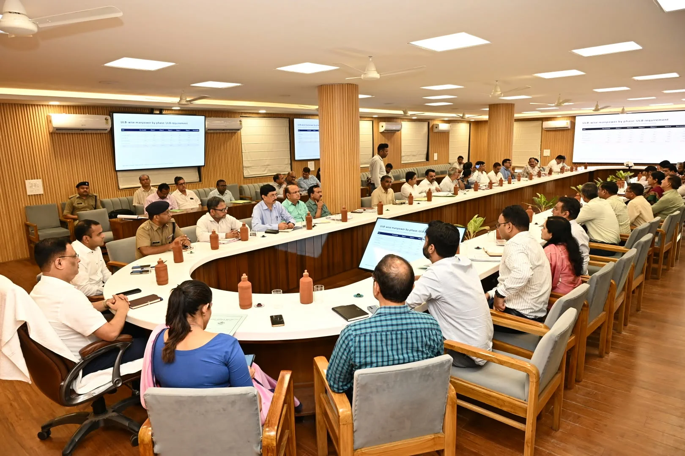
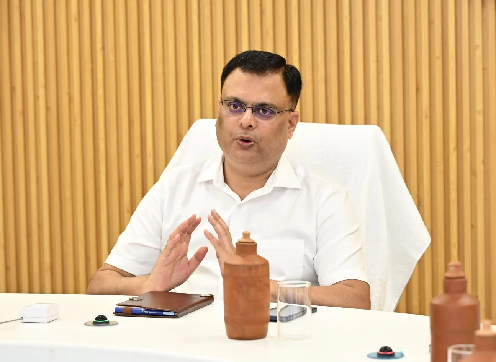
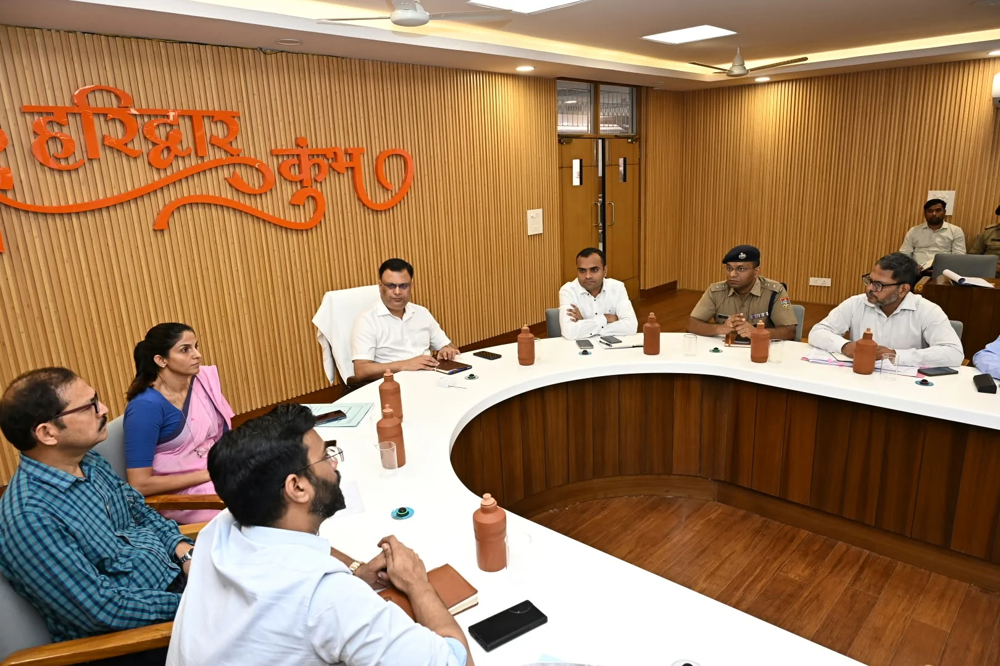
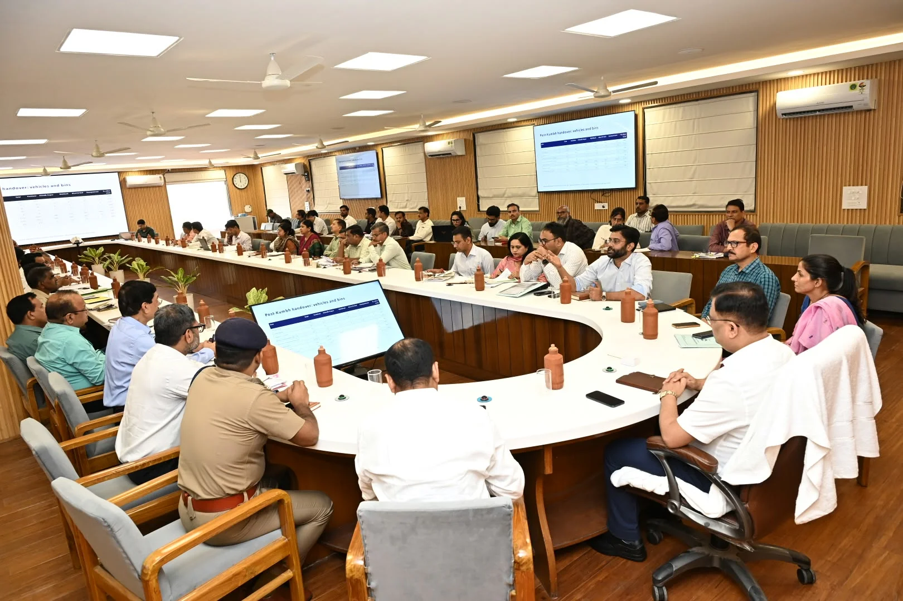

**हरिद्वार संवाददाता | आसिफ खान**

हरिद्वार। कुंभ मेला-2027 को स्वच्छ, व्यवस्थित और संक्रामक बीमारियों से मुक्त रखने के लिए शासन ने तैयारियों को तेज कर दिया है। कुंभ क्षेत्र के 32 सेक्टरों में सफाई एवं सेनिटेशन व्यवस्था को मजबूत बनाने के लिए हजारों टॉयलेट सीट, मूत्रालय और डस्टबिन स्थापित किए जाएंगे। सफाई व्यवस्था के संचालन के लिए 493 वाहनों की योजना तैयार की गई है। वहीं, तैयारियों में किसी भी तरह की कमी न रह जाए, इसके लिए शहरी विकास विभाग ने सभी संबंधित नगर निकायों, जिला पंचायतों और पंचायतीराज विभाग के अधिकारियों को एक सप्ताह के भीतर एकीकृत कार्ययोजना अंतिम रूप देकर प्रस्तुत करने के निर्देश दिए हैं।

शहरी विकास विभाग के सचिव नितेश कुमार झा ने सोमवार को मेला नियंत्रण भवन के सभागार में आयोजित बैठक में स्पष्ट किया कि कुंभ जैसे विशाल आयोजन में स्वच्छता व्यवस्था केवल कागजों तक सीमित नहीं रहनी चाहिए, बल्कि धरातल पर भी इसके पुख्ता इंतजाम सुनिश्चित किए जाने होंगे। बैठक में कुंभ क्षेत्र के सभी संबंधित निकायों और विभागों की तैयारियों की समीक्षा करते हुए आपसी समन्वय के साथ काम करने पर जोर दिया गया।

**32 सेक्टरों में हजारों टॉयलेट-मूत्रालय, 493 वाहन संभालेंगे सफाई व्यवस्था**

नगर आयुक्त नंदन कुमार ने बैठक में प्रस्तावित एकीकृत सेनिटेशन योजना का प्रस्तुतिकरण करते हुए बताया कि कुंभ मेला-2027 के दौरान कुंभ क्षेत्र के सभी 32 सेक्टरों में 13,865 टॉयलेट सीट, 8,065 एफआरपी मूत्रालय और 4,840 डस्टबिन स्थापित करने की तैयारी की जा रही है। सफाई व्यवस्था को सुचारु बनाए रखने के लिए 493 वाहनों के उपयोग की योजना है। सीवरेज के निस्तारण के लिए छह एफएसटीपी एवं सेक्टर एमटीएफ का उपयोग किया जाएगा।

इन व्यवस्थाओं का उद्देश्य मेला क्षेत्र में स्वच्छता बनाए रखना, कचरे का समुचित निस्तारण करना और श्रद्धालुओं को आवश्यक मूलभूत सुविधाएं उपलब्ध कराना है। हालांकि, इन प्रस्तावित व्यवस्थाओं की वास्तविक सफलता समय पर संसाधन उपलब्ध होने और योजनाओं के प्रभावी क्रियान्वयन पर निर्भर करेगी।

**ऑनलाइन डैशबोर्ड पर रहेगी नजर, हर निकाय को देनी होगी रिपोर्ट**

सफाई व्यवस्था में पारदर्शिता और जवाबदेही सुनिश्चित करने के लिए तैयारियों की ऑनलाइन मॉनिटरिंग की जाएगी। सचिव ने शहरी विकास विभाग के डैशबोर्ड पर कुंभ क्षेत्र के सभी नगर निकायों एवं जिला पंचायतों को मैप करने के निर्देश दिए, ताकि विभिन्न क्षेत्रों में चल रहे कार्यों और व्यवस्थाओं की नियमित निगरानी की जा सके।

नगर निगम हरिद्वार के नगर आयुक्त नंदन कुमार को एकीकृत सेनिटेशन योजना के क्रियान्वयन एवं समन्वय की जिम्मेदारी सौंपी गई है। सभी संबंधित निकायों और विभागों को अपनी कार्ययोजना तथा कार्यों की प्रगति की रिपोर्ट नियमित रूप से समन्वय अधिकारी को उपलब्ध करानी होगी।

**मेला शुरू होने से पहले, दौरान और बाद की भी बनेगी योजना**

सचिव शहरी विकास ने निर्देश दिए कि एकीकृत कार्ययोजना में कुंभ मेला शुरू होने से पहले, मेला अवधि के दौरान और मेला समाप्त होने के बाद की व्यवस्थाओं को भी स्पष्ट रूप से शामिल किया जाए। सफाई कर्मियों, वाहनों, उपकरणों, सामग्री और अन्य आवश्यक संसाधनों का आकलन कर उनकी समय से उपलब्धता सुनिश्चित करने को कहा गया।

उन्होंने यह भी स्पष्ट किया कि जरूरत पड़ने पर संसाधनों की कमी को अन्य मदों से पूरा करने की व्यवस्था की जा सकती है। खरीदे जाने वाले उपकरणों एवं साजो-सामान की समय पर उपलब्धता, सेक्टरवार वितरण और मेला समाप्त होने के बाद उनके उपयोग की योजना भी पहले से तैयार की जाएगी।

**हरिद्वार से ऋषिकेश और रुड़की तक सफाई पर फोकस**

बैठक में हरिद्वार नगर निगम के साथ ऋषिकेश एवं रुड़की नगर निगम, शिवालिक नगर नगर पालिका तथा मुनिकीरेती और स्वर्गाश्रम नगर पंचायतों की प्रस्तावित तैयारियों की जानकारी ली गई। अधिकारियों को निर्देश दिए गए कि कुंभ नगरी की ओर आने वाले प्रमुख मार्गों के साथ-साथ ग्रामीण क्षेत्रों, जिला पंचायतों और आसपास के नगर निकायों में भी सफाई के समुचित प्रबंध किए जाएं।

इसके साथ ही स्ट्रीट लाइटों की स्थापना के लिए आवश्यक समन्वय स्थापित करने और कुंभ मेला से जुड़े निर्माण कार्यों की प्रगति पर नियमित नजर रखने को कहा गया।

**दिसंबर से सफाई कर्मियों की तैनाती, प्रशिक्षण पर भी जोर**

कुंभ तैयारियों के प्रारंभिक चरण में दिसंबर माह की शुरुआत से ही आवश्यक संख्या में सफाई कर्मियों की तैनाती करने के निर्देश दिए गए हैं। कर्मचारियों को मक्खी-मच्छरों की रोकथाम में इस्तेमाल होने वाले रसायनों के सुरक्षित उपयोग, उपकरणों के संचालन और अन्य जरूरी व्यवस्थाओं की हैंडलिंग का प्रशिक्षण भी दिया जाएगा, ताकि मेला अवधि में स्वच्छता संबंधी कार्यों को प्रभावी ढंग से संचालित किया जा सके।

**सर्वानंद घाट से लगी मेला भूमि का निरीक्षण**

बैठक के बाद सचिव शहरी विकास ने सर्वानंद घाट से लगी मेला भूमि का निरीक्षण किया और वहां प्रस्तावित व्यवस्थाओं की जानकारी ली। इस दौरान मुख्य विकास अधिकारी डॉ. ललित नारायण मिश्र भी मौजूद रहे।

बैठक में मेलाधिकारी सोनिका, आईजी (कुंभ) डॉ. योगेन्द्र सिंह रावत, जिलाधिकारी मयूर दीक्षित, एसएसपी (कुंभ) आयुष अग्रवाल, नगर आयुक्त नंदन कुमार, अपर मेलाधिकारी दयानंद सरस्वती, अपर मेलाधिकारी आकाश जोशी, मनजीत सिंह, शहरी विकास विभाग के उप सचिव प्रदीप शुक्ला, विषय विशेषज्ञ रवि पाण्डे सहित कुंभ क्षेत्र के विभिन्न नगर निकायों के अधिकारी तथा हरिद्वार, देहरादून, टिहरी गढ़वाल एवं पौड़ी गढ़वाल के जिला पंचायत राज अधिकारी और जिला पंचायतों के अपर मुख्य अधिकारी उपस्थित रहे।

अब सबसे बड़ी चुनौती इन तैयारियों को समयबद्ध तरीके से जमीन पर उतारने की होगी। हजारों शौचालयों, मूत्रालयों, डस्टबिनों और सैकड़ों वाहनों की प्रस्तावित व्यवस्था के बीच विभागों के आपसी समन्वय, संसाधनों की उपलब्धता और नियमित निगरानी की अहम भूमिका रहेगी। कुंभ-2027 में स्वच्छता के इन इंतजामों की असली परीक्षा श्रद्धालुओं की बढ़ती भीड़ के बीच होगी।
