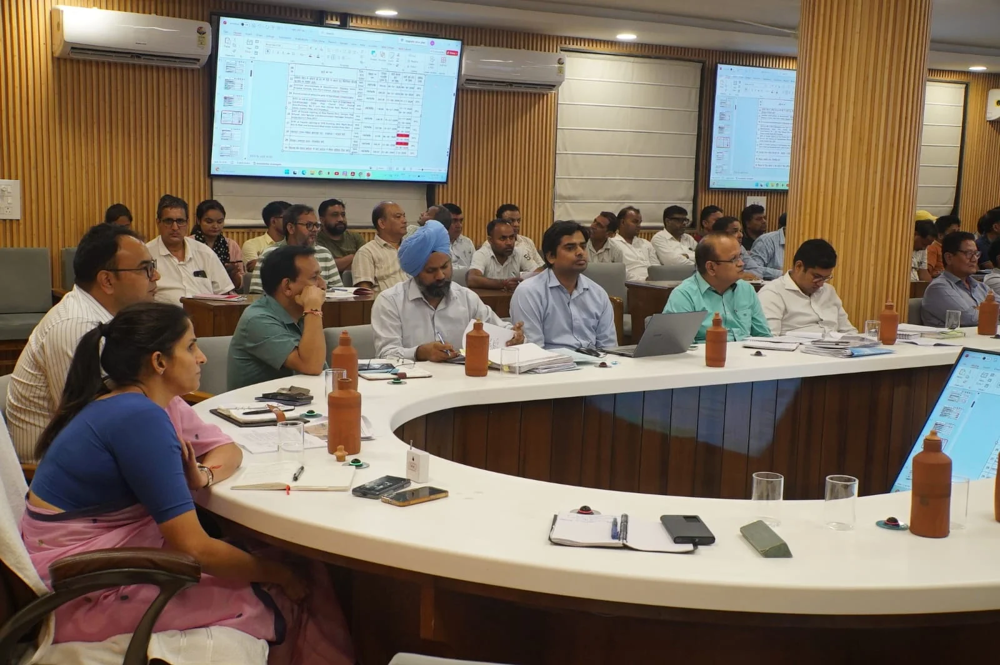
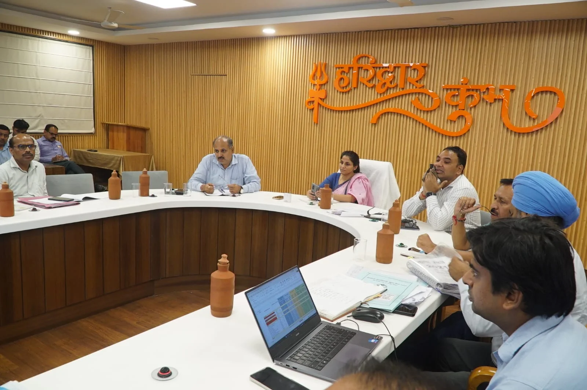
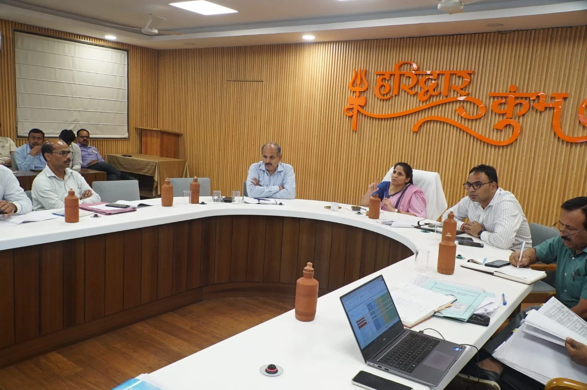

**हरिद्वार संवाददाता | आसिफ खान**

हरिद्वार। कुंभ मेला-2027 की तैयारियों में अब लापरवाही और सुस्ती के लिए जगह नहीं बचेगी। अवस्थापना विकास कार्यों को समय पर पूरा कराने के लिए मेला प्रशासन ने निगरानी का शिकंजा कस दिया है। मेलाधिकारी श्रीमती सोनिका ने कार्यदायी संस्थाओं को स्पष्ट निर्देश दिए हैं कि बड़ी परियोजनाओं में जरूरत के अनुसार रात की पाली में भी काम कराया जाए। अब परियोजनाओं की प्रगति पर केवल दिन में ही नहीं, बल्कि 24 घंटे नजर रखी जाएगी। काम में देरी होने पर संबंधित स्तर पर जवाबदेही भी तय की जाएगी।

**रात-दिन काम, हर दिन समीक्षा; लापरवाही पर तय होगी जिम्मेदारी**

सोमवार को सीसीआर में आयोजित समीक्षा बैठक में मेलाधिकारी सोनिका ने कुंभ मेला-2027 के तहत चल रहे विकास कार्यों की प्रगति का जायजा लिया। उन्होंने सभी कार्यदायी संस्थाओं को मानव संसाधन, मशीनरी और अन्य जरूरी संसाधन बढ़ाने के निर्देश दिए। स्पष्ट किया गया कि जिन परियोजनाओं में काम की गति बढ़ाने की जरूरत है, वहां अतिरिक्त संसाधन लगाकर दिन और रात दोनों पालियों में काम कराया जाए।

मेलाधिकारी ने कहा कि निर्धारित समयसीमा में परियोजनाओं को पूरा करना प्राथमिकता है, लेकिन तेजी के नाम पर निर्माण की गुणवत्ता से कोई समझौता नहीं किया जाएगा। प्रत्येक परियोजना की प्रगति की प्रतिदिन समीक्षा होगी और निर्धारित समय पर काम पूरा नहीं होने की स्थिति में जिम्मेदारी तय की जाएगी।

**24 घंटे कंट्रोल रूम की नजर, रात में भी होंगे औचक निरीक्षण**

कुंभ के निर्माण कार्यों की निगरानी के लिए 24 घंटे संचालित नियंत्रण कक्ष को सक्रिय भूमिका सौंपी गई है। कार्यदायी संस्थाओं को प्रतिदिन शिफ्टवार प्रगति, कार्यस्थल पर तैनात कर्मचारियों और उपलब्ध मशीनरी की जानकारी नियंत्रण कक्ष को देनी होगी।

रात की पाली में चल रहे कार्यों की जांच के लिए संबंधित विभागों के अधिकारियों के साथ मेला प्रशासन के अधिकारी भी औचक निरीक्षण करेंगे। इससे कार्यस्थलों पर संसाधनों की उपलब्धता, काम की गति और निर्धारित मानकों के अनुपालन की निगरानी की जाएगी।

**हर निर्माण स्थल पर लगेगा सूचना बोर्ड, जनता को मिलेगी पूरी जानकारी**

मेलाधिकारी सोनिका ने प्रत्येक कार्यस्थल पर परियोजना से जुड़ी जानकारी वाला बोर्ड प्रमुखता से लगाने के निर्देश भी दिए। बोर्ड पर परियोजना का नाम, कुल लागत, कार्यदायी संस्था, संबंधित अधिकारियों के नाम, उनके दूरभाष नंबर और अनुबंध के अनुसार कार्य पूरा होने की निर्धारित तिथि स्पष्ट रूप से अंकित करनी होगी।

उन्होंने कहा कि सूचना बोर्ड ऐसी जगह लगाए जाएं, जहां आम नागरिक आसानी से जानकारी देख सकें। इससे स्थानीय लोगों और जनप्रतिनिधियों को विकास कार्यों की स्थिति जानने में सुविधा मिलेगी और पारदर्शिता भी बढ़ेगी। निर्देशों का पालन नहीं करने वाले अधिकारियों के विरुद्ध सख्त कार्रवाई की जाएगी।

**गुणवत्ता जांच में भी सख्ती, हर अहम चरण पर होगी पड़ताल**

निर्माण कार्यों की गुणवत्ता सुनिश्चित करने के लिए थर्ड पार्टी जांच एजेंसियों को भी नियमित निरीक्षण के निर्देश दिए गए हैं। एजेंसियों को न केवल गुणवत्ता की जांच करनी होगी, बल्कि परियोजनाओं की समयसीमा के अनुरूप प्रगति रिपोर्ट भी उपलब्ध करानी होगी।

मेलाधिकारी ने स्पष्ट किया कि गुणवत्ता की जांच केवल निर्माण पूरा होने के बाद की औपचारिकता नहीं होनी चाहिए। परियोजना के प्रत्येक महत्वपूर्ण चरण में गुणवत्ता की प्रभावी जांच सुनिश्चित की जाए, ताकि निर्माण में किसी प्रकार की कमी सामने आने पर समय रहते सुधार किया जा सके।

**रोड़ी बेलवाला, हर की पैड़ी और एडमिन रोड पर भी बढ़ेगी रफ्तार**

बैठक में यूआईआईडीबी के माध्यम से संचालित रोड़ी बेलवाला पुनर्विकास, हर की पैड़ी पुनर्विकास और एडमिन रोड से संबंधित कार्यों की भी समीक्षा की गई। मेलाधिकारी ने संबंधित एजेंसियों को इन महत्वपूर्ण परियोजनाओं में तेजी लाने और निर्धारित समयसीमा के भीतर काम पूरा करने के निर्देश दिए।

इन परियोजनाओं के लिए पर्याप्त कर्मचारी, मशीनरी और अन्य जरूरी संसाधन उपलब्ध कराने के साथ आवश्यकता के अनुसार दिन-रात कार्य कराने पर जोर दिया गया। इन कार्यों की प्रगति पर भी 24 घंटे निगरानी रखी जाएगी।

**जनप्रतिनिधियों और स्थानीय नागरिकों से संवाद के निर्देश**

मेलाधिकारी ने अधिकारियों को निर्देश दिए कि अपने-अपने क्षेत्रों में संचालित परियोजनाओं की जानकारी स्थानीय जनप्रतिनिधियों और नागरिकों को नियमित रूप से उपलब्ध कराई जाए। इसका उद्देश्य विकास कार्यों को लेकर भ्रम और संवादहीनता की स्थिति से बचना तथा आमजन को परियोजनाओं की वास्तविक स्थिति से अवगत कराना है।

उन्होंने कहा कि कुंभ मेला-2027 की तैयारियों के लिए उपलब्ध समय का अधिकतम उपयोग जरूरी है। सभी कार्यदायी संस्थाएं तय लक्ष्यों के अनुसार काम करें और प्रगति में तेजी लाने के लिए आवश्यक कदम उठाएं।

**बैठक में ये अधिकारी रहे मौजूद**

बैठक में मुख्य विकास अधिकारी डॉ. ललित नारायण मिश्र, अपर मेलाधिकारी दयानंद सरस्वती, उप मेलाधिकारी आकाश जोशी एवं मनजीत सिंह, यूपीडीसीसी के महाप्रबंधक मनोज कुमार, अधीक्षण अभियंता टेक्निकल सेल मनोज भट्ट, अधीक्षण अभियंता लोक निर्माण विभाग डीपी सिंह सहित विभिन्न कार्यदायी संस्थाओं के अधिशासी अभियंता और अन्य अभियंता उपस्थित रहे।

**STAR NEWS 11 की नजर:** कुंभ-2027 की तैयारियों को समय पर पूरा कराने के लिए मेला प्रशासन ने निगरानी, गुणवत्ता जांच और जवाबदेही पर जोर दिया है। अब देखना होगा कि इन सख्त निर्देशों के बाद निर्माण कार्यों की रफ्तार कितनी बढ़ती है और तय समयसीमा में परियोजनाएं किस हद तक पूरी हो पाती हैं।
