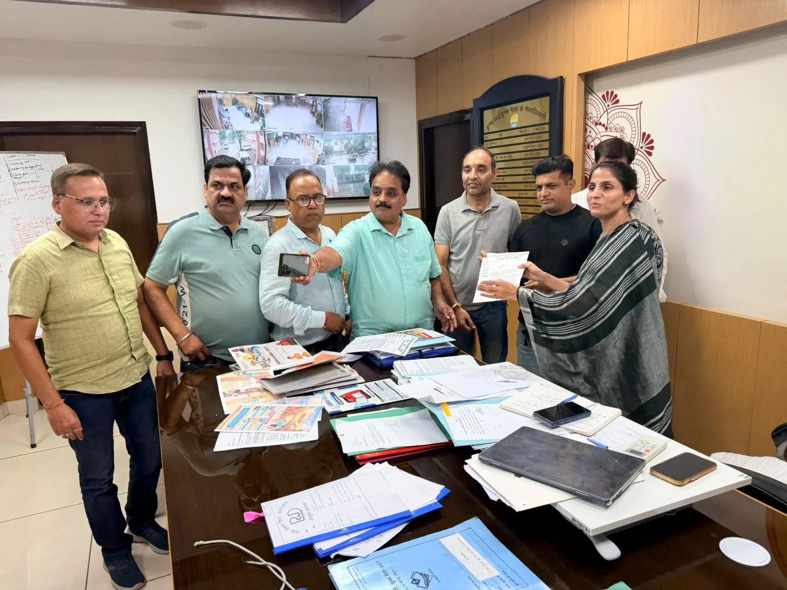
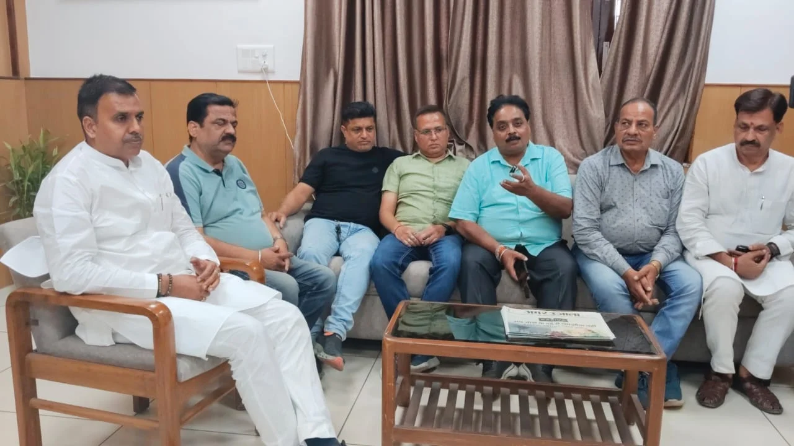

**हरिद्वार संवाददाता | आसिफ खान**

हरिद्वार। कुंभ मेला-2027 की तैयारियों के बीच हरिद्वार के व्यापारियों ने शहर की बुनियादी सुविधाओं को लेकर मेला प्रशासन के सामने अपनी मांगें रखी हैं। प्रांतीय उद्योग व्यापार मंडल के प्रतिनिधिमंडल ने बुधवार को मेलाधिकारी श्रीमती सोनिका और अपर मेलाधिकारी श्री दयानंद सरस्वती से मुलाकात कर व्यापारियों, स्थानीय नागरिकों और श्रद्धालुओं की सुविधाओं से जुड़े मुद्दों पर विस्तार से चर्चा की। प्रतिनिधिमंडल ने कुंभ मेला मद से पार्किंग व्यवस्था के विस्तार सहित अन्य आवश्यक नागरिक सुविधाओं को प्राथमिकता देने का आग्रह किया।

व्यापार मंडल ने स्पष्ट किया कि कुंभ जैसे विशाल धार्मिक आयोजन की तैयारियां केवल मेला अवधि तक सीमित नहीं रहनी चाहिए, बल्कि ऐसे स्थायी विकास कार्य होने चाहिए, जिनका लाभ हरिद्वार को आने वाले वर्षों तक मिलता रहे। प्रतिनिधिमंडल ने शहर में सड़कों के सुदृढ़ीकरण, फुटपाथ निर्माण, चौराहों के सुधार और आधारभूत सुविधाओं के विकास के लिए किए जा रहे प्रयासों की सराहना करते हुए सरकार एवं मेला प्रशासन का आभार व्यक्त किया।

**पार्किंग व्यवस्था पर विशेष जोर, व्यापारियों और श्रद्धालुओं को मिले राहत**

प्रतिनिधिमंडल ने मेला प्रशासन के समक्ष पार्किंग की उपलब्धता और नागरिक सुविधाओं के विस्तार का मुद्दा प्रमुखता से उठाया। व्यापार मंडल का कहना है कि कुंभ के दौरान बड़ी संख्या में श्रद्धालुओं और यात्रियों के हरिद्वार पहुंचने की संभावना को देखते हुए व्यवस्थाओं को समय रहते मजबूत करना आवश्यक है। बेहतर पार्किंग व्यवस्था से शहर में यातायात का दबाव कम करने और व्यापारिक गतिविधियों को सुचारु बनाए रखने में भी मदद मिल सकती है।

व्यापारियों ने स्थानीय नागरिकों की दैनिक जरूरतों को ध्यान में रखते हुए संपर्क मार्गों, पैदल आवागमन और अन्य सार्वजनिक सुविधाओं को बेहतर बनाने पर जोर दिया। उनका कहना है कि कुंभ की तैयारियों में शहर के स्थायी विकास को प्राथमिकता देना भविष्य के लिए भी महत्वपूर्ण साबित होगा।

**मेलाधिकारी सोनिका ने दिया समुचित कार्रवाई का भरोसा**

मेलाधिकारी श्रीमती सोनिका एवं अपर मेलाधिकारी श्री दयानंद सरस्वती ने प्रतिनिधिमंडल को बताया कि कुंभ मेला-2027 की तैयारियों में व्यापारियों सहित सभी संबंधित पक्षों के सुझावों और फीडबैक को महत्वपूर्ण माना जा रहा है। उन्होंने कहा कि योजनाबद्ध तरीके से कार्य कराए जा रहे हैं, ताकि कुंभ की व्यवस्थाओं के साथ हरिद्वार शहर की दीर्घकालीन आवश्यकताओं को भी पूरा किया जा सके।

अधिकारियों ने प्रतिनिधिमंडल की ओर से उठाए गए मुद्दों पर समुचित कार्रवाई का भरोसा दिलाया। उन्होंने बताया कि शहर के आंतरिक क्षेत्रों में संपर्क मार्गों और नागरिक सुविधाओं को बेहतर बनाने के साथ पार्किंग व्यवस्था को सुदृढ़ करने पर भी विशेष ध्यान दिया जा रहा है।

**फुटपाथ निर्माण और सड़क सुधार को बताया दूरगामी कदम**

मुलाकात के बाद व्यापार मंडल के पदाधिकारियों ने कुंभ मेला-2027 के तहत कराए जा रहे स्थायी प्रकृति के विकास कार्यों की सराहना की। उन्होंने कहा कि फुटपाथ निर्माण से प्रमुख मंदिरों और धार्मिक स्थलों तक पैदल पहुंच अधिक सुरक्षित एवं सुविधाजनक बनाने में मदद मिलेगी। वहीं, सड़कों के सुदृढ़ीकरण और चौराहों के सुधार से शहर की यातायात व्यवस्था तथा आधारभूत सुविधाओं को मजबूती मिलने की उम्मीद है।

व्यापार मंडल ने निर्माण कार्यों में गुणवत्ता और पारदर्शिता बनाए रखने के प्रयासों को भी महत्वपूर्ण बताया। पदाधिकारियों के अनुसार, इन योजनाओं का लाभ केवल कुंभ के दौरान ही नहीं, बल्कि मेला समाप्त होने के बाद भी स्थानीय नागरिकों, व्यापारियों और श्रद्धालुओं को मिलता रहेगा। शहर के सौंदर्यीकरण तथा सार्वजनिक सुविधाओं के विकास से हरिद्वार में भविष्य के बड़े आयोजनों के लिए भी बेहतर आधार तैयार होगा।

**व्यापार मंडल के प्रतिनिधिमंडल में ये पदाधिकारी रहे शामिल**

प्रतिनिधिमंडल में प्रांतीय उद्योग व्यापार मंडल के जिलाध्यक्ष श्री संजीव नैयर, जिला प्रभारी एवं प्रदेश मंत्री श्री विजय शर्मा, प्रदेश सचिव श्री कमल बृजवासी, जिला महामंत्री श्री प्रदीप कालरा, हरिद्वार तहसील अध्यक्ष श्री राहुल शर्मा सहित अन्य पदाधिकारी शामिल रहे।

अब निगाहें अमल पर: व्यापार मंडल की इस मुलाकात में पार्किंग विस्तार, संपर्क मार्गों के सुधार और नागरिक सुविधाओं को लेकर अहम मुद्दे सामने आए हैं। अब इन मांगों पर होने वाली कार्रवाई और धरातल पर मिलने वाले परिणामों से तय होगा कि कुंभ-2027 की तैयारियां हरिद्वार के व्यापारियों, स्थानीय लोगों और श्रद्धालुओं के लिए कितनी सुविधाजनक साबित होती हैं।
