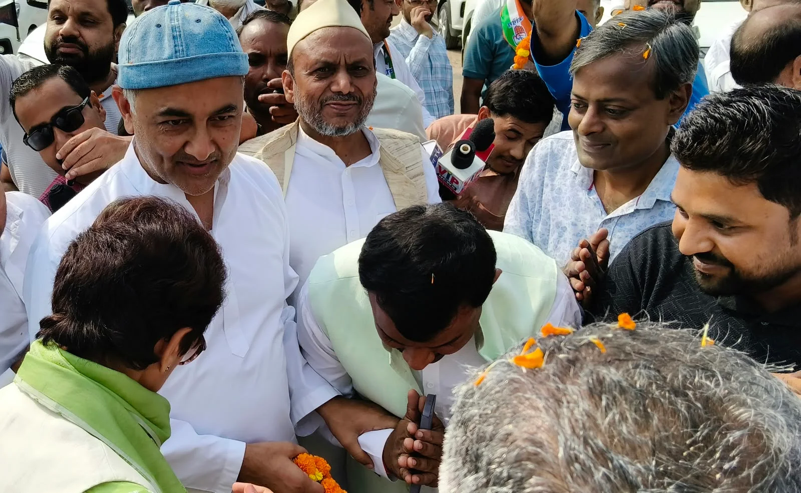

**रुड़की संवाददाता | आसिफ खान**

नारसन/रुड़की। उत्तराखंड में कांग्रेस ने ‘वोट चोरी’ के मुद्दे को लेकर अपनी सियासी सक्रियता तेज कर दी है। इसी क्रम में उत्तराखंड कांग्रेस की प्रदेश प्रभारी कुमारी शैलजा के हरिद्वार आगमन पर नारसन बॉर्डर पर कांग्रेस कार्यकर्ताओं ने जोरदार स्वागत किया। बड़ी संख्या में जुटे पार्टी कार्यकर्ताओं ने नारेबाजी और उत्साहपूर्ण माहौल के बीच प्रदेश प्रभारी का अभिनंदन किया। हरिद्वार में प्रस्तावित विशाल जनसभा एवं विरोध-प्रदर्शन में शामिल होने पहुंचीं कुमारी शैलजा के स्वागत को कांग्रेस ने अपनी राजनीतिक ताकत के प्रदर्शन के रूप में पेश किया।

नारसन बॉर्डर पर आयोजित स्वागत कार्यक्रम में कांग्रेस नेताओं और कार्यकर्ताओं की भारी मौजूदगी देखने को मिली। इस दौरान प्रदेश प्रभारी कुमारी शैलजा ने कार्यकर्ताओं को संबोधित करते हुए चुनाव आयोग की कार्यप्रणाली पर गंभीर सवाल उठाए। उन्होंने आरोप लगाया कि चुनाव आयोग सत्ताधारी दल के पक्ष में काम कर रहा है और बड़ी संख्या में आम नागरिकों के वोट काटे जा रहे हैं। उन्होंने कहा कि मताधिकार लोकतंत्र की बुनियाद है और यदि किसी पात्र नागरिक का नाम मतदाता सूची से हटाया जाता है, तो यह बेहद गंभीर विषय है।

**‘वोट चोरी’ के मुद्दे पर आर-पार की लड़ाई का ऐलान**

कुमारी शैलजा ने कहा कि कांग्रेस पार्टी देशभर में कथित वोट चोरी के मुद्दे को लेकर मुखर है और इस मामले में अपना संघर्ष जारी रखेगी। उन्होंने मुख्य चुनाव आयुक्त ज्ञानेश कुमार के इस्तीफे की मांग दोहराते हुए कहा कि जब तक वह इस्तीफा नहीं देते, कांग्रेस का संघर्ष जारी रहेगा। उनके इस बयान के बाद कार्यक्रम में राजनीतिक माहौल और गरमा गया।

प्रदेश प्रभारी ने कार्यकर्ताओं को एकजुट होकर जनता के बीच जाने और मतदाता सूची से जुड़े मुद्दों को मजबूती से उठाने का संदेश दिया। हरिद्वार में होने वाली जनसभा और विरोध-प्रदर्शन को भी इसी राजनीतिक अभियान की अहम कड़ी माना जा रहा है। कांग्रेस नेताओं का जोर इस बात पर रहा कि लोकतांत्रिक अधिकारों और मतदाताओं के हितों से जुड़े सवालों को व्यापक स्तर पर उठाया जाए।

**पूर्व मेयर गौरव गोयल की मौजूदगी भी रही चर्चा में**

नारसन बॉर्डर पर प्रदेश प्रभारी के स्वागत कार्यक्रम में पूर्व मेयर गौरव गोयल भी प्रमुख रूप से मौजूद रहे। उनके साथ अन्य कांग्रेस नेताओं और कार्यकर्ताओं ने कुमारी शैलजा का स्वागत कर कार्यक्रम में भागीदारी की। रुड़की क्षेत्र की राजनीति में सक्रिय रहे गौरव गोयल की उपस्थिति ने स्थानीय स्तर पर इस कार्यक्रम को राजनीतिक दृष्टि से भी महत्वपूर्ण बनाया।

पूर्व मेयर गौरव गोयल समेत स्थानीय नेताओं और कार्यकर्ताओं की मौजूदगी ने यह संकेत दिया कि हरिद्वार और रुड़की क्षेत्र में कांग्रेस अपने संगठनात्मक संपर्क और राजनीतिक गतिविधियों को सक्रिय रखने में जुटी है। प्रदेश प्रभारी के स्वागत के लिए जुटे कार्यकर्ताओं ने कार्यक्रम के दौरान उत्साह दिखाया। हालांकि, इस आयोजन का वास्तविक राजनीतिक प्रभाव आगामी कार्यक्रमों और जनसमर्थन के आधार पर ही आंका जा सकेगा।

**कई वरिष्ठ नेताओं ने किया स्वागत**

प्रदेश प्रभारी कुमारी शैलजा का स्वागत करने वालों में विधायक काजी निजामुद्दीन, पूर्व मेयर गौरव गोयल, जितेंद्र पंवार, मोनू प्रधान, चेयरमैन मोइनुद्दीन अंसारी, राव शेर मोहम्मद, पूर्व पालिकाध्यक्ष मोहम्मद इस्लाम, गौरव गर्ग, तुषार गोयल, अनूप शर्मा और दीपक वर्मा सहित अनेक नेता एवं कार्यकर्ता शामिल रहे।

इसके अतिरिक्त विभिन्न स्थानों पर भी कांग्रेस कार्यकर्ताओं ने प्रदेश प्रभारी का स्वागत किया। नारसन बॉर्डर पर जुटी भीड़ और नेताओं की सक्रिय भागीदारी ने हरिद्वार में होने वाली जनसभा एवं विरोध-प्रदर्शन को लेकर पार्टी कार्यकर्ताओं के उत्साह को सामने रखा।

कुल मिलाकर, कुमारी शैलजा का नारसन बॉर्डर पर स्वागत केवल औपचारिक अभिनंदन तक सीमित नहीं रहा, बल्कि यह कांग्रेस के मतदाता सूची और कथित वोट चोरी से जुड़े मुद्दों पर चलाए जा रहे राजनीतिक अभियान का हिस्सा भी बना। अब निगाहें हरिद्वार में होने वाली जनसभा और विरोध-प्रदर्शन पर रहेंगी, जहां कांग्रेस इस मुद्दे को किस तरह जनता के बीच उठाती है, यह देखना महत्वपूर्ण होगा।
