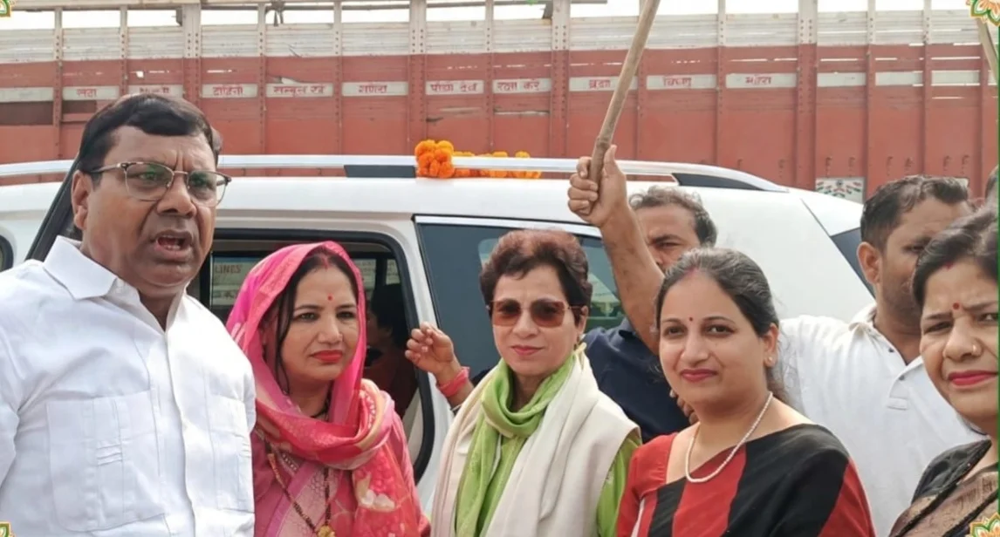

रूडकी संवाददाता | आसिफ खान 

दिल्ली से उत्तराखंड पहुंचीं कांग्रेस की प्रदेश प्रभारी एवं वरिष्ठ कांग्रेस नेत्री कुमारी शैलजा का रुड़की बाईपास स्थित नगला हाईवे पर जोरदार स्वागत एवं अभिनंदन किया गया। इस दौरान रुड़की विधानसभा-31 से पूजा गुप्ता ने पुष्पमाला भेंट कर उनका गर्मजोशी के साथ स्वागत किया। स्वागत कार्यक्रम में कांग्रेस कार्यकर्ताओं का उत्साह देखने लायक रहा।

कुमारी शैलजा के आगमन पर पूजा गुप्ता ने उनका अभिनंदन करते हुए कांग्रेस संगठन के प्रति अपनी प्रतिबद्धता और सक्रियता का परिचय दिया। उन्होंने पूरे सम्मान और उत्साह के साथ प्रदेश प्रभारी का स्वागत कर कांग्रेस नेतृत्व के प्रति अपना विश्वास व्यक्त किया। उनके नेतृत्व में आयोजित स्वागत कार्यक्रम ने रुड़की विधानसभा क्षेत्र में कांग्रेस की सक्रियता को भी सामने रखा।

**पूजा गुप्ता ने दिखाया संगठन के प्रति उत्साह**

रुड़की विधानसभा-31 से पूजा गुप्ता ने कुमारी शैलजा का स्वागत कर यह संदेश देने का प्रयास किया कि क्षेत्र में कांग्रेस संगठन को मजबूत बनाने और पार्टी के वरिष्ठ नेतृत्व के साथ समन्वय बनाए रखने के लिए कार्यकर्ता पूरी तरह सक्रिय हैं। पुष्पमाला भेंट कर किए गए स्वागत के दौरान उन्होंने प्रदेश प्रभारी के प्रति सम्मान प्रकट किया। कार्यक्रम में उनकी सक्रिय भागीदारी ने स्वागत समारोह को खास बनाया।

कांग्रेस की प्रदेश प्रभारी कुमारी शैलजा के स्वागत के दौरान पार्टी के प्रति कार्यकर्ताओं का उत्साह और आपसी एकजुटता देखने को मिली। नगला हाईवे पर आयोजित इस कार्यक्रम में कांग्रेस नेताओं एवं कार्यकर्ताओं ने पूरे जोश के साथ अपनी उपस्थिति दर्ज कराई।

**स्वागत कार्यक्रम में कांग्रेस के पदाधिकारी और कार्यकर्ता मौजूद रहे।**
