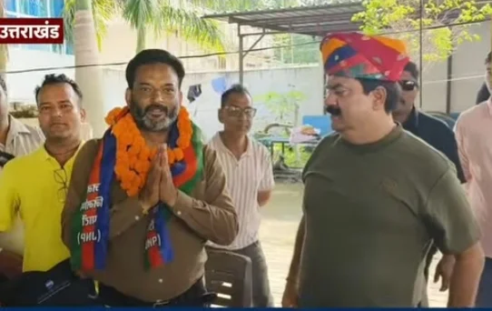
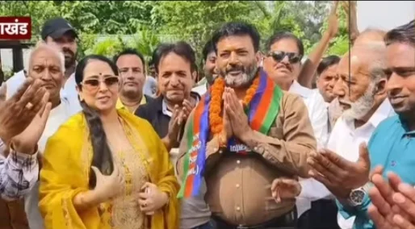
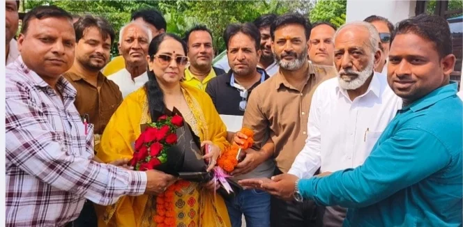

**हरिद्वार/रुड़की संवाददाता | आसिफ खान**

रुड़की। रुड़की विधानसभा की सियासत में वर्ष 2027 के चुनाव से पहले हलचल तेज होने लगी है। राजनीतिक दलों के बीच अपनी जमीन मजबूत करने की कवायद जारी है, वहीं अब पत्रकारिता जगत से जुड़े वरिष्ठ पत्रकार दीपक शर्मा ने भी चुनावी मैदान में उतरने की तैयारी का खुला संकेत दे दिया है। करीब दो दशक तक पत्रकारिता के क्षेत्र में सक्रिय रहने के बाद दीपक शर्मा ने जन निर्माण पार्टी का दामन थाम लिया है। पत्रकारों के साथ बैठक, पैदल रोड शो और पार्टी की सदस्यता ग्रहण करने के घटनाक्रम ने उनकी राजनीतिक पारी को चर्चा के केंद्र में ला दिया है।

दीपक शर्मा का अगला लक्ष्य रुड़की विधानसभा सीट से वर्ष 2027 का चुनाव लड़ना है। बुधवार को प्रेस क्लब भवन में पत्रकार साथियों के साथ बैठक के बाद उन्होंने पैदल रोड शो किया और जन निर्माण पार्टी की राष्ट्रीय अध्यक्ष सोनिया शर्मा के कैंप कार्यालय पहुंचे। यहां सोनिया शर्मा ने उनका स्वागत करते हुए पार्टी की सदस्यता दिलाई। इस दौरान विधानसभा चुनाव में टिकट को लेकर सकारात्मक आश्वासन भी दिया गया। हालांकि, पार्टी की ओर से अभी अंतिम टिकट की औपचारिक घोषणा नहीं हुई है।

**पत्रकारिता से राजनीति तक: दीपक शर्मा ने बदला अपना मैदान**

करीब दो दशक की पत्रकारिता के अनुभव के साथ दीपक शर्मा ने अब राजनीतिक पारी की ओर कदम बढ़ा दिए हैं। रुड़की शहर और आसपास के क्षेत्रों की समस्याओं को करीब से देखने-समझने का दावा करने वाले दीपक शर्मा का कहना है कि अब वह जनसमस्याओं को लेकर जनता के बीच सक्रिय भूमिका निभाना चाहते हैं।

प्रेस क्लब भवन में आयोजित बैठक में पत्रकार साथियों के साथ उनके राजनीतिक फैसले पर चर्चा हुई। इसके बाद पत्रकारों के साथ पैदल रोड शो करते हुए पार्टी कार्यालय पहुंचना उनकी चुनावी तैयारी का अहम घटनाक्रम रहा। पार्टी की सदस्यता ग्रहण करने के बाद दीपक शर्मा ने स्पष्ट संकेत दिया कि वर्ष 2027 के विधानसभा चुनाव को लेकर उनकी तैयारी शुरू हो चुकी है।

रुड़की की राजनीति में अब सवाल यह है कि पत्रकारिता के अनुभव को दीपक शर्मा किस तरह जनसमर्थन में बदलते हैं और चुनावी मुकाबले में अपनी दावेदारी को कितना मजबूत बना पाते हैं। आने वाले महीनों में उनका जनसंपर्क और जनता के मुद्दों पर सक्रियता उनकी राजनीतिक दिशा तय करने में महत्वपूर्ण भूमिका निभा सकती है।

**सोनिया शर्मा से मुलाकात के बाद बढ़ी राजनीतिक चर्चाएं**

जन निर्माण पार्टी की राष्ट्रीय अध्यक्ष सोनिया शर्मा ने दीपक शर्मा का स्वागत करते हुए कहा कि वह लंबे समय से पत्रकारिता के क्षेत्र में सक्रिय हैं और रुड़की शहर की समस्याओं से भली-भांति परिचित हैं। उन्होंने कहा कि पार्टी ऐसे लोगों को आगे बढ़ाने का प्रयास करेगी, जो क्षेत्र की समस्याओं को समझते हैं और जनहित के मुद्दों को प्रमुखता से उठाना चाहते हैं।

सोनिया शर्मा ने वर्ष 2027 के विधानसभा चुनाव में सक्रिय और युवा चेहरों को अवसर देने की बात कही। इसी दौरान दीपक शर्मा को टिकट को लेकर सकारात्मक आश्वासन मिलने से उनकी चुनावी दावेदारी को लेकर चर्चाएं तेज हो गई हैं।

हालांकि, चुनावी राजनीति में किसी भी दावेदारी का अंतिम फैसला पार्टी नेतृत्व और उसकी आधिकारिक घोषणा पर निर्भर करता है। ऐसे में अब निगाहें इस बात पर रहेंगी कि जन निर्माण पार्टी रुड़की विधानसभा सीट को लेकर क्या रणनीति अपनाती है और दीपक शर्मा की भूमिका को किस रूप में आगे बढ़ाती है।

**‘जनता को आश्वासन नहीं, समस्याओं का समाधान चाहिए’ — दीपक शर्मा**

दीपक शर्मा ने कहा कि पत्रकारिता के दौरान उन्हें जनता की समस्याओं, स्थानीय जरूरतों और विकास से जुड़े मुद्दों को करीब से समझने का अवसर मिला। पत्रकार साथियों के सुझाव और आग्रह के बाद उन्होंने चुनावी राजनीति में उतरने का निर्णय लिया है।

उन्होंने कहा कि रुड़की में विकास से जुड़े कई मुद्दों पर अभी भी गंभीरता से काम किए जाने की जरूरत है। उनका कहना है कि जनता को केवल वादों और आश्वासनों तक सीमित नहीं रखा जाना चाहिए, बल्कि उसकी समस्याओं के समाधान के लिए ठोस प्रयास होने चाहिए।

दीपक शर्मा के अनुसार, आगामी समय में वह जनता के बीच जाकर संवाद करेंगे और शहर की मूलभूत समस्याओं को समझने के साथ उन्हें अपने राजनीतिक एजेंडे में प्रमुखता देंगे। उन्होंने दावा किया कि उन्हें सर्वसमाज का समर्थन मिल रहा है और वह वर्ष 2027 के विधानसभा चुनाव में मजबूती के साथ उतरने की तैयारी कर रहे हैं।

**2027 की जंग के लिए अभी से तैयारी, जनता के बीच जाने की रणनीति**

रुड़की विधानसभा सीट पर आगामी चुनाव को लेकर राजनीतिक गतिविधियां आने वाले समय में और तेज हो सकती हैं। ऐसे माहौल में दीपक शर्मा का जन निर्माण पार्टी में शामिल होना उनकी चुनावी रणनीति का पहला बड़ा कदम है। अब उनके सामने सबसे बड़ी चुनौती अपने दावे को जमीन पर उतारने, जनता के बीच लगातार संपर्क बनाने और स्थानीय मुद्दों पर अपनी स्पष्ट राजनीतिक भूमिका प्रस्तुत करने की होगी।

दीपक शर्मा ने संकेत दिया है कि वह जनता के बीच जाकर संवाद को प्राथमिकता देंगे। यदि वह अपने पत्रकारिता अनुभव को व्यवस्थित जनसंपर्क और स्थानीय समस्याओं पर सक्रिय पहल से जोड़ पाते हैं, तो उनकी दावेदारी आने वाले समय में चर्चा का विषय बनी रह सकती है।

फिलहाल दीपक शर्मा ने अपनी राजनीतिक पारी शुरू कर दी है। जन निर्माण पार्टी की सदस्यता, सोनिया शर्मा से मिला सकारात्मक आश्वासन और वर्ष 2027 के चुनाव की तैयारी—इन तीन घटनाक्रमों ने रुड़की विधानसभा की सियासत में एक नए चेहरे की दावेदारी को सामने ला दिया है। अब देखना होगा कि दीपक शर्मा का यह राजनीतिक कदम चुनावी मैदान में कितनी मजबूती हासिल करता है और पार्टी टिकट को लेकर क्या अंतिम निर्णय लेती है।

**पत्रकारों की मौजूदगी में हुई राजनीतिक शुरुआत**

इस अवसर पर वरिष्ठ पत्रकार एनए पुंडीर, अनिल पुंडीर, आसिफ खान, शाहरुख, दिलशाद खान, संदीप पोहीवाल, बिजेंद्र सिंह, महेश मिश्रा, महेश्वर सिंह, रियाज कुरैशी, सुभाष सक्सेना, अनिल सैनी, जुबैर काजमी, सनत शर्मा, परवेज आलम, मनोज जुयाल, योगराज पाल, अमर मौर्य, नाजिम, मनीष ग्रोवर, दीपक अरोड़ा, विनीत त्यागी, मुकेश पांडेय, अंकित सोंधी, रजनीश सहगल, राहुल सक्सेना सहित अन्य पत्रकार मौजूद रहे।
