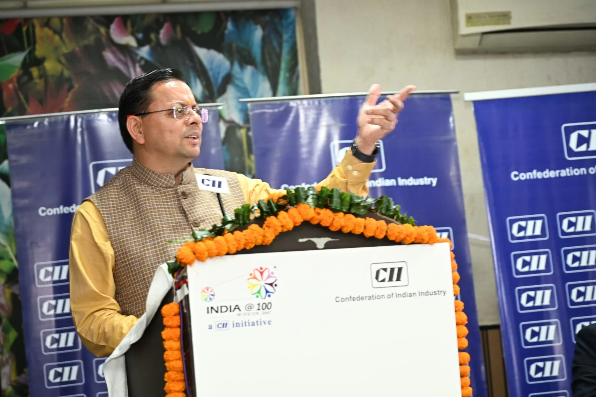
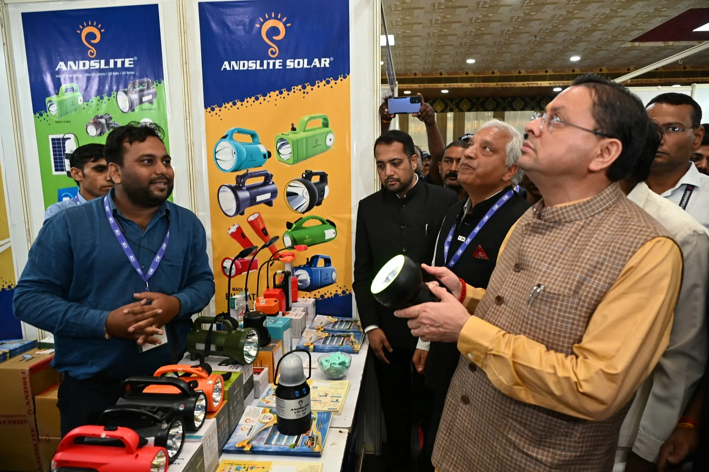
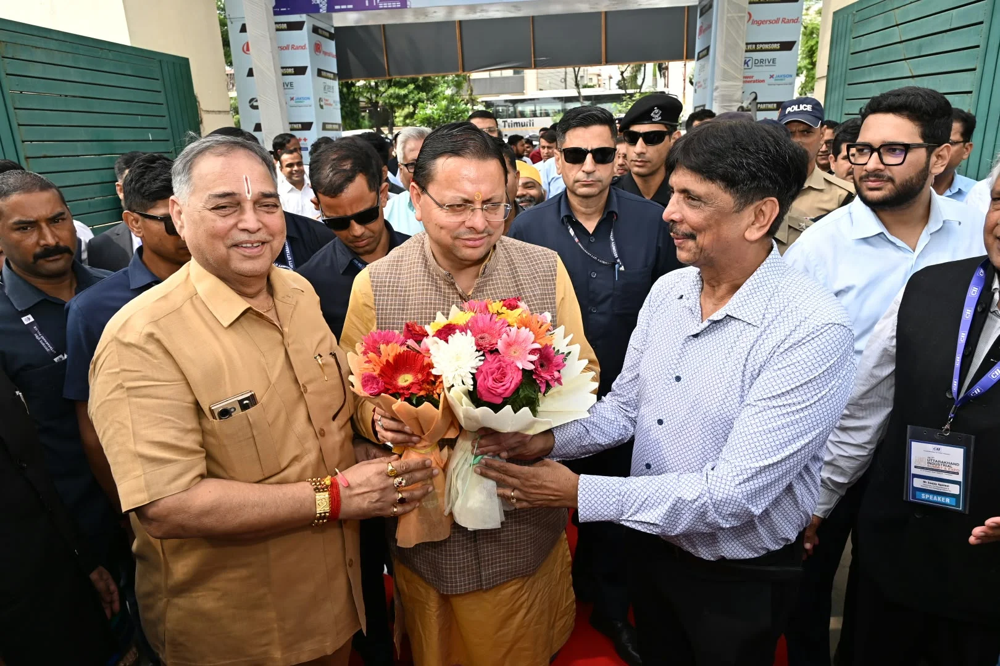
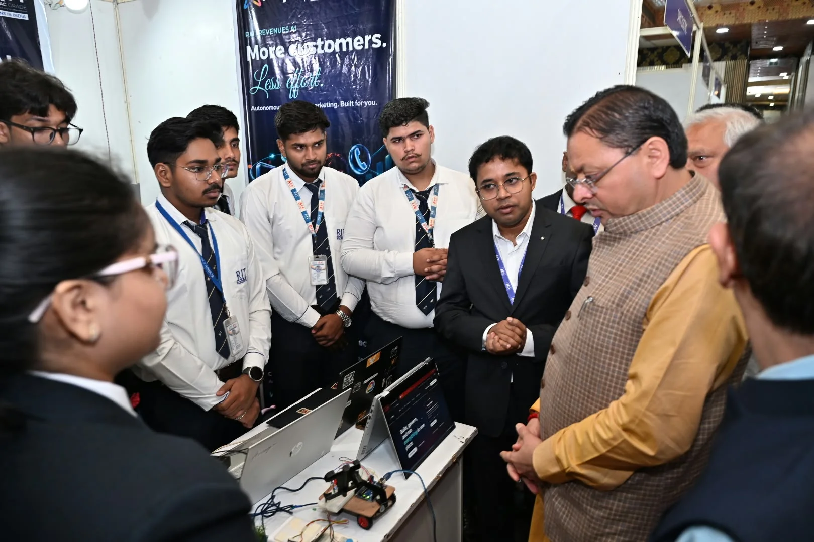
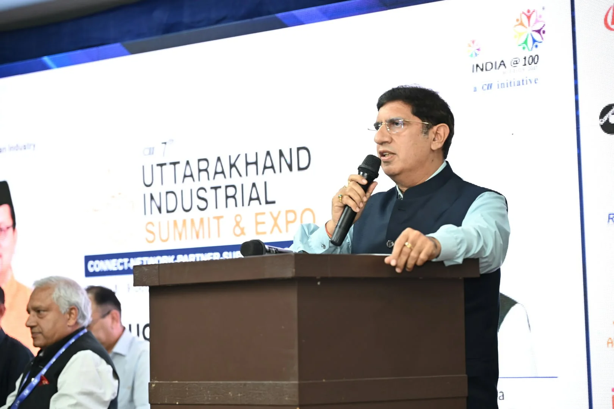
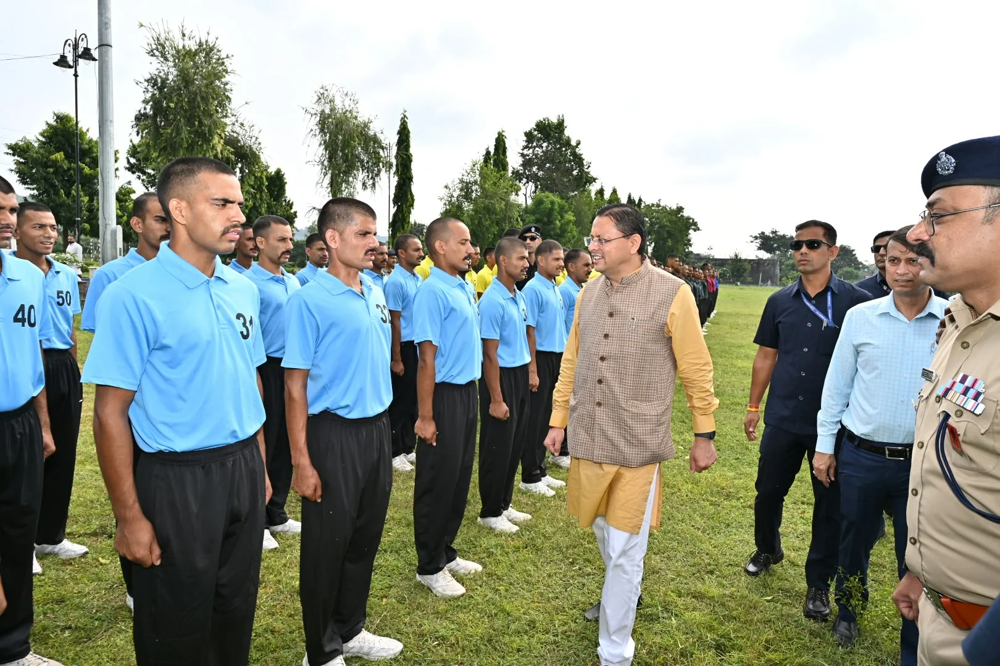
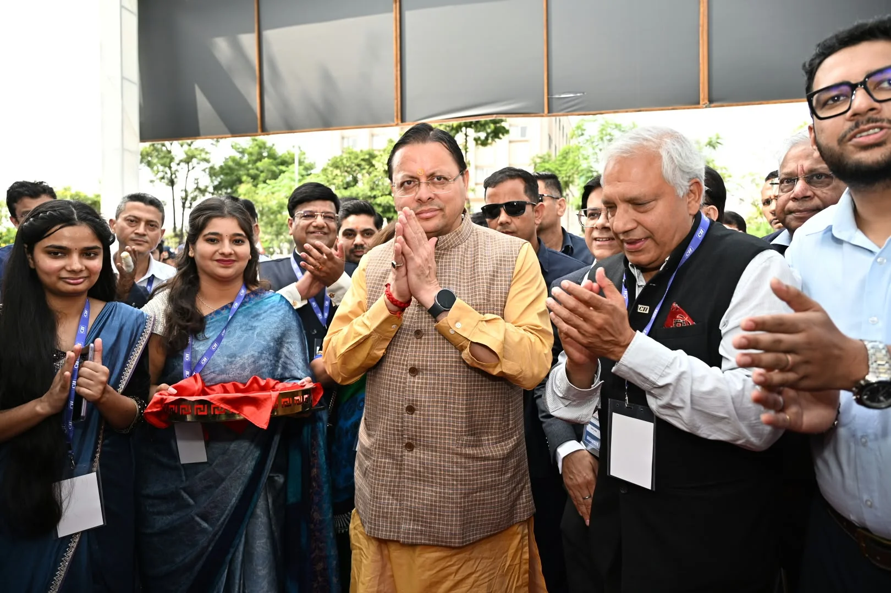

**हरिद्वार संवाददाता | आसिफ खान**

हरिद्वार। उत्तराखंड में औद्योगिक विकास को नई रफ्तार देने और निवेश के जरिए रोजगार के अवसर बढ़ाने की दिशा में राज्य सरकार ने अपनी प्राथमिकताएं स्पष्ट कर दी हैं। मुख्यमंत्री पुष्कर सिंह धामी ने हरिद्वार में आयोजित 7वें सीआईआई उत्तराखंड इंडस्ट्रियल समिट एंड एक्सपो-2026 में उद्योग जगत के सामने सरकार का विजन रखते हुए कहा कि प्रदेश में उद्योगों को केवल नियमों के दायरे में रखने वाली व्यवस्था नहीं, बल्कि उनके विकास में सहयोग करने वाली सरकार की भूमिका सुनिश्चित की जा रही है। मुख्यमंत्री ने दावा किया कि प्रदेश में पिछले कुछ वर्षों में 29 हजार से अधिक नई एमएसएमई इकाइयां स्थापित हुई हैं, जिनसे लगभग 1.27 लाख युवाओं को रोजगार मिला है।

मुख्यमंत्री के इस बयान के साथ ही औद्योगिक विकास, निवेश आकर्षित करने और युवाओं को रोजगार उपलब्ध कराने का मुद्दा एक बार फिर केंद्र में आ गया है। सरकार का जोर अब उद्योगों के लिए सरल प्रक्रियाएं, पारदर्शी व्यवस्था, बेहतर कनेक्टिविटी और निवेश के अनुकूल माहौल तैयार करने पर है।

**निवेश बढ़ाने के लिए सिंगल विंडो सिस्टम पर जोर**

मुख्यमंत्री धामी ने कहा कि किसी भी राज्य की अर्थव्यवस्था को मजबूत बनाने में उद्यमियों, व्यापारियों और निवेशकों की अहम भूमिका होती है। उद्योग स्थापित होने से रोजगार के अवसर बढ़ते हैं, नई तकनीक को बढ़ावा मिलता है और स्थानीय अर्थव्यवस्था को मजबूती मिलती है। इसी सोच के तहत सरकार उद्योगों के लिए सुरक्षित और सरल व्यवस्था विकसित करने पर काम कर रही है।

उन्होंने बताया कि निवेशकों और उद्यमियों की समस्याओं के त्वरित समाधान के लिए ‘निवेश मित्र’ व्यवस्था लागू की गई है। वहीं, सिंगल विंडो सिस्टम के तहत 26 प्रमुख विभागों की 206 से अधिक सेवाएं ऑनलाइन उपलब्ध कराई जा रही हैं। सरकार का उद्देश्य है कि उद्योग स्थापित करने के लिए उद्यमियों को अनावश्यक प्रक्रियाओं में न उलझना पड़े और निवेश संबंधी निर्णय तेजी से लिए जा सकें।

**200 करोड़ के वेंचर फंड से स्टार्टअप को मिलेगा प्रोत्साहन**

मुख्यमंत्री ने कहा कि उत्तराखंड का युवा केवल नौकरी तलाशने वाला नहीं, बल्कि दूसरों के लिए रोजगार के अवसर पैदा करने वाला उद्यमी भी बने। इसी उद्देश्य से प्रदेश में स्टार्टअप और नवाचार को बढ़ावा दिया जा रहा है। उत्तराखंड स्टार्टअप नीति के साथ स्टार्टअप्स को वित्तीय सहयोग देने के लिए 200 करोड़ रुपये के वेंचर फंड की व्यवस्था की गई है।

उन्होंने कहा कि राज्य में सड़क, रेल और हवाई कनेक्टिविटी का विस्तार औद्योगिक गतिविधियों के लिए अनुकूल परिस्थितियां तैयार कर रहा है। ऋषिकेश-कर्णप्रयाग रेल परियोजना, चारधाम सड़क परियोजना और बेहतर होते परिवहन नेटवर्क से लॉजिस्टिक्स सुविधाओं को मजबूती मिल रही है।

**खुरपिया में 1,002 एकड़ में विकसित होगा औद्योगिक क्लस्टर**

औद्योगिक विस्तार की योजनाओं का उल्लेख करते हुए मुख्यमंत्री ने बताया कि ऊधमसिंह नगर के खुरपिया में लगभग 1,002 एकड़ क्षेत्र में इंटीग्रेटेड मैन्युफैक्चरिंग क्लस्टर विकसित किया जा रहा है। इस परियोजना से औद्योगिक निवेश को बढ़ावा देने और रोजगार के नए अवसर पैदा करने की उम्मीद है।

उन्होंने स्पष्ट किया कि औद्योगिक विकास को केवल मैदानी क्षेत्रों तक सीमित नहीं रखा जाएगा। चमोली, पौड़ी और अल्मोड़ा में छोटे उद्योगों को प्रोत्साहित करने के लिए विशेष औद्योगिक पार्क विकसित करने की दिशा में कार्य किया जा रहा है। हरिद्वार में फ्लैटेड फैक्ट्री विकसित की जा रही है, जबकि भविष्य में सेलाकुई और पंतनगर में भी ऐसी सुविधाएं विकसित करने की योजना है।

**फार्मा से ऑटो-कंपोनेंट तक उत्तराखंड की पहचान**

मुख्यमंत्री ने कहा कि उत्तराखंड फार्मा, हर्बल, आयुष, इंजीनियरिंग और ऑटो-कंपोनेंट जैसे क्षेत्रों में अपनी औद्योगिक पहचान मजबूत कर रहा है। स्थानीय उत्पादों, हस्तशिल्प और पारंपरिक उद्यमों को बड़े बाजारों से जोड़ने के लिए भी प्रयास किए जा रहे हैं। ‘एक जनपद, दो उत्पाद’ जैसी योजनाओं के माध्यम से स्थानीय उत्पादों को राष्ट्रीय और अंतरराष्ट्रीय स्तर पर पहचान दिलाने का लक्ष्य रखा गया है।

उन्होंने कहा कि बिजनेस रिफॉर्म एक्शन प्लान में उत्तराखंड को ‘टॉप अचीवर्स’ श्रेणी में स्थान मिला है। इसके साथ ही एक्सपोर्ट प्रिपेयर्डनेस इंडेक्स-2024 में भी प्रदेश ने अपनी श्रेणी में प्रथम स्थान प्राप्त किया है। मुख्यमंत्री ने उद्यमियों और निवेशकों से प्रदेश की औद्योगिक संभावनाओं का लाभ उठाने और निवेश के माध्यम से रोजगार सृजन में भागीदार बनने का आह्वान किया।

**कैबिनेट मंत्री प्रदीप बत्रा बोले—उद्योग अर्थव्यवस्था की रीढ़**

कार्यक्रम में कैबिनेट मंत्री प्रदीप बत्रा ने कहा कि उद्योग देश की अर्थव्यवस्था की रीढ़ हैं। हरिद्वार में आयोजित इंडस्ट्रियल समिट उत्तराखंड के औद्योगिक विकास को नई दिशा देने में महत्वपूर्ण भूमिका निभा सकता है। उन्होंने कहा कि विकसित भारत के संकल्प को पूरा करने के लिए उद्योग जगत को गुणवत्ता, नवाचार और मजबूत इच्छाशक्ति के साथ आगे बढ़ना होगा।

उन्होंने कहा कि बीते वर्षों में हाईवे, रेलवे, एयरपोर्ट, शिक्षा और स्वास्थ्य सहित विभिन्न क्षेत्रों में विकास कार्यों को गति मिली है। आत्मनिर्भर और मजबूत भारत के निर्माण में उद्योगों की भूमिका निर्णायक होगी।

**प्रदर्शनी का अवलोकन, पुलिस जवानों का भी बढ़ाया हौसला**

समिट के दौरान मुख्यमंत्री पुष्कर सिंह धामी ने विभिन्न औद्योगिक इकाइयों की ओर से लगाई गई प्रदर्शनी का अवलोकन किया और औद्योगिक गतिविधियों से संबंधित जानकारी ली।

इससे पूर्व मुख्यमंत्री ने पुलिस लाइन स्थित हेलीपैड पर प्रशिक्षण प्राप्त कर रहे पुलिस जवानों से मुलाकात की। उन्होंने जवानों का हालचाल जाना, प्रशिक्षण से जुड़ी जानकारी ली और उन्हें पूरी लगन, अनुशासन तथा समर्पण के साथ अपने दायित्वों का निर्वहन करने के लिए प्रेरित किया।

**उद्योग जगत के प्रतिनिधियों सहित कई जनप्रतिनिधि रहे मौजूद**

कार्यक्रम में रानीपुर विधायक आदेश चौहान, पूर्व कैबिनेट मंत्री स्वामी यतीश्वरानंद, शिवालिकनगर नगर पालिका अध्यक्ष राजीव शर्मा, पूर्व मेयर मनोज गर्ग, पूर्व विधायक संजय गुप्ता, राज्य मंत्री आदेश सैनी, विक्रम भुल्लर, सीआईआई उत्तराखंड अध्यक्ष संजय अग्रवाल, वाइस चेयरमैन सौरव दास, इंडस्ट्री सेक्रेटरी विनय शंकर पांडे, जिलाधिकारी मयूर दीक्षित, सिडकुल के प्रबंध निदेशक सौरव गहवार, वरिष्ठ पुलिस अधीक्षक नवनीत सिंह भुल्लर, सीआईआई उत्तराखंड के निदेशक गौरव लांबा, चेयरपर्सन सोनिया, संदीप जैन सहित उद्योग एवं व्यापार जगत के अनेक प्रतिनिधि उपस्थित रहे।

अब निगाहें इन योजनाओं के धरातल पर क्रियान्वयन पर रहेंगी। उद्योगों की स्थापना, निवेश प्रस्तावों को वास्तविक परियोजनाओं में बदलने और युवाओं को स्थायी रोजगार उपलब्ध कराने में सरकार की नीतियों का असर आने वाले समय में महत्वपूर्ण माना जाएगा।
