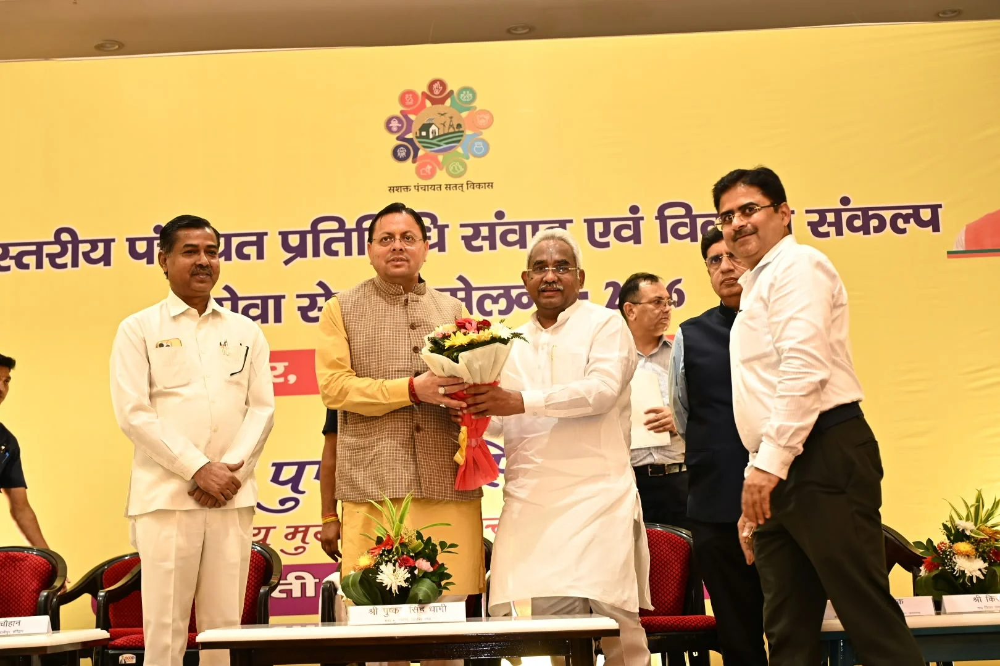
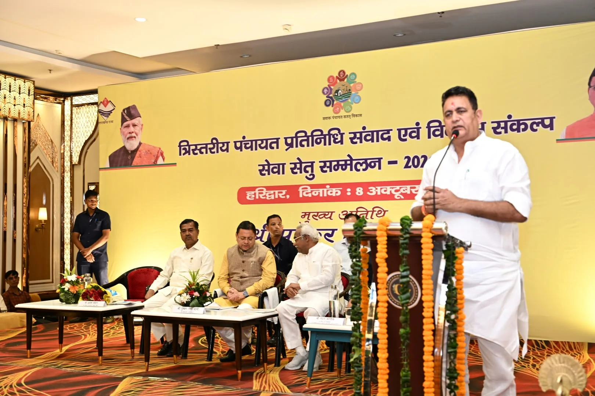
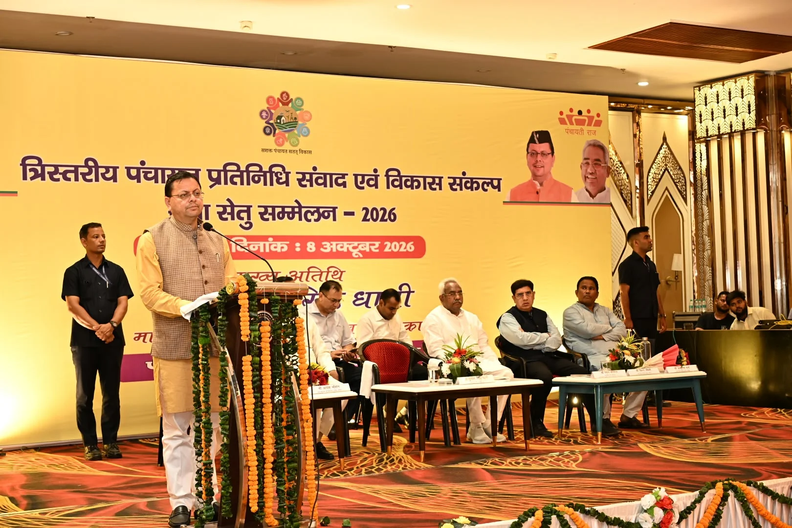
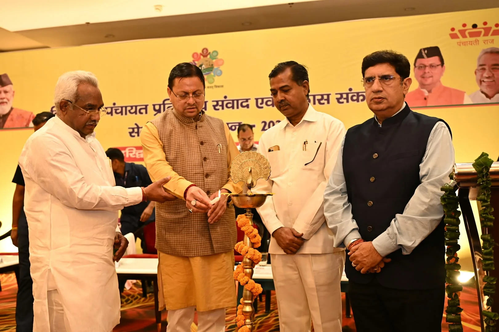
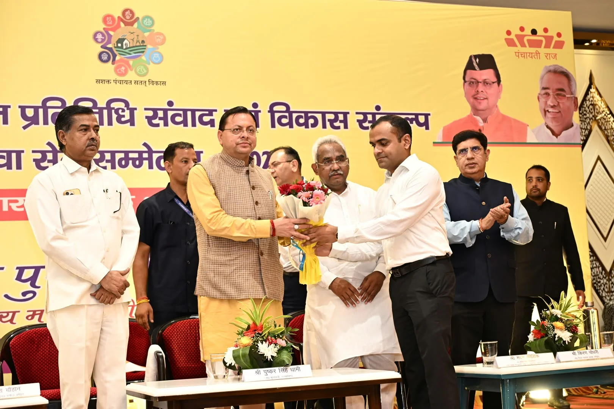
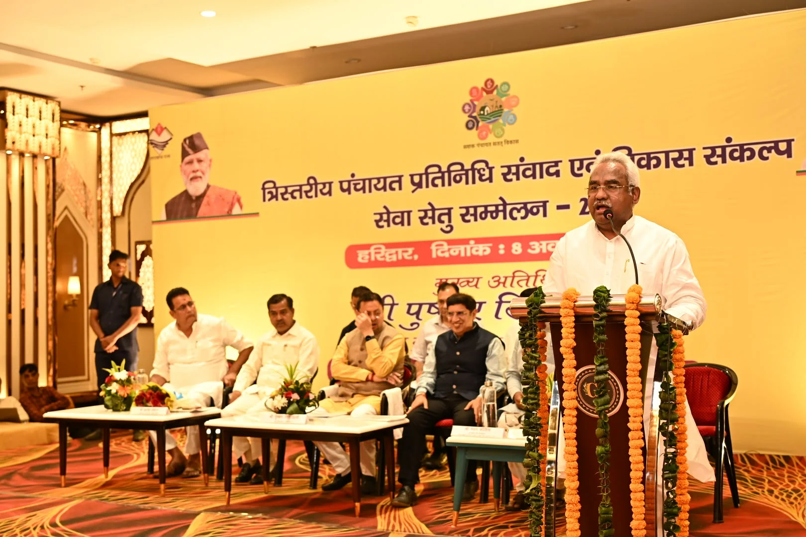
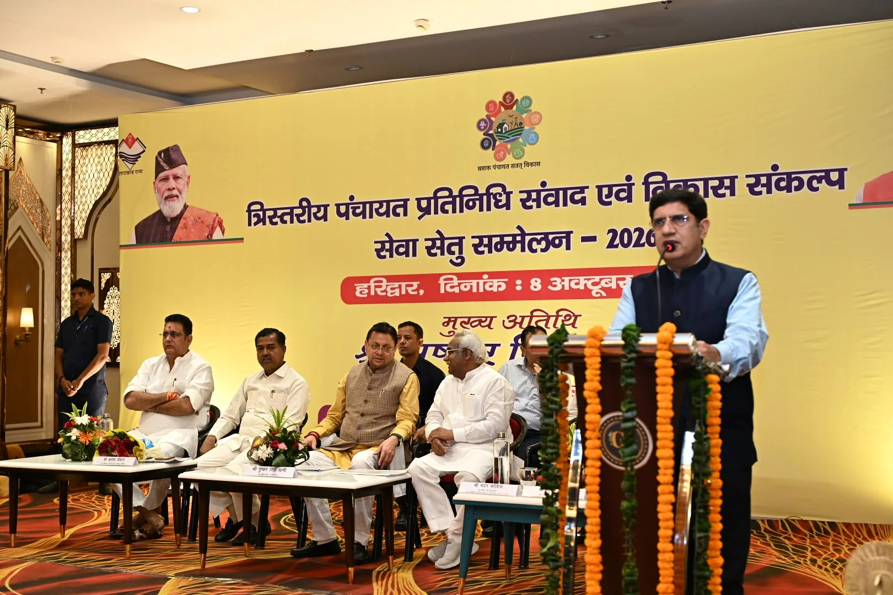

**हरिद्वार संवाददाता | आसिफ खान** 

उत्तराखंड के गांवों को विकास की मुख्यधारा से जोड़ने और पंचायतों को मजबूत बनाने के लिए मुख्यमंत्री पुष्कर सिंह धामी ने पंचायत प्रतिनिधियों को स्पष्ट संदेश दिया कि अब विकास कार्यों में केवल योजनाएं बनाने से काम नहीं चलेगा, बल्कि उनकी गुणवत्ता, पारदर्शिता और धरातल पर मिलने वाले परिणाम भी सुनिश्चित करने होंगे। मुख्यमंत्री ने कहा कि सशक्त पंचायतें ही विकसित उत्तराखण्ड की मजबूत नींव हैं और ग्रामीण विकास की असली तस्वीर तभी बदलेगी, जब योजनाओं का लाभ अंतिम पात्र व्यक्ति तक पहुंचेगा।

गुरुवार को हरिद्वार में त्रिस्तरीय पंचायत प्रतिनिधियों के क्षमता विकास के लिए आयोजित एक दिवसीय अभिमुखीकरण एवं प्रशिक्षण कार्यक्रम में प्रतिभाग करते हुए मुख्यमंत्री ने जनप्रतिनिधियों से ‘मेरा गांव-मेरी जिम्मेदारी’ की भावना के साथ काम करने का आह्वान किया। प्रदेश के सभी विकासखंडों में एक साथ 60 हजार से अधिक पंचायत प्रतिनिधियों को प्रशिक्षण से जोड़ने की पहल को उन्होंने ग्रामीण विकास की दिशा में महत्वपूर्ण कदम बताया।

**पंचायतों की जिम्मेदारी बड़ी, जवाबदेही भी उतनी ही जरूरी**

मुख्यमंत्री ने कहा कि पंचायत प्रतिनिधि लोकतंत्र की सबसे महत्वपूर्ण कड़ियों में शामिल हैं। वे सरकार और जनता के बीच सेतु बनकर स्थानीय समस्याओं को समझते हैं और सरकारी योजनाओं का लाभ जरूरतमंदों तक पहुंचाने में निर्णायक भूमिका निभाते हैं। ऐसे में पंचायत प्रतिनिधियों की जिम्मेदारी केवल विकास कार्यों को स्वीकृत कराने तक सीमित नहीं है, बल्कि उनकी निगरानी और प्रभावी क्रियान्वयन भी उतना ही जरूरी है।

उन्होंने निर्देशात्मक लहजे में कहा कि प्रत्येक पंचायत अपनी विकास योजना में स्थानीय जरूरतों, जनसुझावों और उपलब्ध संसाधनों को प्राथमिकता दे। योजनाओं के लिए स्पष्ट लक्ष्य, समयसीमा और अपेक्षित परिणाम तय किए जाएं, ताकि ग्रामीणों को विकास का वास्तविक लाभ मिल सके।

**पंचायत के बजट की एक-एक पाई का हिसाब जनता के सामने हो**

मुख्यमंत्री ने विकास कार्यों में पारदर्शिता पर जोर देते हुए कहा कि पंचायत का पैसा जनता का पैसा है और इसकी एक-एक पाई का हिसाब जनता के सामने होना चाहिए। विकास कार्यों की संख्या बढ़ाना ही पर्याप्त नहीं है, बल्कि यह देखना भी जरूरी है कि उन कार्यों से आम लोगों के जीवन में कितना सकारात्मक बदलाव आया।

उन्होंने सड़कों की गुणवत्ता, पेयजल योजनाओं की उपयोगिता, पंचायत भवनों से मिलने वाली सेवाओं और विकास कार्यों की नियमित समीक्षा को प्राथमिकता देने की बात कही। ई-ग्राम स्वराज पोर्टल के माध्यम से पंचायतों की कार्ययोजनाओं, वित्तीय एवं भौतिक प्रगति और कार्यों की जियो टैगिंग का उल्लेख करते हुए उन्होंने डिजिटल व्यवस्था को पारदर्शी और जवाबदेह पंचायत प्रशासन का महत्वपूर्ण आधार बताया।

**7,817 ग्राम पंचायतों में विकास व्यवस्था को मजबूत करने पर जोर**

मुख्यमंत्री ने पंचायतों में आधारभूत सुविधाओं और प्रशासनिक व्यवस्थाओं की जानकारी देते हुए बताया कि वर्ष 2025-26 में प्रदेश के 56 हजार से अधिक पंचायत प्रतिनिधियों को प्रशिक्षण दिया गया। राज्य की 7,817 ग्राम पंचायतों में से 5,972 ग्राम पंचायतों में पंचायत भवन ग्राम सचिवालय के रूप में संचालित हो रहे हैं।

उन्होंने बताया कि पिछले पांच वर्षों में 1,362 पंचायत भवनों का निर्माण किया गया और 584 पंचायत भवनों की मरम्मत कराई गई। एक हजार से अधिक ग्राम पंचायतों का कम्प्यूटरीकरण भी हो चुका है। मुख्यमंत्री ने इन व्यवस्थाओं का प्रभावी उपयोग करते हुए ग्रामीणों को बेहतर सुविधाएं उपलब्ध कराने पर जोर दिया।

**पेयजल, सड़क, शिक्षा और स्वास्थ्य को मिले प्राथमिकता**

मुख्यमंत्री ने कहा कि प्रत्येक ग्राम पंचायत की विकास योजना में पेयजल, सड़क, स्वच्छता, शिक्षा और स्वास्थ्य जैसी बुनियादी जरूरतों का स्पष्ट उल्लेख होना चाहिए। ग्राम सभाओं में ग्रामीणों की राय लेकर योजनाएं तैयार की जाएं और विकास कार्यों की प्रगति की नियमित समीक्षा हो।

उन्होंने कमजोर एवं वंचित वर्गों की आवश्यकताओं को प्राथमिकता देने तथा यह सुनिश्चित करने का आह्वान किया कि सरकारी योजनाओं का लाभ वास्तव में पात्र परिवारों तक पहुंच रहा है। मुख्यमंत्री के अनुसार, गांवों का विकास तभी सार्थक होगा, जब योजनाओं का असर आम ग्रामीण के जीवन में दिखाई देगा।

**स्वच्छ गांव, मजबूत अर्थव्यवस्था और पलायन पर रोक का लक्ष्य**

मुख्यमंत्री ने स्वच्छता को जनभागीदारी से जोड़ने की आवश्यकता पर बल दिया। उन्होंने बताया कि ठोस अपशिष्ट प्रबंधन के लिए जिला पंचायतों को ग्रामीण मोटर मार्गों और स्थानीय बाजारों की सफाई के लिए कचरा उठाने वाली मशीनें उपलब्ध कराई गई हैं। विकासखंड स्तर पर भी इस कार्य के लिए विशेष मशीनें स्थापित की गई हैं।

उन्होंने पंचायत प्रतिनिधियों से गांवों में नियमित सफाई सुनिश्चित करने और स्वच्छ एवं स्वस्थ वातावरण तैयार करने की अपील की। साथ ही स्वयं सहायता समूहों, महिला उद्यमिता, कृषि, बागवानी, स्थानीय उत्पादों और पर्यटन को बढ़ावा देकर ग्रामीण अर्थव्यवस्था को मजबूत करने की बात कही।

मुख्यमंत्री ने कहा कि गांवों में रोजगार और स्वरोजगार के अवसर बढ़ाना तथा पलायन कम करना सरकार की प्राथमिकताओं में शामिल है। महिलाओं के सशक्तिकरण के लिए सरकारी नौकरियों में 30 प्रतिशत क्षैतिज आरक्षण सहित विभिन्न कदम उठाए गए हैं। उन्होंने गांवों की सांस्कृतिक विरासत को संरक्षित रखने पर भी विशेष ध्यान देने की आवश्यकता बताई।

**कैबिनेट मंत्री मदन कौशिक बोले—योजनाओं को जमीन पर उतारने में पंचायतों की अहम भूमिका**

कार्यक्रम में कैबिनेट मंत्री मदन कौशिक ने कहा कि सरकार की विभिन्न योजनाओं को धरातल पर सफल बनाने में पंचायतों की भूमिका बेहद महत्वपूर्ण है। सड़क, बिजली, पंचायत भवन और विद्यालय सहित विकास की अनेक योजनाएं पंचायतों के माध्यम से जनता तक पहुंचती हैं। पंचायतों में जनप्रतिनिधित्व और सक्रियता बढ़ने से गांवों में व्यापक बदलाव लाया जा सकता है।

उन्होंने प्रधानमंत्री नरेंद्र मोदी के नेतृत्व में सेवा के 25 वर्ष पूरे होने के अवसर पर चलाए जा रहे सेवा संकल्प अभियान का उल्लेख करते हुए पंचायत प्रतिनिधियों से विकास योजनाओं को प्रभावी ढंग से लागू करने और अंतिम व्यक्ति तक उनका लाभ पहुंचाने का आह्वान किया।

**प्रशिक्षण से गांवों की तस्वीर बदलने की उम्मीद**

मुख्यमंत्री ने पंचायत प्रतिनिधियों से प्रशिक्षण के दौरान प्राप्त ज्ञान का उपयोग करते हुए गांवों को स्वच्छ, समृद्ध और आत्मनिर्भर बनाने की अपील की। उन्होंने कहा कि प्रत्येक विकास कार्य में गुणवत्ता, समयबद्धता और जवाबदेही सुनिश्चित करना आवश्यक है। पंचायत प्रतिनिधियों के सक्रिय सहयोग से ग्रामीण विकास को नई गति मिलेगी और विकसित उत्तराखण्ड का संकल्प साकार करने में मदद मिलेगी।

कार्यक्रम में कैबिनेट मंत्री प्रदीप बत्रा, जिला पंचायत अध्यक्ष किरण चौधरी, रानीपुर विधायक आदेश चौहान, पूर्व कैबिनेट मंत्री स्वामी यतीश्वरानंद, राज्य मंत्री देशराज कर्णवाल, आदेश सैनी, बहादराबाद ब्लॉक प्रमुख आशा नेगी, जिलाधिकारी मयूर दीक्षित, पुलिस अधीक्षक नवनीत सिंह भुल्लर, मुख्य विकास अधिकारी डॉ. ललित नारायण मिश्र, अपर जिलाधिकारी (प्रशासन) जितेंद्र कुमार, उप जिलाधिकारी हरिद्वार योगेश मेहरा, जिला पंचायत राज अधिकारी अतुल प्रताप सिंह सहित विभिन्न ग्राम पंचायतों के प्रधान, जनप्रतिनिधि और संबंधित अधिकारी मौजूद रहे।
