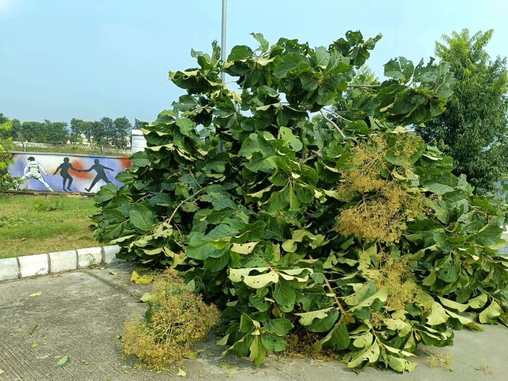

**हरिद्वार संवाददाता | आसिफ खान**

हरिद्वार। जनपद हरिद्वार में शुक्रवार सुबह अचानक बदले मौसम ने कई क्षेत्रों में नुकसान की स्थिति पैदा कर दी। आंधी-तूफान और ओलावृष्टि के चलते किसानों की फसलों को क्षति पहुंचने के साथ ही कई स्थानों पर पेड़ गिरने से भवनों और सड़क मार्गों पर भी असर पड़ने की सूचना सामने आई है। कुछ स्थानों पर आवागमन बाधित होने की स्थिति को गंभीरता से लेते हुए जिलाधिकारी मयूर दीक्षित ने संबंधित विभागों के अधिकारियों को तत्काल कार्रवाई के सख्त निर्देश दिए हैं।

मौसम की इस अचानक मार के बीच प्रशासन की प्राथमिकता प्रभावित लोगों को राहत पहुंचाना, बाधित मार्गों को खुलवाना और किसानों की फसल क्षति का वास्तविक आकलन करना है। जिलाधिकारी ने अधिकारियों को प्रभावित क्षेत्रों में मौके पर पहुंचकर स्थलीय निरीक्षण करने, नुकसान का आकलन तैयार करने और नियमानुसार राहत उपलब्ध कराने के लिए आवश्यक कदम उठाने के निर्देश दिए हैं।

**सड़कें बाधित, पेड़ गिरने से बढ़ी परेशानी; तत्काल राहत के निर्देश**

आंधी-तूफान के कारण जहां किसानों की फसलों पर नुकसान का खतरा मंडराया है, वहीं पेड़ गिरने से कुछ स्थानों पर सड़क मार्गों पर भी असर पड़ा है। जिलाधिकारी ने स्पष्ट निर्देश दिए कि जिन मार्गों पर पेड़ गिरने से आवाजाही बाधित हुई है, वहां प्राथमिकता के आधार पर पेड़ों को हटवाया जाए और यातायात व्यवस्था जल्द से जल्द सुचारू कराई जाए।

इसके साथ ही क्षतिग्रस्त भवनों और अन्य प्रभावित स्थलों का निरीक्षण कर नुकसान की स्थिति का आकलन करने तथा आवश्यकता के अनुसार सुरक्षा एवं बचाव संबंधी कदम उठाने को कहा गया है, ताकि किसी भी संभावित खतरे को समय रहते नियंत्रित किया जा सके और आमजन को अनावश्यक परेशानी का सामना न करना पड़े।

**किसानों की फसल क्षति पर प्रशासन सख्त, सर्वे में लापरवाही बर्दाश्त नहीं**

ओलावृष्टि और तेज हवाओं से प्रभावित किसानों के नुकसान को लेकर जिलाधिकारी ने उप जिलाधिकारियों एवं कृषि विभाग के अधिकारियों को विशेष निर्देश दिए हैं। अधिकारियों को प्रभावित क्षेत्रों में फसलों की क्षति का सर्वेक्षण कर नियमानुसार रिपोर्ट तैयार करने को कहा गया है, जिससे पात्र किसानों को निर्धारित नियमों के तहत मुआवजा एवं राहत उपलब्ध कराने की कार्रवाई की जा सके।

जिलाधिकारी ने फसल नुकसान के आकलन में किसी भी प्रकार की लापरवाही नहीं बरतने और सभी संबंधित विभागों को आपसी समन्वय के साथ काम करने के निर्देश दिए हैं। प्रशासन को यह सुनिश्चित करना होगा कि प्रभावित क्षेत्रों की वास्तविक स्थिति सामने आए और राहत प्रक्रिया में पात्र किसानों के हितों की अनदेखी न हो।

**प्रभावित क्षेत्रों पर प्रशासन की नजर, नुकसान का आकलन कर राहत पहुंचाने पर जोर**

जिलाधिकारी मयूर दीक्षित ने अधिकारियों को निर्देशित किया है कि मौसम की मार से प्रभावित क्षेत्रों में स्थिति का गंभीरता से जायजा लिया जाए और नुकसान के अनुसार आवश्यक कार्रवाई सुनिश्चित की जाए। सड़क मार्गों को सुचारू करने से लेकर भवनों की क्षति और किसानों की फसलों के सर्वे तक सभी जरूरी कार्यों को प्राथमिकता देने पर जोर दिया गया है।

अब प्रभावित क्षेत्रों में नुकसान का आकलन और राहत संबंधी कार्रवाई महत्वपूर्ण होगी। किसानों को मिलने वाली राहत नियमानुसार सर्वेक्षण, पात्रता और निर्धारित प्रावधानों के आधार पर तय की जाएगी। प्रशासन के सामने चुनौती है कि प्रभावित लोगों तक समय पर सहायता पहुंचे और सामान्य जनजीवन जल्द पटरी पर लौटे।
