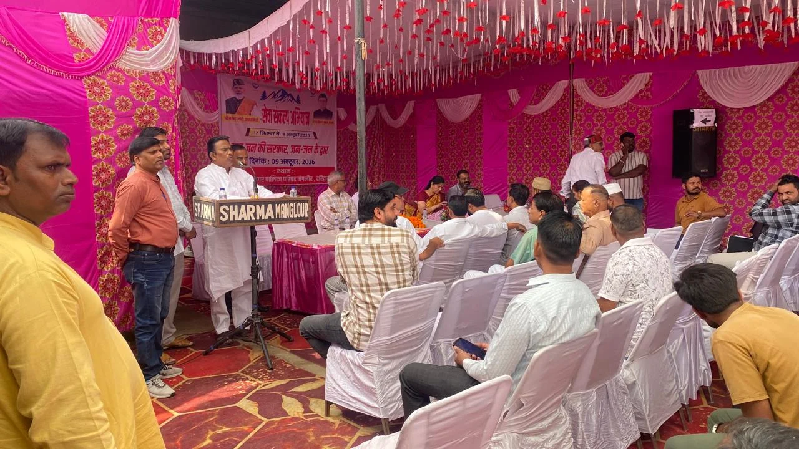
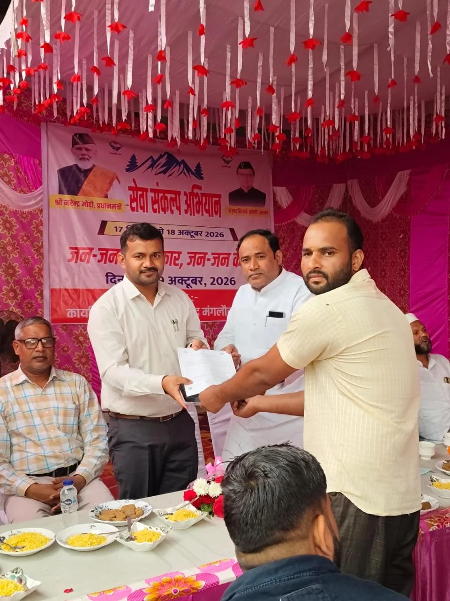
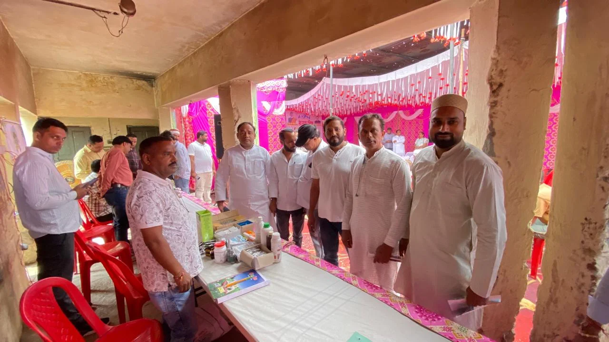

**हरिद्वार संवाददाता | आसिफ खान**

मंगलौर। आमजन की समस्याओं के समाधान और सरकारी योजनाओं का लाभ पात्र लोगों तक पहुंचाने के उद्देश्य से नगर पालिका परिषद मंगलौर में ‘जन-जन की सरकार, जन-जन के द्वार’ सेवा संकल्प अभियान के तहत बहुद्देशीय शिविर आयोजित किया गया। राज्य मंत्री देशराज कर्णवाल की अध्यक्षता में आयोजित इस शिविर में 520 नागरिकों ने प्रतिभाग कर विभिन्न विभागों की सेवाओं और योजनाओं का लाभ उठाया। शिविर में 17 शिकायतें दर्ज हुईं, जिनमें से 14 का मौके पर ही निस्तारण किया गया, जबकि शेष शिकायतों को आवश्यक कार्रवाई के लिए संबंधित अधिकारियों को भेजा गया।

उत्तराखंड शासन के निर्देशों तथा जिलाधिकारी मयूर दीक्षित के निर्देशन में आयोजित शिविर में 25 विभागों ने अपने स्टॉल लगाए। इन स्टॉलों के माध्यम से क्षेत्रवासियों को सरकार की जनकल्याणकारी योजनाओं की जानकारी दी गई और पात्र लाभार्थियों के आवेदन प्राप्त किए गए। शिविर के दौरान 210 लाभार्थियों को विभिन्न सरकारी योजनाओं से लाभान्वित किया गया, जबकि नौ लोगों को विभिन्न प्रकार के प्रमाण-पत्र वितरित किए गए।

**पात्र व्यक्ति योजनाओं के लाभ से वंचित न रहे: देशराज कर्णवाल**

शिविर को संबोधित करते हुए राज्य मंत्री देशराज कर्णवाल ने कहा कि प्रदेश सरकार का उद्देश्य जनकल्याणकारी योजनाओं का लाभ समाज के प्रत्येक पात्र व्यक्ति तक पहुंचाना है। इसी सोच के साथ ‘जन-जन की सरकार, जन-जन के द्वार’ अभियान के अंतर्गत बहुद्देशीय शिविर आयोजित किए जा रहे हैं, ताकि लोगों को सरकारी कार्यालयों के चक्कर लगाने के बजाय अपने क्षेत्र में ही विभिन्न विभागों की सेवाएं मिल सकें।

उन्होंने अधिकारियों को स्पष्ट निर्देश दिए कि शिविर में प्राप्त शिकायतों और आवेदनों को गंभीरता से लिया जाए तथा उनका निर्धारित समयसीमा के भीतर निस्तारण सुनिश्चित किया जाए। उन्होंने कहा कि सरकारी योजनाओं का लाभ पात्र लोगों तक पहुंचाना संबंधित विभागों की जिम्मेदारी है। इसमें किसी भी प्रकार की लापरवाही नहीं होनी चाहिए और अधिकारियों को आपसी समन्वय के साथ संवेदनशीलता एवं तत्परता से काम करना चाहिए।

**जनशिकायतों के निस्तारण में तेजी लाने पर जोर**

ज्वाइंट मजिस्ट्रेट दीपक रामचंद्र सेठ ने कहा कि स्थानीय नागरिकों की समस्याओं का नियमानुसार प्राथमिकता के आधार पर निस्तारण किया जाएगा। उन्होंने कहा कि शासन की जनकल्याणकारी योजनाओं का लाभ पात्र व्यक्तियों तक पहुंचाने के लिए संबंधित विभागों के साथ समन्वय स्थापित कर आवश्यक कार्रवाई की जाएगी।

शिविर में विभिन्न विभागों के अधिकारियों और कर्मचारियों ने नागरिकों को योजनाओं की पात्रता, आवेदन प्रक्रिया तथा उपलब्ध सुविधाओं के बारे में जानकारी दी। अधिकारियों ने पात्र व्यक्तियों के आवेदन भी प्राप्त किए, ताकि उन्हें संबंधित योजनाओं से जोड़ा जा सके।

**अब कार्रवाई और समयबद्ध निस्तारण पर रहेगी नजर**

शिविर में 17 शिकायतों का दर्ज होना स्थानीय स्तर पर जनसमस्याओं के समाधान की आवश्यकता को रेखांकित करता है। हालांकि, 14 शिकायतों का मौके पर निस्तारण किया गया, लेकिन शेष शिकायतों के समाधान के लिए संबंधित अधिकारियों को कार्रवाई करनी होगी। ऐसे में अभियान की वास्तविक सफलता इस बात से भी तय होगी कि लंबित शिकायतों का कितनी तेजी और प्रभावी ढंग से निस्तारण किया जाता है तथा पात्र लाभार्थियों को योजनाओं का लाभ समय पर मिलता है।

कार्यक्रम में भाजपा रुड़की जिलाध्यक्ष डॉ. मधु सिंह, नगर पालिका परिषद मंगलौर के अध्यक्ष मोहयुद्दीन, मंडल अध्यक्ष शोभित गुप्ता, सभासद कलीम, विपिन जैन, सहसंयोजक जमीर हसन अंसारी, नगर पालिका के अधिशासी अधिकारी उत्तम सिंह नेगी सहित विभिन्न विभागों के अधिकारी, जनप्रतिनिधि और क्षेत्रीय नागरिक उपस्थित रहे।
