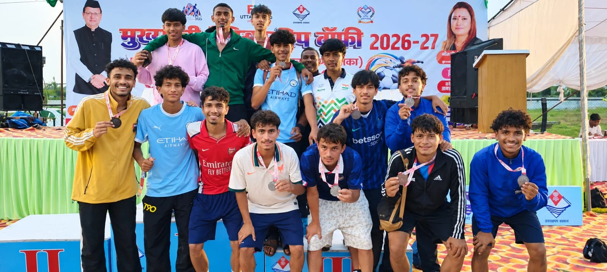
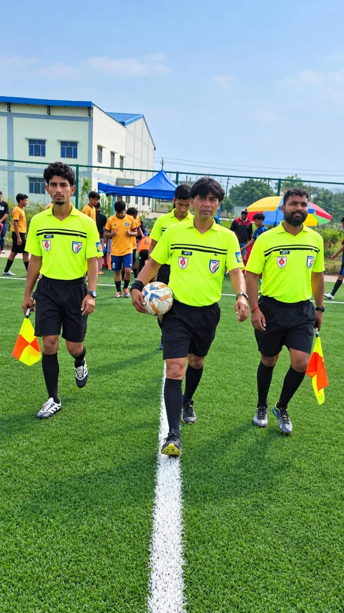
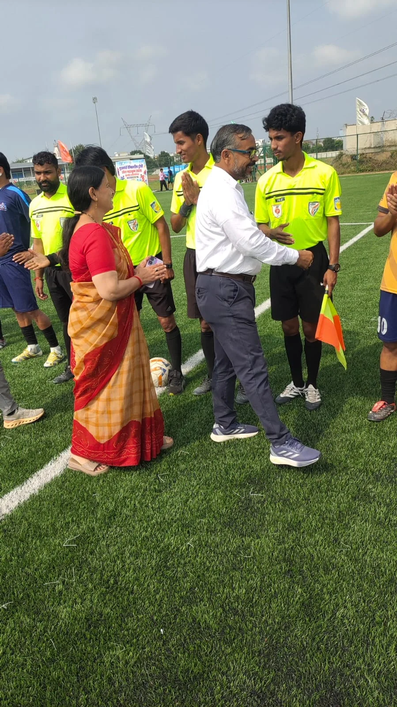

**हरिद्वार संवाददाता | आसिफ खान**

हरिद्वार। खेल महाकुम्भ-2026 के अंतर्गत आयोजित मुख्यमंत्री चैम्पियनशिप ट्रॉफी की राज्य स्तरीय फुटबॉल प्रतियोगिता के अंतिम दिन नैनीताल की टीम ने मैदान पर ऐसा दमदार प्रदर्शन किया कि अंडर-14 और अंडर-19, दोनों बालक वर्गों के खिताब अपने नाम कर लिए। फाइनल मुकाबलों में नैनीताल के खिलाड़ियों ने बेहतरीन तालमेल, आक्रामक खेल और मजबूत रणनीति का परिचय देते हुए प्रतिद्वंद्वी टीमों को कोई मौका नहीं दिया। दो खिताबी जीत के साथ नैनीताल ने प्रतियोगिता में अपनी श्रेष्ठता साबित की।

**दोनों फाइनल में नैनीताल का दबदबा, विरोधी टीमों के गोल करने के अरमान अधूरे**

प्रतियोगिता के अंडर-14 बालक वर्ग के फाइनल मुकाबले में नैनीताल ने अल्मोड़ा को 3-0 से हराकर खिताब पर कब्जा जमाया। नैनीताल के खिलाड़ियों ने पूरे मुकाबले में शानदार खेल का प्रदर्शन किया और अल्मोड़ा की टीम को गोल करने का अवसर नहीं दिया। एकतरफा रहे इस मुकाबले में नैनीताल की टीम का आक्रामक अंदाज और मजबूत रक्षापंक्ति जीत की बड़ी वजह बनी।

वहीं, अंडर-19 बालक वर्ग के फाइनल में भी नैनीताल की टीम का जलवा बरकरार रहा। नैनीताल ने पौड़ी गढ़वाल को 4-0 से करारी शिकस्त देकर दूसरा खिताब भी अपने नाम कर लिया। इस मुकाबले में नैनीताल के खिलाड़ियों ने बेहतरीन प्रदर्शन करते हुए प्रतिद्वंद्वी टीम पर लगातार दबाव बनाए रखा। लगातार दो आयु वर्गों में खिताबी जीत दर्ज कर नैनीताल ने राज्य स्तरीय फुटबॉल प्रतियोगिता में अपनी दमदार उपस्थिति दर्ज कराई।

**हार्डलाइन मुकाबले में देहरादून ने मारी बाजी**

अंडर-14 बालक वर्ग के हार्डलाइन मुकाबले में देहरादून और पौड़ी गढ़वाल की टीमों के बीच कड़ा संघर्ष देखने को मिला। रोमांचक मुकाबले में देहरादून ने पौड़ी गढ़वाल को 3-2 से पराजित कर जीत हासिल की। दोनों टीमों के बीच मुकाबला संघर्षपूर्ण रहा, लेकिन अंतिम परिणाम देहरादून के पक्ष में गया।

**अधिकारियों और खेल प्रशिक्षकों की मौजूदगी में संपन्न हुई प्रतियोगिता**

प्रतियोगिता के दौरान जिला क्रीड़ाधिकारी रविन्द्र भण्डारी, प्रभारी सांसद चैम्पियनशिप ट्रॉफी एवं युवा कल्याण विभाग, हरिद्वार के मुकेश कुमार भट्ट, क्षेत्रीय युवा कल्याण एवं प्रांतीय रक्षक दल अधिकारी, यमकेश्वर श्रीमती पूनम मिश्रा, युवा कल्याण विभाग, हरिद्वार के प्रशासनिक अधिकारी जितेन्द्र पुण्डीर तथा खेल विभाग, हरिद्वार के सहायक प्रशिक्षक शुभम बोरा उपस्थित रहे।

इसके अतिरिक्त खेल विभाग के खेल समन्वयक, शिक्षा विभाग के खेल शिक्षक तथा निर्णायक के रूप में वीरेन्द्र सिंह रावत, मनोज नेगी, वरुण चौहान, उत्कृष्ट गोस्वामी, हिमांशू प्रजापति, सौरभ, संदीप, सुमित एवं मुदस्सीम सहित युवा कल्याण विभाग के खेल प्रशिक्षक और अन्य विभागीय कार्मिक भी मौजूद रहे।

खेल महाकुम्भ-2026 की राज्य स्तरीय फुटबॉल प्रतियोगिता के अंतिम दिन हुए मुकाबलों ने खिलाड़ियों की प्रतिभा, खेल भावना और प्रतिस्पर्धात्मक क्षमता को सामने रखा। नैनीताल की दोनों खिताबी जीत प्रतियोगिता के प्रमुख आकर्षणों में शामिल रहीं।
