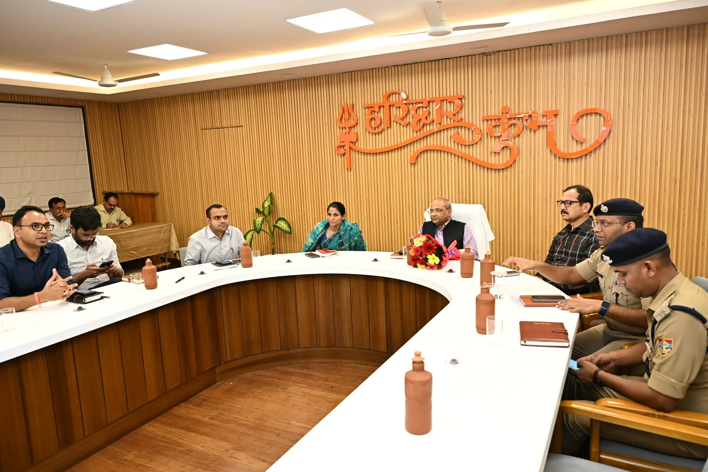
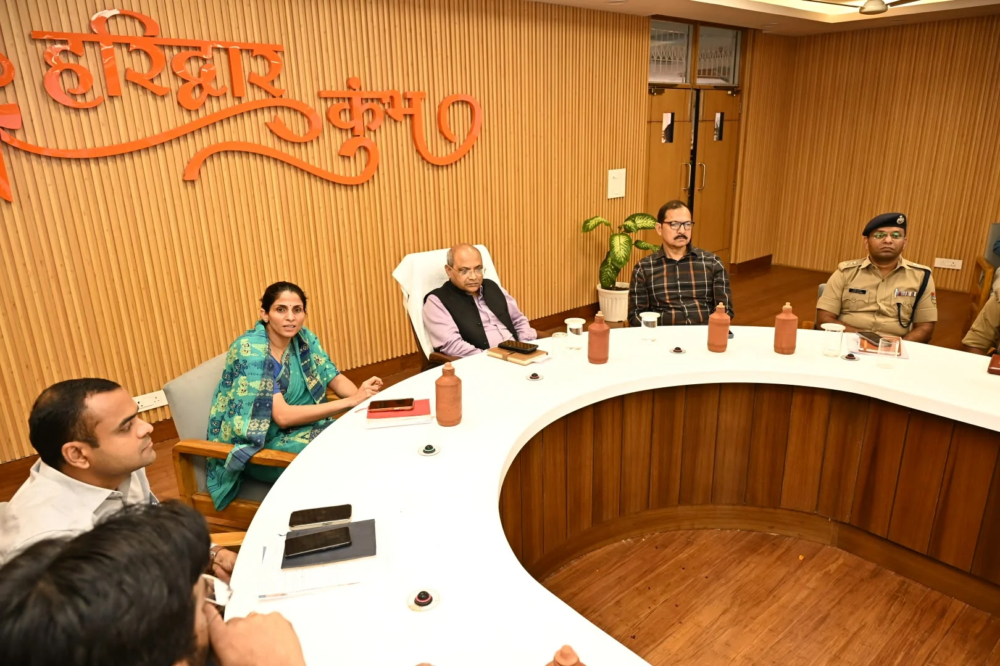
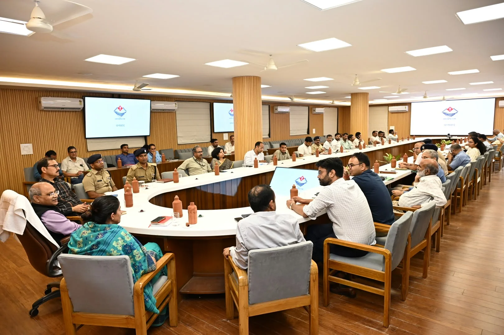

**हरिद्वार संवाददाता | आसिफ खान**

हरिद्वार। कुंभ मेला-2027 की तैयारियों को लेकर प्रशासन अब पूरी तरह एक्शन मोड में नजर आ रहा है। निर्माण कार्यों में तेजी लाने, समयसीमा का सख्ती से पालन कराने और गुणवत्ता सुनिश्चित करने के लिए मंडलायुक्त आनंद स्वरूप ने अधिकारियों एवं कार्यदायी संस्थाओं को स्पष्ट निर्देश दिए हैं कि कुंभ से जुड़े किसी भी महत्वपूर्ण कार्य में अनावश्यक देरी नहीं होनी चाहिए। शुक्रवार को मेला नियंत्रण भवन (सीसीआर) सभागार में आयोजित उच्च स्तरीय समिति की बैठक में कुंभ की तैयारियों की विस्तृत समीक्षा करते हुए उन्होंने सड़कों, पुलों और घाटों के निर्माण कार्यों को प्राथमिकता के आधार पर पूरा कराने पर जोर दिया।

बैठक में साफ संदेश दिया गया कि कुंभ की तैयारियों में अब समय गंवाने की गुंजाइश नहीं है। सभी विभागों को आपसी समन्वय के साथ काम करते हुए निर्धारित लक्ष्यों को समय पर हासिल करना होगा। निर्माण स्थलों पर श्रमिकों, मशीनरी और आवश्यक सामग्री की पर्याप्त उपलब्धता सुनिश्चित करने के निर्देश देते हुए मंडलायुक्त ने नियमित निगरानी और प्रगति की समीक्षा पर विशेष जोर दिया।

**गंग नहर की क्लोजर अवधि पर रहेगी खास नजर**

कुंभ की तैयारियों में घाटों का निर्माण एक महत्वपूर्ण कार्य है। इसे देखते हुए मंडलायुक्त ने गंग नहर की क्लोजर अवधि का प्रभावी उपयोग करने के लिए पहले से ठोस कार्ययोजना तैयार करने के निर्देश दिए। उन्होंने स्पष्ट किया कि क्लोजर के दौरान निर्माण कार्यों में तेजी लाने के लिए जरूरी सामग्री, मशीनरी और श्रमिकों की व्यवस्था पहले ही कर ली जाए, ताकि काम शुरू होने के बाद संसाधनों की कमी के कारण बहुमूल्य समय बर्बाद न हो।

उन्होंने कहा कि घाटों के निर्माण से जुड़े कार्यों को योजनाबद्ध तरीके से आगे बढ़ाया जाए और आवश्यकता के अनुसार अतिरिक्त संसाधन तैनात किए जाएं। निर्माण की समयसीमा को ध्यान में रखते हुए संबंधित विभाग अभी से तैयारियां पूरी रखें, जिससे उपलब्ध अवधि का अधिकतम उपयोग किया जा सके।

**दिन-रात काम, लेकिन गुणवत्ता से समझौता नहीं**

मंडलायुक्त ने सड़कों, पुलों और घाटों के निर्माण कार्यों में तेजी लाने के साथ गुणवत्ता मानकों का कड़ाई से पालन करने के निर्देश दिए। उन्होंने कहा कि कार्यों को समय पर पूरा करना जितना जरूरी है, उतना ही जरूरी उनका गुणवत्तापूर्ण होना भी है। कार्यदायी संस्थाएं निर्माण की प्रगति का लगातार आकलन करें और जहां श्रमिकों, मशीनरी अथवा अन्य संसाधनों की आवश्यकता हो, वहां तत्काल व्यवस्था की जाए।

उन्होंने अधिकारियों को निर्देशित किया कि निर्माण कार्यों में आने वाली बाधाओं की पहचान कर उनका समयबद्ध समाधान किया जाए। विभागीय समन्वय में कमी या संसाधनों के अभाव के कारण परियोजनाओं की गति प्रभावित नहीं होनी चाहिए। इसके लिए संबंधित अधिकारी अपने-अपने विभागों के कार्यों की नियमित समीक्षा करें और निर्धारित लक्ष्यों के अनुरूप काम पूरा कराएं।

**त्योहारों से पहले श्रमिकों की व्यवस्था करने के निर्देश**

आगामी त्योहारों के दौरान श्रमिकों की उपलब्धता प्रभावित होने की आशंका को देखते हुए मंडलायुक्त ने कार्यदायी संस्थाओं को पहले से वैकल्पिक व्यवस्था करने के निर्देश दिए। उन्होंने कहा कि संभावित श्रमिक कमी का आकलन करते हुए पर्याप्त श्रमिकों की उपलब्धता सुनिश्चित की जाए, ताकि निर्माण कार्यों की रफ्तार में किसी प्रकार की बाधा न आए।

निर्माण स्थलों पर जरूरत के अनुसार श्रमिकों की तैनाती, मशीनरी की उपलब्धता और सामग्री की आपूर्ति बनाए रखने पर भी जोर दिया गया। प्रशासन की प्राथमिकता है कि त्योहारों के दौरान भी महत्वपूर्ण परियोजनाओं का काम निर्धारित गति से चलता रहे और कुंभ से जुड़ी व्यवस्थाएं समय रहते तैयार हो सकें।

**काउंटडाउन मोड में कुंभ की तैयारी, प्रतिदिन हो रही समीक्षा**

बैठक में मेलाधिकारी सोनिका ने बताया कि कुंभ मेला-2027 की तैयारियों को समयबद्ध ढंग से पूरा कराने के लिए सभी कार्यदायी संस्थाओं को निर्माण स्थलों पर श्रमिकों और संसाधनों की संख्या बढ़ाने के निर्देश दिए गए हैं। निर्माण कार्यों में तेजी लाने के लिए दिन-रात काम कराने की व्यवस्था की गई है।

उन्होंने बताया कि तैयारियों को काउंटडाउन मोड में आगे बढ़ाया जा रहा है और कार्यों की प्रगति की प्रतिदिन समीक्षा की जा रही है। निर्धारित लक्ष्यों के अनुसार काम पूरा कराने और मेले के आयोजन से पहले आवश्यक व्यवस्थाएं तैयार करने पर विशेष ध्यान दिया जा रहा है।

कुंभ-2027 के मद्देनजर प्रशासन के सामने अब निर्माण कार्यों को समयबद्ध तरीके से पूरा करने की महत्वपूर्ण चुनौती है। ऐसे में आगामी दिनों में विभिन्न परियोजनाओं की प्रगति, निर्माण की गुणवत्ता और विभागीय समन्वय पर निगरानी और अधिक महत्वपूर्ण होगी।

**कई वरिष्ठ अधिकारी रहे मौजूद**

उच्च स्तरीय समिति की बैठक में आईजी (कुंभ) डॉ. योगेंद्र सिंह रावत, जिलाधिकारी हरिद्वार मयूर दीक्षित, एसएसपी (कुंभ) आयुष अग्रवाल, नगर आयुक्त नंदन कुमार, अपर मेलाधिकारी दयानंद सरस्वती, एसपी सिटी दीपक सिंह, मेला स्वास्थ्य अधिकारी डॉ. मनीष दत्त, तकनीकी सेल के अधीक्षण अभियंता मनोज भट्ट, लोक निर्माण विभाग के अधीक्षण अभियंता डीपी सिंह, उप मेलाधिकारी आकाश जोशी एवं मनजीत सिंह सहित विभिन्न विभागों के अधिकारी उपस्थित रहे।
