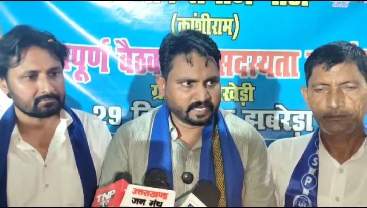
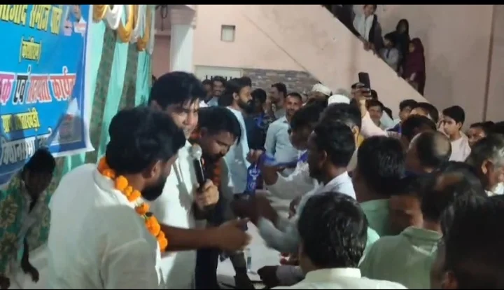
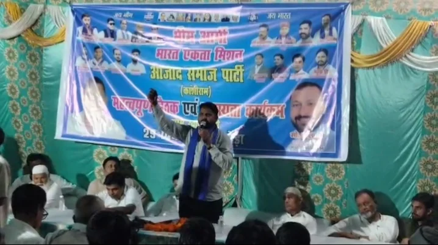

**रूडकी/झबरेड़ा संवाददाता | आसिफ खान** 

झबरेड़ा विधानसभा क्षेत्र की राजनीति में आज़ाद समाज पार्टी ने सदस्यता अभियान के जरिए अपनी सक्रियता बढ़ाने का दावा किया है। खाताखेड़ी गांव में पार्टी के नवनियुक्त मंडल महासचिव मोहम्मद इंतनाम के आवास पर आयोजित बैठक और सदस्यता कार्यक्रम में विधानसभा प्रत्याशी महक सिंह का कार्यकर्ताओं ने जोरदार स्वागत किया। कार्यक्रम में कांग्रेस विधायक वीरेंद्र जाति को लेकर तीखी राजनीतिक बयानबाजी हुई। महक सिंह ने विधायक पर सीधा निशाना साधते हुए ऐसा बयान दिया, जिसने क्षेत्र की सियासत में नई बहस छेड़ दी।

महक सिंह ने कहा, वीरेंद्र जाति “**बाई चांस विधायक बने हैं, बाई चॉइस नहीं**, क्योंकि जनता की मांग कुछ और थी।” उनके इस बयान को झबरेड़ा में कांग्रेस विधायक के खिलाफ आज़ाद समाज पार्टी के खुलकर मैदान में उतरने के राजनीतिक संदेश के रूप में देखा जा रहा है। महक सिंह ने कांग्रेस और भाजपा की राजनीति पर सवाल उठाते हुए अपनी पार्टी को मजबूत करने का आह्वान किया।

**विधायक वीरेंद्र जाति पर सियासी हमला, जनता की पसंद को लेकर उठाए सवाल**

महक सिंह के बयान ने झबरेड़ा विधानसभा क्षेत्र में राजनीतिक चर्चा को हवा दे दी है। उन्होंने विधायक वीरेंद्र जाति के नेतृत्व पर सवाल उठाते हुए यह संदेश देने की कोशिश की कि क्षेत्र में राजनीतिक विकल्प की मांग मौजूद है। उनके बयान से साफ है कि आज़ाद समाज पार्टी आगामी विधानसभा चुनाव को लेकर कांग्रेस को चुनौती देने की तैयारी में जुटी है।

कार्यक्रम के दौरान कुछ ग्रामीणों की ओर से भी विधायक वीरेंद्र जाति के प्रति नाराजगी जताए जाने की बात सामने आई। आयोजकों और पार्टी कार्यकर्ताओं ने दावा किया कि विधायक से नाराज कई लोगों ने कांग्रेस छोड़कर आज़ाद समाज पार्टी से जुड़ने का फैसला किया है। हालांकि, इन दावों की स्वतंत्र पुष्टि नहीं हुई है और विधायक वीरेंद्र जाति की प्रतिक्रिया भी सामने नहीं आई है।

**खाताखेड़ी में सदस्यता अभियान, सैकड़ों लोगों के जुड़ने का दावा**

आज़ाद समाज पार्टी के इस कार्यक्रम में आयोजकों के मुताबिक, सैकड़ों लोगों ने पार्टी की सदस्यता ग्रहण की। पार्टी कार्यकर्ताओं ने इसे झबरेड़ा विधानसभा क्षेत्र में संगठन विस्तार की दिशा में महत्वपूर्ण कदम बताया। कार्यक्रम के जरिए ग्रामीणों के बीच जनसंपर्क बढ़ाने, स्थानीय समस्याओं को उठाने और आगामी चुनाव के लिए संगठन को मजबूत करने पर जोर दिया गया।

राजनीतिक जानकारों की नजर अब इस बात पर रहेगी कि सदस्यता अभियान के जरिए पार्टी अपनी जमीनी मौजूदगी कितनी मजबूत कर पाती है। फिलहाल, महक सिंह के आक्रामक बयान और सदस्यता कार्यक्रम ने झबरेड़ा की स्थानीय राजनीति में हलचल पैदा कर दी है।

**मोहम्मद इंतनाम को नई जिम्मेदारी, संगठन मजबूत करने का संकल्प**

कार्यक्रम के आयोजक एवं नवनियुक्त मंडल महासचिव मोहम्मद इंतनाम ने कहा कि वह पिछले ढाई से तीन वर्षों से आज़ाद समाज पार्टी के साथ कार्यकर्ता के रूप में जुड़े हुए हैं। पार्टी ने उन्हें जो जिम्मेदारी दी है, उसे वह पूरी निष्ठा के साथ निभाएंगे। उन्होंने आगामी विधानसभा चुनाव में महक सिंह के समर्थन में काम करने और गांव-गांव तक संगठन को मजबूत बनाने की बात कही।

इस अवसर पर भाई इंतनाम को गढ़वाल मंडल सचिव तथा सुलेमान उर्फ बाबू भाई को विधानसभा सचिव की जिम्मेदारी सौंपी गई। पार्टी पदाधिकारियों ने संगठन विस्तार और अधिक से अधिक लोगों को पार्टी से जोड़ने पर जोर दिया।

**कई प्रमुख लोग रहे मौजूद**

कार्यक्रम में पूर्व प्रधान शमीम अहमद, हाजी मोहम्मद इनाम उर्फ कल्लू, शाहरुख, अशरफ अली, शराफत, इरशाद ठेकेदार, लियाकत अली, मारूफ अली, जीशान, दानिश अली, जुल्फान अली, भालू, तेजपाल, रवि, अभिषेक, अजय कुमार, रोहित, पिंटू, कलीम, शाकिर, तनवीर उर्फ तन्नू, मुनीर, जकी, अब्दुस्समद, अय्यूब उर्फ बंडू, गय्यूर, असलम, अहमद, डॉ. अय्यूब, सद्दाम, भूटो, तनवीर मुखिया, मोंटी और शिशुपाल सहित अन्य लोग उपस्थित रहे।

**चुनावी मुकाबले से पहले सियासी संदेश**

खाताखेड़ी में आयोजित इस कार्यक्रम के जरिए आज़ाद समाज पार्टी ने झबरेड़ा विधानसभा क्षेत्र में अपनी राजनीतिक सक्रियता का प्रदर्शन किया। महक सिंह का कांग्रेस विधायक पर सीधा हमला और सदस्यता अभियान पार्टी की आगामी चुनावी रणनीति के अहम हिस्से के रूप में सामने आए हैं।

अब बड़ा सवाल यह है कि महक सिंह का यह आक्रामक रुख और पार्टी का संगठन विस्तार झबरेड़ा की चुनावी राजनीति में कितना प्रभाव डालता है। विधायक वीरेंद्र जाति की ओर से इस बयान और कथित नाराजगी पर प्रतिक्रिया आने के बाद राजनीतिक तस्वीर और स्पष्ट हो सकेगी।
