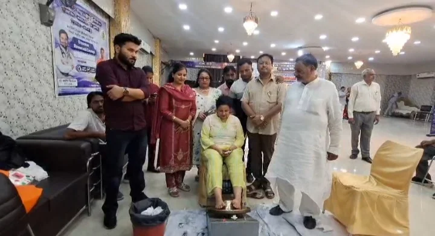
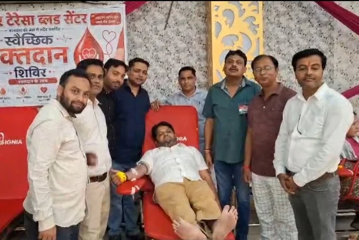
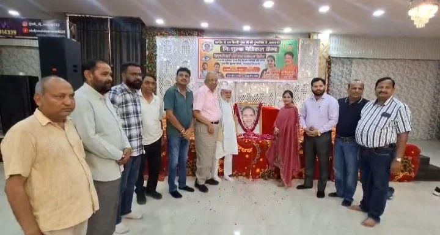

**रुड़की संवाददाता | आसिफ खान**

रुड़की। समाजसेवा के संकल्प को जमीन पर उतारते हुए वरिष्ठ कांग्रेस नेता एवं समाजसेवी स्वर्गीय राम बिहारी गुप्ता की पुण्यतिथि पर रुड़की में निशुल्क चिकित्सा शिविर का आयोजन किया गया। ईदगाह चौक स्थित होटल में आयोजित इस शिविर ने जरूरतमंदों को स्वास्थ्य सेवाएं उपलब्ध कराने के साथ ही जनसेवा की मजबूत मिसाल पेश की। हंस फाउंडेशन के सहयोग से आयोजित शिविर में मरीजों की आंखों की जांच, चश्मा वितरण, विभिन्न बीमारियों की जांच, निशुल्क दवाइयां, चिकित्सकीय परामर्श और पंचकर्मा परामर्श की सुविधा उपलब्ध कराई गई।

**श्रद्धांजलि सिर्फ रस्म नहीं, जनसेवा का संकल्प!**

स्वर्गीय राम बिहारी गुप्ता को श्रद्धांजलि अर्पित कर कार्यक्रम की शुरुआत की गई। उनके पुत्र एवं वरिष्ठ कांग्रेस नेता सचिन गुप्ता तथा कांग्रेस नेत्री और पूर्व मेयर प्रत्याशी पूजा गुप्ता ने कहा कि पिता की स्मृतियों को जीवित रखने का सबसे बड़ा माध्यम जरूरतमंदों की सेवा करना है। उन्होंने बताया कि परिवार लंबे समय से समाजसेवा के कार्यों में सक्रिय है और प्रत्येक वर्ष पुण्यतिथि पर चिकित्सा शिविर आयोजित कर लोगों की मदद करने का प्रयास किया जाता है।

**आंखों की जांच से लेकर पंचकर्मा परामर्श तक, एक ही शिविर में स्वास्थ्य सेवाएं**

शिविर में मरीजों को केवल सामान्य चिकित्सकीय परामर्श ही नहीं, बल्कि आंखों की जांच, जरूरतमंदों को चश्मे, विभिन्न बीमारियों की जांच और निशुल्क दवाइयां भी उपलब्ध कराई गईं। इसके साथ ही पंचकर्मा परामर्श की सुविधा भी शिविर का हिस्सा रही। प्रसिद्ध चिकित्सक डॉ. आशीष सिसोदिया और डॉ. अर्पित सैनी सहित अन्य चिकित्सकों ने मरीजों को सेवाएं प्रदान कीं। आयोजन का उद्देश्य जरूरतमंद लोगों तक स्वास्थ्य सेवाएं पहुंचाना और उन्हें उपचार संबंधी मार्गदर्शन उपलब्ध कराना रहा।

**रक्तदान से दिया जिंदगी बचाने का संदेश**

चिकित्सा शिविर के दौरान स्वैच्छिक रक्तदान भी किया गया। रक्तदान करने वाले लोगों को आयोजकों ने सम्मानित किया। इस पहल ने यह संदेश दिया कि समाजसेवा केवल सहायता तक सीमित नहीं, बल्कि जरूरत के समय किसी की जिंदगी बचाने के संकल्प का नाम भी है।

**राजनीतिक और सामाजिक क्षेत्र की हस्तियों की मौजूदगी**

कार्यक्रम में विधायक फुरकान अहमद, विकास त्यागी, पूर्व मेयर गौरव गोयल, पूर्व मंत्री राम सिंह सैनी, उदयवीर सिंह पुंडीर, ईश्वर लाल शास्त्री, हेमेंद्र चौधरी, कलीम खान, मनोज जयंत, नासिर प्रवेज, नरेश प्रिंस, सुभाष सरीन और राहुल सैनी सहित अनेक गणमान्य लोग मौजूद रहे।

**राम बिहारी गुप्ता की स्मृति को जनसेवा से जोड़ने की पहल**

स्वर्गीय राम बिहारी गुप्ता की पुण्यतिथि पर आयोजित यह शिविर समाज के प्रति जिम्मेदारी निभाने का संदेश दे गया। जरूरतमंदों को निशुल्क स्वास्थ्य सेवाएं उपलब्ध कराने, रक्तदान को प्रोत्साहित करने और पंचकर्मा परामर्श सहित विभिन्न सुविधाएं देने की इस पहल ने श्रद्धांजलि को जनकल्याण से जोड़ दिया। आयोजन का संदेश स्पष्ट रहा—सच्ची श्रद्धांजलि वही है, जो किसी जरूरतमंद के चेहरे पर राहत लाए और समाज के हित में काम आए।
