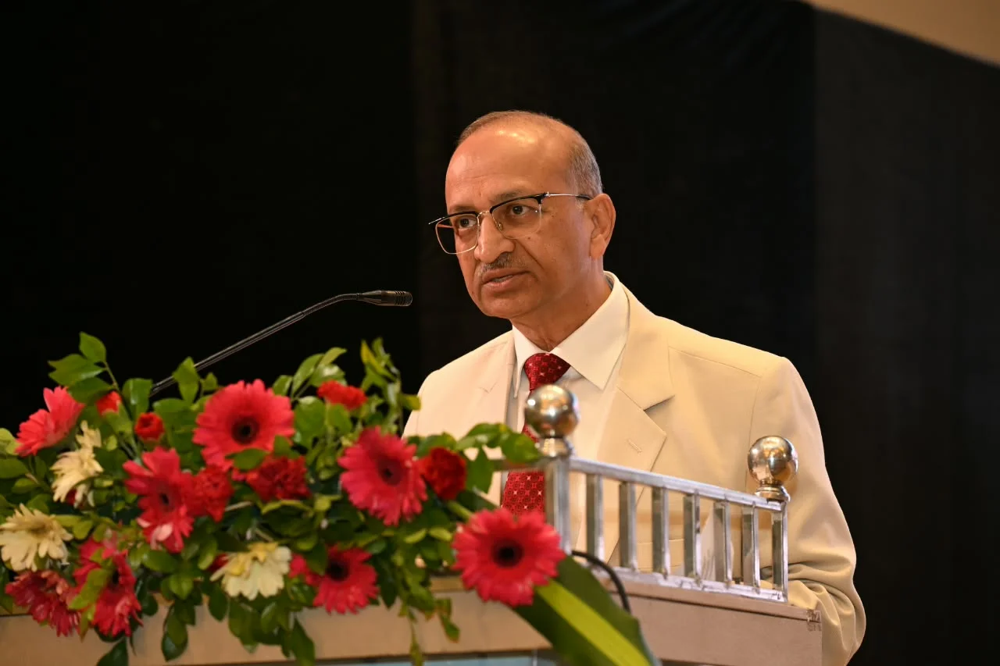
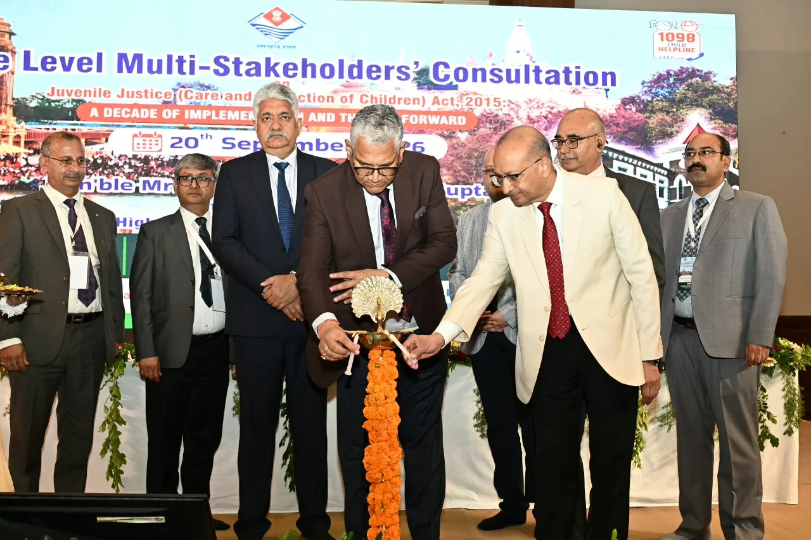

हरिद्वार। किशोर न्याय व्यवस्था को और अधिक प्रभावी, संवेदनशील और बाल-केंद्रित बनाने को लेकर हरिद्वार में राज्य स्तरीय मंथन हुआ। हयात प्लेस, बहादराबाद में आयोजित “किशोर न्याय (बालकों की देखरेख एवं संरक्षण) अधिनियम, 2015 : क्रियान्वयन के एक दशक की समीक्षा एवं भावी दिशा” विषयक हितधारक परामर्श में न्यायपालिका, प्रशासन, पुलिस, शिक्षा, स्वास्थ्य, समाज कल्याण सहित बाल संरक्षण से जुड़े विभिन्न विभागों के अधिकारियों और विशेषज्ञों ने भाग लिया।

माननीय मुख्य न्यायाधीश मनोज कुमार गुप्ता के मार्गदर्शन में किशोर न्याय समिति, उत्तराखण्ड उच्च न्यायालय ने महिला सशक्तिकरण एवं बाल विकास विभाग, उत्तराखण्ड सरकार के सहयोग से इस राज्य स्तरीय कार्यक्रम का आयोजन किया। कार्यक्रम में 180 से अधिक प्रतिभागियों ने हिस्सा लिया।

**कानून अच्छा होना ही काफी नहीं, जमीन पर असर दिखना जरूरी**

उद्घाटन सत्र में मुख्य न्यायाधीश मनोज कुमार गुप्ता के साथ न्यायमूर्ति मनोज कुमार तिवारी, न्यायमूर्ति रवीन्द्र मैठाणी, न्यायमूर्ति राकेश थपलियाल, न्यायमूर्ति पंकज पुरोहित, न्यायमूर्ति आलोक महरा, न्यायमूर्ति सुभाष उपाध्याय और न्यायमूर्ति सिद्धार्थ साह मौजूद रहे।

कार्यक्रम का शुभारंभ दीप प्रज्ज्वलन के साथ हुआ। मातृ आँचल कन्या विद्यालय, राजागार्डन की छात्राओं तथा राजकीय बाल देखरेख गृह, रोशनाबाद की बालिकाओं ने सामूहिक रूप से सरस्वती वंदना प्रस्तुत की। कार्यक्रम में बच्चों को न्यायाधीशों की धर्मपत्नीगण द्वारा उपहार देकर सम्मानित किया गया।

अध्यक्षीय उद्बोधन में मुख्य न्यायाधीश मनोज कुमार गुप्ता ने किशोर न्याय समिति और महिला सशक्तिकरण एवं बाल विकास विभाग को आयोजन के लिए बधाई दी। उन्होंने कहा कि किसी भी कानून की सफलता उसके प्रभावी क्रियान्वयन पर निर्भर करती है। उन्होंने सभी हितधारकों से व्यावहारिक और क्रियान्वयन-केंद्रित दृष्टिकोण अपनाकर अधिनियम के उद्देश्यों को धरातल तक पहुंचाने का आह्वान किया।

**दंड नहीं, पुनर्वास और समाज में वापसी पर जोर**

किशोर न्याय समिति के अध्यक्ष न्यायमूर्ति राकेश थपलियाल ने अधिनियम के दस वर्षों की यात्रा की समीक्षा करते हुए कहा कि विधि के साथ संघर्षरत अथवा देखरेख एवं संरक्षण की आवश्यकता वाले बच्चे को सबसे पहले एक बच्चे के रूप में देखा जाना चाहिए। उन्होंने दंड के बजाय पुनर्वास और अलगाव के बजाय समाज में पुनः एकीकरण को प्राथमिकता देने की जरूरत बताई।

उन्होंने कहा कि कोई भी कानून उतना ही प्रभावी होता है, जितनी प्रभावी उसे लागू करने वाली संस्थाएं और उनके बीच आपसी समन्वय होता है।

न्यायमूर्ति आलोक महरा ने कहा कि न्याय में देरी बच्चे के जीवन और भविष्य को गहराई से प्रभावित कर सकती है। उन्होंने समयबद्ध और बाल-केंद्रित न्यायिक प्रक्रिया को आवश्यक बताया।

न्यायमूर्ति सुभाष उपाध्याय ने स्वागत भाषण में सभी अतिथियों और प्रतिभागियों का स्वागत करते हुए कहा कि बाल संरक्षण के क्षेत्र में काम करने वाली सभी संस्थाओं के बीच मजबूत समन्वय जरूरी है। उन्होंने उत्तराखण्ड के दूरस्थ और दुर्गम क्षेत्रों तक प्रत्येक बच्चे के लिए गरिमा, देखरेख, संरक्षण और आवश्यक सहयोग सुनिश्चित करने पर जोर दिया।

**न्यायपालिका से लेकर पुलिस-प्रशासन तक जुटे अधिकारी**

परामर्श में उत्तराखण्ड उच्च न्यायालय के रजिस्ट्रार जनरल एवं अन्य रजिस्ट्रार, निदेशक उजाला, सचिव विधि एवं विधिक परामर्शदाता, सचिव महिला सशक्तिकरण एवं बाल विकास, राज्य बाल अधिकार संरक्षण आयोग की अध्यक्ष, सभी जनपदों के जिला एवं सत्र न्यायाधीश, पॉक्सो एवं एफटीएससी न्यायालयों के न्यायाधीश, किशोर न्याय बोर्डों के प्रधान मजिस्ट्रेट तथा पुलिस, शिक्षा, स्वास्थ्य, समाज कल्याण और पंचायती राज विभागों के वरिष्ठ अधिकारी शामिल हुए।

उद्घाटन सत्र का समापन रजिस्ट्रार जनरल उत्तराखण्ड उच्च न्यायालय योगेश कुमार गुप्ता के धन्यवाद ज्ञापन से हुआ। उन्होंने सभी प्रतिभागियों से प्रत्येक बच्चे के लिए सुरक्षित, स्नेहपूर्ण और पोषणकारी वातावरण तैयार करने के लिए मिलकर काम करने का आह्वान किया।

**पांच तकनीकी सत्रों में खुलकर हुआ मंथन**

दिनभर चले कार्यक्रम में पांच तकनीकी सत्र आयोजित किए गए। इनमें दत्तक ग्रहण, देखरेख एवं संरक्षण की आवश्यकता वाले बच्चे, विधि के साथ संघर्षरत बच्चे, प्रारम्भिक मूल्यांकन तथा किशोर न्याय अधिनियम-2015 का समग्र अवलोकन जैसे महत्वपूर्ण विषयों पर विस्तार से चर्चा हुई।

तकनीकी सत्रों में निदेशक उजाला प्रदीप पंत, सचिव महिला कल्याण एवं बाल विकास चंद्रेश यादव, CEO कारा भारत सरकार भावना सक्सेना, आईजी कुमाऊं निवेदिता कुकरेती, राजीव भल्ला, अनाथ शिशु पालन ट्रस्ट, संगीता गौड़, इंडिया चाइल्ड प्रोटेक्शन, अधिवक्ता स्नेहा सिंह, अधिवक्ता एवं इंडिपेंडेंट थॉट के संस्थापक विक्रम श्रीवास्तव, सुपरिंटेंडेंट स्पेशल होम्स रोशनाबाद विजय दीक्षित तथा पूर्व चेयरपर्सन एचडब्ल्यूसी देहरादून रघुवरदत्त तिवारी ने विशेषज्ञ एवं वक्ता के रूप में विभिन्न सत्रों में योगदान दिया।

**जिला न्यायालय और प्रशासन की सक्रिय भागीदारी**

कार्यक्रम के सफल आयोजन में जिला न्यायाधीश हरिद्वार नरेन्द्र दत्त, रजिस्ट्रार/सचिव किशोर न्याय समिति उच्च न्यायालय नैनीताल श्री विक्रम तथा जिलाधिकारी मयूर दीक्षित के नेतृत्व में जिला न्यायालय एवं जिला प्रशासन की सक्रिय भागीदारी रही।

राज्य स्तरीय इस परामर्श के जरिए किशोर न्याय अधिनियम के दस वर्षों के क्रियान्वयन की समीक्षा के साथ-साथ आने वाले समय में बाल संरक्षण, पुनर्वास, न्यायिक प्रक्रिया और विभिन्न विभागों के बीच समन्वय को और मजबूत करने की दिशा में विचार-विमर्श किया गया।
